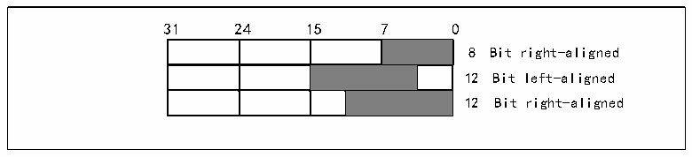
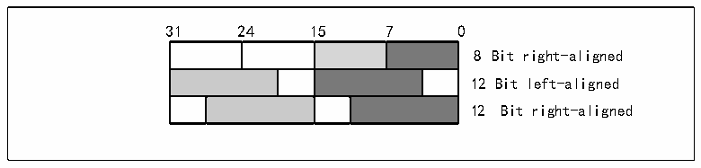

<!-- source-page: 168 -->

[← p.167](0167.md) · [index](../README.md) · [PDF p.168](https://ch32-riscv-ug.github.io/CH32V407/datasheet_zh/CH32V407RM.PDF#page=168) · [p.169 →](0169.md)

<!-- header: CH32V407应用手册 https://wch.cn -->

### 13.2.2 DAC通道配置

#### 13.2.2.1 开启DAC功能

将DAC_CTLR寄存器的ENx位置1，即可打开对DAC通道x的模拟供电。经过一段启动时间，DAC  
通道x即被使能。DAC包含2个模拟输出通道，可同时或分别独立输出。  
注：为了避免寄生的干扰和额外的功耗，DAC通道对应的引脚需提前设置成模拟输入（AIN）模式。  

#### 13.2.2.2 打开输出缓冲

DAC 集成了输出缓冲，可以用来减少输出阻抗，增加驱动能力直接驱动外部负载。每个 DAC 通  
道输出缓存可以通过设置DAC_CTLR寄存器的BOFFx位来使能或关闭。  

#### 13.2.2.3 数据格式

单DAC通道模式下，包括8位数据右对齐、12位数据左对齐、12位数据右对齐。  
8 位数据右对齐时，写入数据到 DAC_R8BDHRx[7:0]，模块将加载（1个 PB1时钟周期后）其左  
移数据到数据输出寄存器DAC_DORx[11:4]。  
12位数据右对齐时，写入数据到DAC_R12BDHRx[11:0]，模块将加载（1个PB1时钟周期后）右  
对齐数据到数据输出寄存器DAC_DORx[11:0]。  
12数据左对齐时，写入数据到DAC_L12BDHRx[15:4]，模块经过相应的移位后，将加载（1个PB1  
时钟周期后）左对齐数据到数据输出寄存器DAC_DORx[11:0]。  

图13-2 单通道数据格式  
 <!-- rendered from the PDF; verify at https://ch32-riscv-ug.github.io/CH32V407/datasheet_zh/CH32V407RM.PDF#page=168 -->

🖼 Text parsed from the figure above

31 24 15 7 0  
8 Bit right-aligned  
12 Bit left-aligned  
12 Bit right-aligned  

双DAC通道模式下，同样包括8位数据右对齐、12数据左对齐、12位数据右对齐三种方式。  
8位数据右对齐时，写入数据到DAC_RD8BDHR[7:0]，模块将加载（1个PB1时钟周期后）位[7:0]  
移位后到DAC_DOR1[11:4]，位[15:8]移位后到DAC_DOR2[11:4]。  
12数据左对齐时，写入数据到DAC_LD12BDHR[31:0]，模块将加载（1个PB1时钟周期后）位[15:4]  
数据移位后到DAC_DOR1[11:0]，位[31:20]数据移位后到DAC_DOR2[11:0]。  
12位数据右对齐，写入数据到DAC_RD12BDHR[31:0]，模块将加载（1个PB1时钟周期后）位[11:0]  
数据到DAC_DOR1[11:0]，位[27:16]数据到DAC_DOR2[11:0]。  

图13-3 双通道数据格式  
 <!-- rendered from the PDF; verify at https://ch32-riscv-ug.github.io/CH32V407/datasheet_zh/CH32V407RM.PDF#page=168 -->

🖼 Text parsed from the figure above

31 24 15 7 0  
8 Bit right-aligned  
12 Bit left-aligned  
12 Bit right-aligned  

#### 13.2.2.4 DMA功能

DAC通道具有DMA功能。设置DAC_CTLR寄存器的DMAENx位为1，开启对应通道的DMA功能。当  
有触发事件（不包括软件触发）发生，则产生一个DMA请求，然后DAC_DORx寄存器的数据将被更新。  

#### 13.2.2.5 触发事件选择

DAC转换可以由以下事件触发进行转换。当配置DAC_CTLR寄存器的TENx位为1，配置TSELx[2:0]  
控制位选择某个触发事件触发DAC转换。  
<!-- image: p168-draw-image-00001 bbox=[507.84, 786.36, 527.28, 796.68] -->
<!-- footer: V1.2 166 -->
