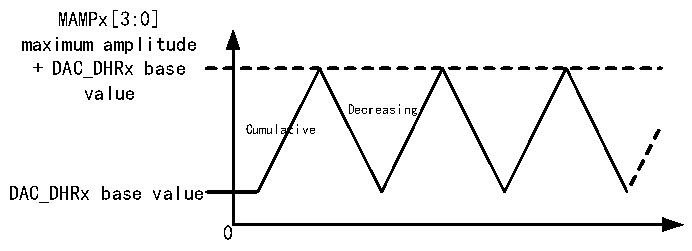
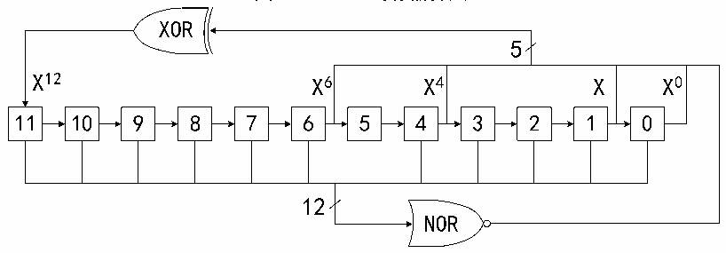

<!-- source-page: 170 -->

[← p.169](0169.md) · [index](../README.md) · [PDF p.170](https://ch32-riscv-ug.github.io/CH32V407/datasheet_zh/CH32V407RM.PDF#page=170) · [p.171 →](0171.md)

<!-- header: CH32V407应用手册 https://wch.cn -->

图13-4 三角波生成  
 <!-- rendered from the PDF; verify at https://ch32-riscv-ug.github.io/CH32V407/datasheet_zh/CH32V407RM.PDF#page=170 -->

🖼 Text parsed from the figure above

MAMPx[3:0]  
maximum amplitude  
+ DAC_DHRx base  
value  
Decreasing  
Cumulative  
DAC_DHRx base value  
0  

### 13.2.5 DAC噪声生成器

模块内置了一个噪声生成器，是利用线性反馈移位寄存器（Linear Feedback Shift Register  
LFSR）产生幅度变化的伪噪声。设置 WAVE[1:0]位为 01b，选择 DAC 噪声生成功能。设置 DAC_CTLR  
寄存器的MAMPx[3:0]位来选择屏蔽部分LFSR的数据。  
寄存器LFSR的预装入值为0xAAA。按照特定算法，在每次触发事件后3个PB1时钟周期之后更  
新该寄存器的值。设置DAC_CR寄存器的MAMPx[3:0]位可以屏蔽部分或者全部LFSR的数据，这样的  
得到的 LSFR 值与 DAC_DHRx 的数值相加，去掉溢出位之后即被写入 DAC_DORx 寄存器。如果寄存器  
LFSR值为0x000，则会注入1（防锁定机制）。将WAVEx[1:0]位置00b，可以复位LFSR波形的生成  
算法。  
注：为了产生噪声，必须使能DAC触发，即设DAC_CTLR寄存器的TENx位为1。  

图13-5 LFSR寄存器算法  
 <!-- rendered from the PDF; verify at https://ch32-riscv-ug.github.io/CH32V407/datasheet_zh/CH32V407RM.PDF#page=170 -->

🖼 Text parsed from the figure above

XOR  
5  
X12 X6 X4 X X0  
<!-- image: p170-draw-image-00010 inside the figure -->
<!-- image: p170-draw-image-00009 inside the figure -->
<!-- image: p170-draw-image-00002 inside the figure -->
<!-- image: p170-draw-image-00003 inside the figure -->
<!-- image: p170-draw-image-00004 inside the figure -->
<!-- image: p170-draw-image-00005 inside the figure -->
<!-- image: p170-draw-image-00006 inside the figure -->
<!-- image: p170-draw-image-00007 inside the figure -->
<!-- image: p170-draw-image-00008 inside the figure -->
<!-- image: p170-draw-image-00011 inside the figure -->
<!-- image: p170-draw-image-00012 inside the figure -->
<!-- image: p170-draw-image-00013 inside the figure -->
11 10 9 8 7 6 5 4 3 2 1 0  
12  
NOR  
<!-- image: p170-draw-image-00014 inside the figure -->

## 13.3 双 DAC 转换

当需要2个DAC同时转换的情况下，为了更加便捷和高效的操作DAC模块，模块集成3个双DAC  
模式下的数据寄存器 DAC_RD8BDHR、DAC_LD12BDHR、DAC_RD12BDHR。只需操作其中之一寄存器即可  
更新2个DAC的转换值。  
针对双DAC的转换可配合模块的其他寄存器，可实现11种不同组合的转换模式，两个通道待转  
换值需写入上述3个双通道数据寄存器之一。  

### 13.3.1 不同触发下使用相同 LFSR

设置TENx置位，TSELx为不同值，WAVEx为0b01，MAMPx为相同的LFSR屏蔽值。当通道1触发  
事件发生时，将通道1数据寄存器DAC_DHR1值加上带相同屏蔽的LFSR1计数值，延迟3个PB1时钟  
后送给DAC_DOR1，用于转换，并更新LFSR1；当通道2触发事件发生时，将通道2数据寄存器DAC_DHR2  
值加上带相同屏蔽的LFSR2计数值，延迟3个PB1时钟后送给DAC_DOR2，用于转换，并更新LFSR2。  

### 13.3.2 不同触发下使用不同 LFSR

设置TENx置位，TSELx为不同值，WAVEx为0b01，MAMPx为不同的LFSR屏蔽值。当通道1触发  
事件发生时，将通道1数据寄存器DAC_DHR1值加上按MAMP1[3:0］所设屏蔽的LFSR1计数值，延迟  
<!-- image: p170-draw-image-00001 bbox=[507.84, 786.36, 527.28, 796.68] -->
<!-- footer: V1.2 168 -->
