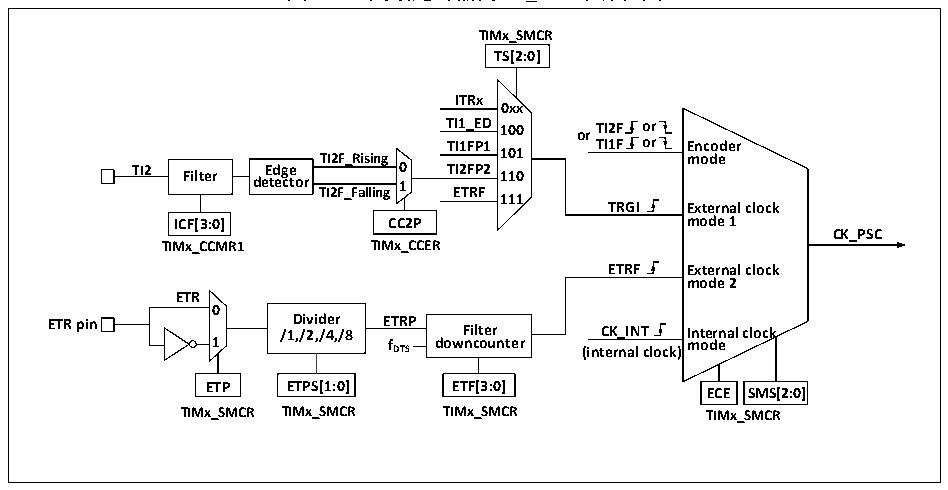

<!-- source-page: 181 -->

[← p.180](0180.md) · [index](../README.md) · [PDF p.181](https://ch32-riscv-ug.github.io/CH32V407/datasheet_zh/CH32V407RM.PDF#page=181) · [p.182 →](0182.md)

<!-- header: CH32V407应用手册 https://wch.cn -->

### 14.2.2 时钟输入

图14-2 高级定时器的CK_PSC来源框图  
 <!-- rendered from the PDF; verify at https://ch32-riscv-ug.github.io/CH32V407/datasheet_zh/CH32V407RM.PDF#page=181 -->

🖼 Text parsed from the figure above

<strong>TIMx_SMCR</strong>  
<strong>TS[2:0]</strong>  
<strong>ITRx</strong>  
<strong>0xx</strong>  
<strong>TI1_ED 100 or TI2F or</strong>  
<strong>TI1FP1 TI1F or Encoder</strong>  
<strong>TI2F_Rising 101 mode</strong>  
<strong>TI2 Filter de E t d e g c e tor TI2F_Falling 0 1 T E I2 T F R P F 2 110</strong>  
<strong>111</strong>  
<strong>TRGI External clock</strong>  
<strong>ICF[3:0] CC2P mode 1</strong>  
<strong>CK_PSC</strong>  
<strong>TIMx_CCMR1 TIMx_CCER</strong>  
<strong>ETRF External clock</strong>  
<strong>mode 2</strong>  
<strong>ETR</strong>  
<strong>0</strong>  
<strong>ETR pin 1 /1 D ,/ i 2 vi , d /4 e , r /8 E f T D R TS P dow F n i c lt o e u r nter (int C e K r _ n I a N l T clock) I m n o te d r e nal clock</strong>  
<strong>ETP ETPS[1:0] ETF[3:0] ECE SMS[2:0]</strong>  
<strong>TIMx_SMCR TIMx_SMCR TIMx_SMCR TIMx_SMCR</strong>  

高级定时器CK_PSC的时钟来源很多，可以分为4类：  
1） 外部时钟引脚（ETR）输入时钟的路线：ETR→ETRP→ETRF；  
2） 内部PB时钟输入路线：CK_INT；  
3） 来自比较捕获通道引脚（TIMx_CHx）的路线：TIMx_CHx→TIx→TIxFPx，此路线也用于编码器模  
式；  
4） 来自内部其他定时器的输入：ITRx；  
通过决定CK_PSC来源的SMS的输入脉冲选择可以将实际的操作分为4类：  
1） 选择内部时钟源（CK_INT）；  
2） 外部时钟源模式1；  
3） 外部时钟源模式2；  
4） 编码器模式；  
上文提到的4种时钟源来源都可通过这4种操作选定。  

#### 14.2.2.1 内部时钟源（CK_INT）

如果将SMS域保持000b时启动高级定时器，那么就是选定内部时钟源（CK_INT）为时钟。此时  
CK_INT就是CK_PSC。  

#### 14.2.2.2 外部时钟源模式1

如果将SMS域设置为111b时，就会启用外部时钟源模式1。启用外部时钟源1时，TRGI被选定  
为CK_PSC的来源，值得注意的，还需要通过配置TS域来选择TRGI的来源。TS域可选择以下几种  
脉冲作为时钟来源：  
1） 内部触发（ITRx，x为0，1，2，3）；  
2） 比较捕获通道1经过边缘检测器后的信号（TI1F_ED）；  
3） 比较捕获通道的信号TI1FP1、TI2FP2；  
4） 来自外部时钟引脚输入的信号ETRF。  

#### 14.2.2.3 外部时钟源模式2

使用外部触发模式2能在外部时钟引脚输入的每一个上升沿或下降沿计数。将ECE位置位时，  
将使用外部时钟源模式2。使用外部时钟源模式2时，ETRF被选定为CK_PSC。ETR引脚经过可选的  
<!-- image: p181-draw-image-00001 bbox=[507.84, 786.36, 527.28, 796.68] -->
<!-- footer: V1.2 179 -->
