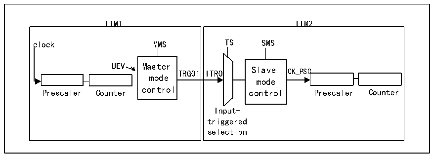
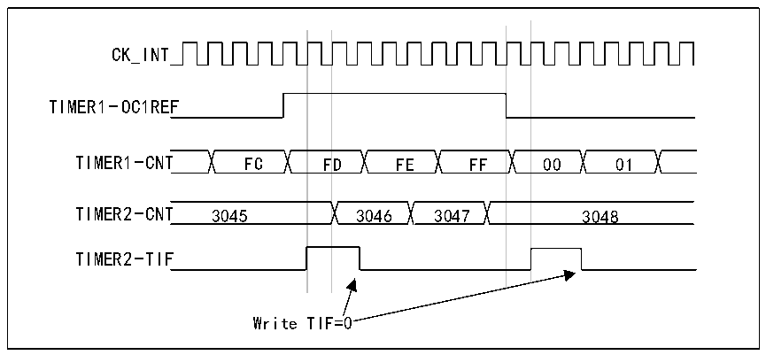

<!-- source-page: 189 -->

[← p.188](0188.md) · [index](../README.md) · [PDF p.189](https://ch32-riscv-ug.github.io/CH32V407/datasheet_zh/CH32V407RM.PDF#page=189) · [p.190 →](0190.md)

<!-- header: CH32V407应用手册 https://wch.cn -->
将一个定时器用作另一个定时器的预分频器  

图14-10主/从定时器示例  
 <!-- rendered from the PDF; verify at https://ch32-riscv-ug.github.io/CH32V407/datasheet_zh/CH32V407RM.PDF#page=189 -->

🖼 Text parsed from the figure above

TIM1 TIM2  
TIM1 clock MMS UEV Master TRGO1 mode control Prescaler Counter  TIM2 TS SMS ITRO Slave CK_PSC mode control Prescaler Counter Input- triggered selection  

例如，可以将定时器1配置为定时器2的预分频器。为此：  
1) 将定时器1配置为主模式，每次发生更新事件UEV时都输出一个周期性触发信号。如果将  
MMS=010写入R16_TIM1_CTLR2，则每当生成更新事件，TRGO1都会输出一个上升沿。  
2) 要将定时器1的TRGO1输出连接到定时器2，必须将定时器2配置为从模式，使用ITR0作  
为内部触发。通过R16_TIM2_SMCFGR寄存器中的TS位（写入TS=000）可对此进行选择。  
3) 然后将从模式控制器设为外部时钟模式1（在R16_TIM2_SMCFGR寄存器中写入SMS=111）。  
这样一来，定时器2的时钟将由定时器1周期性触发信号的上升沿（与定时器1的计数器  
上溢对应）提供。  
4) 最后必须通过将这两个定时器的相应CEN位（R16_TIMx_CTLR1寄存器）置1同时使能二者。  
注：如果选择定时器1的OCx信号作为触发输出(MMS=1xx)，该信号的上升沿将用于驱动定时器2  
的计数器。  
使用一个定时器使能另一个定时器  
本例中通过定时器1的输出比较1来使能定时器2。仅当定时器1的OC1REF为高电平时，定时  
器2才根据分频后的内部时钟进行计数。两个计数器的时钟频率都基于CK_INT通过预分频器执行3  
分频(fCK_CNT=fCK_INT/3)。  
1) 将定时器 1 配置为主模式，发送其输出比较 1 参考信号(OC1REF)作为触发输出  
（R16_TIM1_CR2寄存器中的MMS=100）。  
2) 配置定时器1的OC1REF波形（R16_TIM1_CCMR1寄存器）。  
3) 配置定时器2以接收来自定时器1的输入触发（R16_TIM2_SMCFGR寄存器中的TS=000）。  
4) 将定时器2配置为门控模式（R16_TIM2_SMCFGR寄存器中的SMS=101）。  
5) 通过向CEN位（R16_TIM2_CTLR1寄存器）写入“1”使能定时器2。  
6) 通过向CEN位（R16_TIM1_CTLR1寄存器）写入“1”启动定时器1。  
注：计数器2的时钟与计数器1不同步，此模式仅影响定时器2的计数器使能信号。  

图14-11 使用定时器1的OC1REF对定时器2实施门控控制  
 <!-- rendered from the PDF; verify at https://ch32-riscv-ug.github.io/CH32V407/datasheet_zh/CH32V407RM.PDF#page=189 -->

<!-- image: p189-draw-image-00001 bbox=[507.84, 786.36, 527.28, 796.68] -->
<!-- footer: V1.2 187 -->
