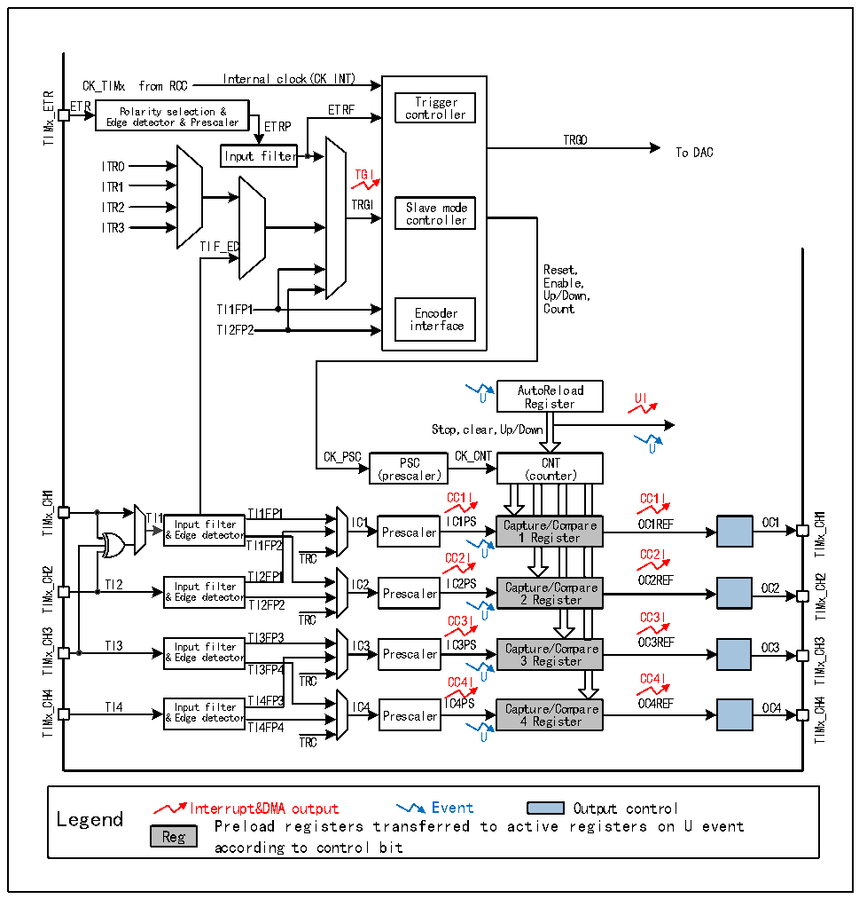

<!-- source-page: 214 -->

[← p.213](0213.md) · [index](../README.md) · [PDF p.214](https://ch32-riscv-ug.github.io/CH32V407/datasheet_zh/CH32V407RM.PDF#page=214) · [p.215 →](0215.md)

<!-- header: CH32V407应用手册 https://wch.cn -->

## 15.2 原理和结构

图15-1 通用定时器的结构框图  
 <!-- rendered from the PDF; verify at https://ch32-riscv-ug.github.io/CH32V407/datasheet_zh/CH32V407RM.PDF#page=214 -->

🖼 Text parsed from the figure above

Internal clock(CK_INT)  
CK_TIMx from RCC  
TIMx_ETR  
ETR Polarity selection &amp; ETRF co T n r t i r g o g l e l r e r  
Polarity selection &amp; Edge detector &amp; Prescaler  
TRGO  
Input filter To DAC  
ITR0  
TGI  
ITR1  
ITR2 TRGI Slave mode  
controller  
ITR3  
TIF_ED  
Reset,  
Enable,  
Up/Down,  
TI1FP1 Encoder Count  
TI2FP2 interface  
AutoReload  
U Register UI  
Stop,clear,Up/Down  
U  
CK_PSC CK_CNT  
PSC CNT  
(prescaler) (counter)  
TIMx_CH1  
CC1I CC1I  
TI1 Input filter TI1FP1 IC1 IICC11PPSS Capture/Compare OC1REF OC1  
TIMx_CH1  
&amp; Edge detector Prescaler 1 Register  
TI1FP2  
TRC CC2I U CC2I  
TIMx_CH2  
TI2 &amp; I E n d p g u e t d f e i t l e t c e t r o r T T I I 2 2 F F P P 1 2 IC2 Prescaler IC2PS Cap 2 t u R r e e g / i C s o t m e p r are OC2REF OC2  
TIMx_CH2  
TRC CC3I U CC3I  
TIMx_CH3  
TI3 &amp; I E n d p g u e t d f e i t l e t c e t r o r TI3FP3 IC3 Prescaler IC3PS Cap 3 t u R r e e g / i C s o t m e p r are OC3REF OC3  
TIMx_CH3  
TI3FP4  
TRC CC4I U CC4I  
TIMx_CH4  
TI4 Input filter TI4FP3 IC4 IC4PS Capture/Compare OC4REF OC4  
TIMx_CH4  
&amp; Edge detector Prescaler 4 Register  
TI4FP4  
TRC U  
Interrupt&amp;DMA output Event Output control  
Legend  
Preload registers transferred to active registers on U event  
Reg  
according to control bit  

### 15.2.1 概述

如图15-1所示，通用定时器的结构大致可以分为三部分，即输入时钟部分，核心计数器部分和  
比较捕获通道部分。  
通用定时器的时钟可以来自于PB1总线时钟（CK_INT），可以来自外部时钟输入引脚（TIMx_ETR），  
可以来自于其他具有时钟输出功能的定时器（ITRx），还可以来自于比较捕获通道的输入端  
（TIMx_CHx）。这些输入的时钟信号经过各种设定的滤波分频等操作后成为CK_PSC时钟，输出给核  
心计数器部分。另外，这些复杂的时钟来源还可以作为TRGO输出给其他的定时器、ADC等外设。  
通用定时器的核心是一个16位计数器（CNT）。CK_PSC经过预分频器（PSC）分频后，成为CK_CNT  
再最终输给CNT，CNT支持增计数模式、减计数模式和增减计数模式。在减计数模式下每个计数周期  
结束后为CNT重装载初始值。在增计数下每个计数周期结束后为CNT从0开始计数。  
通用定时器拥有四组比较捕获通道，每组比较捕获通道都可以从专属的引脚上输入脉冲，也可  
以向引脚输出波形，即比较捕获通道支持输入和输出模式。比较捕获寄存器每个通道的输入都支持  
<!-- image: p214-draw-image-00001 bbox=[507.84, 786.36, 527.28, 796.68] -->
<!-- footer: V1.2 212 -->
