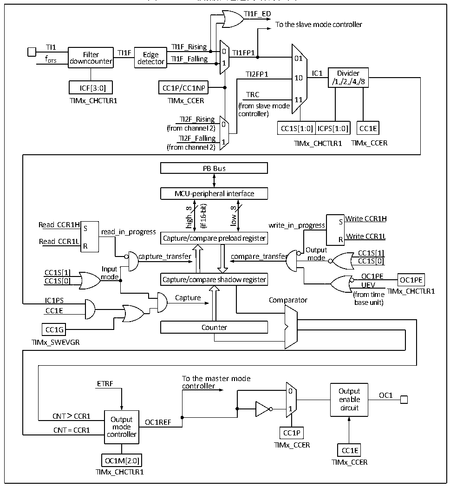

<!-- source-page: 217 -->

[← p.216](0216.md) · [index](../README.md) · [PDF p.217](https://ch32-riscv-ug.github.io/CH32V407/datasheet_zh/CH32V407RM.PDF#page=217) · [p.218 →](0218.md)

<!-- header: CH32V407应用手册 https://wch.cn -->

图15-3 比较捕获通道的结构框图  
 <!-- rendered from the PDF; verify at https://ch32-riscv-ug.github.io/CH32V407/datasheet_zh/CH32V407RM.PDF#page=217 -->

🖼 Text parsed from the figure above

TI1F_ED  
To the slave mode controller  
TI1 TI1F_Rising  
Filter TI1F Edge 0 TI1FP1  
f DTS downcounter detector TI1F_Falling 1 01  
TI2FP1 IC1 Divider  
10  
/1,/2,/4,/8  
ICF[3:0] CC1P/CC1NP  
TRC  
TIMx_CHCTLR1 TIMx_CCER 11  
(from slave mode  
controller)  
TI2F_Rising  
0  
CC1S[1:0]  ICPS[1:0]  
(from channel 2) CC1S[1:0] ICPS[1:0] CC1E  
TI2F_Falling  
1 TIMx_CCER  
TIMx_CHCTLR1  
(from channel 2)  
PB Bus  
MCU-peripheral interface  
16-bit)  
8  
8  
low  
high  
Write CCR1H  
Read CCR1H write_in_progress S S  
(if  
read_in_progress  
Write CCR1L Read CCR1L R  
Capture/compare preload register  
R  
Output  
CC1S[1]  
capture_transfer compare_transfer mode  
CC1S[0]  
Input  
CC1S[1]  
mode OC1PE CC1S[0] OC1PE  
Capture/compare shadow register  
UEV  
TIMx_CHCTLR1  
(from time  
IC1PS Capture Comparator base unit)  
CC1E  
CC1G Counter  
TIMx_SWEVGR  
To the master mode  
ETRF controller  
0 Output  
OC1  
enable  
1 circuit  
CNT &gt; CCR1  
Output OC1REF  
mode  
CNT = CCR1 controller CC1P  
TIMx_CCER  
CC1E  
OC1M[2:0] TIMx_CCER  
TIMx_CHCTLR1  

信号从通道x引脚输入进来后可选做为TI（x TI1的来源可以不只是CH1，见定时器的框图15-1），  
以 TI1 举例：TI1 经过滤波器（ICF[3:0]）生成 TI1F，再经过边沿检测器分成 TI1F_Rising 和  
TI1F_Falling，这两个信号经过选择（CC1P）生成TI1FP1，TI1FP1和来自通道2的TI2FP1一起送  
给CC1S选择成为IC1，经过ICPS分频后送给比较捕获寄存器。  
比较捕获寄存器由一个预装载寄存器和一个影子寄存器组成，读写过程仅操作预装载寄存器。  
在捕获模式下，捕获发生在影子寄存器上，然后复制到预装载寄存器；在比较模式下，预装载寄存  
器的内容被复制到影子寄存器中，然后影子寄存器的内容与核心计数器（CNT）进行比较。  

## 15.3 功能和实现

通用定时器复杂功能的实现都是对定时器的比较捕获通道、时钟输入电路和计数器及周边组件  
进行操作实现的。定时器的时钟输入可以来自于包括比较捕获通道的输入在内的多个时钟源。对比  
<!-- image: p217-draw-image-00001 bbox=[507.84, 786.36, 527.28, 796.68] -->
<!-- footer: V1.2 215 -->
