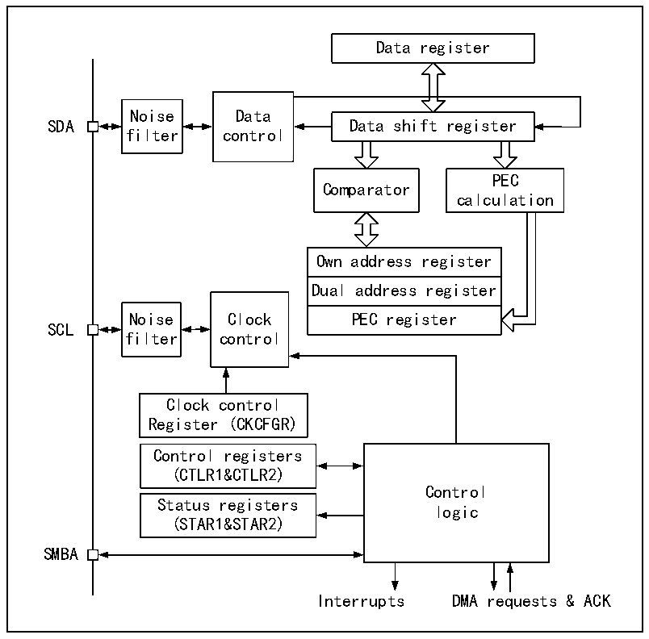

<!-- source-page: 259 -->

[← p.258](0258.md) · [index](../README.md) · [PDF p.259](https://ch32-riscv-ug.github.io/CH32V407/datasheet_zh/CH32V407RM.PDF#page=259) · [p.260 →](0260.md)

<!-- header: CH32V407应用手册 https://wch.cn -->

图18-2 I2C功能框图  
 <!-- rendered from the PDF; verify at https://ch32-riscv-ug.github.io/CH32V407/datasheet_zh/CH32V407RM.PDF#page=259 -->

🖼 Text parsed from the figure above

Data register  
Noise Data  
SDA Data shift register  
filter control  
PEC  
Comparator  
calculation  
Own address register  Dual address register  PEC register  
Noise Clock PEC register  
SCL  
filter control  
Clock control  
Register (CKCFGR)  
Control registers  
(CTLR1&amp;CTLR2)  
Control  
Status registers  
logic  
(STAR1&amp;STAR2)  
SMBA  
Interrupts DMA requests &amp; ACK  

## 18.3 主模式

主模式时，I2C 模块主导数据传输并输出时钟信号，数据传输以开始事件开始，以结束事件结  
束。使用主模式通讯的步骤为：  
在控制寄存器2（R16_I2C_CTLR2）和时钟控制寄存器（R16_I2C_CKCFGR）中设置正确的时钟；  
在上升沿寄存器（R16_I2C_RTR）设置合适的上升沿；  
在控制寄存器（R16_I2C_CTLR1）中置PE位启动外设；  
在控制寄存器（R16_I2C_CTLR1）中置START位，产生起始事件。在置START位后，I2C模块会  
自动切换到主模式，MSL 位会置位，产生起始事件，在产生起始事件后，SB 位会置位，如果  
ITEVTEN 位（在 R16_I2C_CTLR2）被置位，则会产生中断。此时应该读取状态寄存器 1  
（R16_I2C_STAR1），写从地址到数据寄存器后，SB位会自动清除；  
如果是使用 10 位地址模式，那么写数据寄存器发送头序列（头序列为 11110xx0b，其中的 xx  
位是10位地址的最高两位）。  
在发送完头序列之后，状态寄存器的ADD10位会被置位，如果ITEVTEN位已经置位，则会产生  
中断，此时应读取R16_I2C_STAR1寄存器后，写第二个地址字节到数据寄存器后，清除ADD10位。  
然后写数据寄存器发送第二个地址字节，在发送完第二个地址字节后，状态寄存器的 ADDR 位  
会被置位，如果ITEVTEN位已经置位，则会产生中断，此时应读取R16_I2C_STAR1寄存器后再读一  
次R16_I2C_STAR2寄存器以清除ADDR位；  
如果使用的是7位地址模式，那么写数据寄存器发送地址字节，在发送完地址字节后，状态寄  
存器的 ADDR 位会被置位，如果 ITEVTEN 位已经置位，则会产生中断，此时应读取 R16_I2C_STAR1  
<!-- image: p259-draw-image-00001 bbox=[507.84, 786.36, 527.28, 796.68] -->
<!-- footer: V1.2 257 -->
