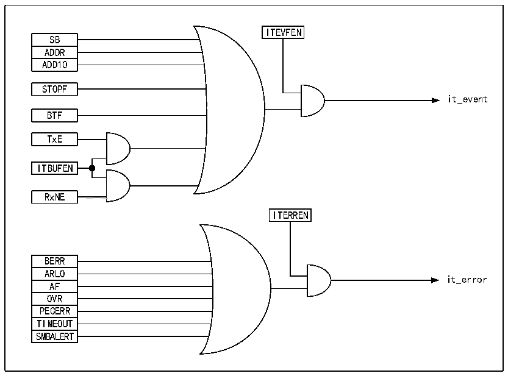

<!-- source-page: 262 -->

[← p.261](0261.md) · [index](../README.md) · [PDF p.262](https://ch32-riscv-ug.github.io/CH32V407/datasheet_zh/CH32V407RM.PDF#page=262) · [p.263 →](0263.md)

<!-- header: CH32V407应用手册 https://wch.cn -->
● 在发送模式下，如果TxE置位且BTF置位，SCL将一直为低，一直等待用户读取状态寄存器，  
并向数据寄存器写入待发送的数据；  
● 在接收模式下，如果RxNE置位且BTF置位，那么SCL在接收到数据后将保持低，直到用户读取  
状态寄存器，并读取数据寄存器；  
由此可见，使能时钟延长可以避免出现过载/欠载错误。  

## 18.7 SMBus

SMBus也是一种双线接口，它一般应用在系统和电源管理之间。SMBus和I2C有很多相似的地方，  
例如SMBus使用和I2C一样的7位地址模式，以下是SMBus和I2C的共同点：  
1） 主从通信模式，主机提供时钟，支持多主多从；  
2） 两线通讯结构，其中SMBus可选一个警示线；  
3） 都支持7位地址格式。  
同时SMBus和I2C也存在区别：  
1） I2C支持的速度最高400KHz，而SMBus支持的最高是100KHz，且SMBus有最小10KHz的速度限  
制；  
2） SMBus的时钟为低超过35mS时，会报超时，但I2C无此限制；  
3） SMBus有固定的逻辑电平，而I2C没有，取决于VDD；  
4） SMBus有总线协议，而I2C没有。  
SMBus还包括设备识别、地址解析协议、唯一的设备标识符、SMBus提醒和各种总线协议，具体  
请参考SMBus规范2.0版本。当使用SMBus时，只需要置控制寄存器的SMBus位，按需配置SMBTYPE  
位和ENAARP位。  

## 18.8 中断

每个I2C模块都有两种中断向量，分别是事件中断和错误中断。两种中断支持图18-4的中断源。  

图18-4 I2C中断请求  
 <!-- rendered from the PDF; verify at https://ch32-riscv-ug.github.io/CH32V407/datasheet_zh/CH32V407RM.PDF#page=262 -->

🖼 Text parsed from the figure above

ITEVFEN  
SB  ADDR  ADD10  
STOPF  
it_event  
BTF  
TxE  
ITBUFEN  
RxNE  
<!-- image: p262-draw-image-00002 inside the figure -->
ITERREN  
BERR  ARLO  AF  OVR  PECERR  TIMEOUT  SMBALERT  
it_error  

<!-- image: p262-draw-image-00001 bbox=[507.84, 786.36, 527.28, 796.68] -->
<!-- footer: V1.2 260 -->
