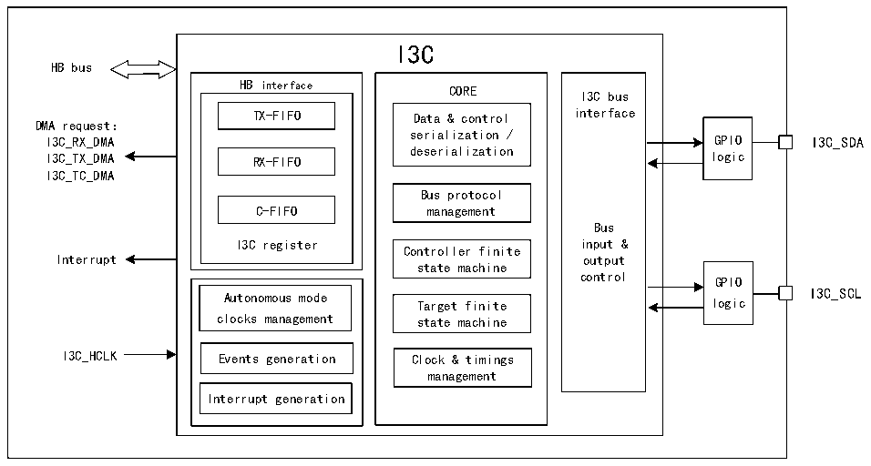

<!-- source-page: 272 -->

[← p.271](0271.md) · [index](../README.md) · [PDF p.272](https://ch32-riscv-ug.github.io/CH32V407/datasheet_zh/CH32V407RM.PDF#page=272) · [p.273 →](0273.md)

<!-- header: CH32V407应用手册 https://wch.cn -->

# 第 19 章 I3C 总线（I3C）

I3C总线是一种双线制串行单端多分支总线，旨在对传统的I2C总线进行改进。I3C接口负责处  
理本设备与连接在I3C总线上的其他设备之间的通信。作为主设备时，能够增强I2C接口的功能，  
同时保持一定程度的向后兼容性。  

## 19.1 主要特征

● 支持主设备  
● 支持MIPI I3C规范v1.1  
● 支持DMA功能  
● 带内中断（IBI）功能  
● 热加入（HJ）功能  
● 内置错误检测和恢复  
● 支持动态分配地址，直接和广播通用命令代码（CCC）和私有读写传输  

## 19.2 概述

图19-1 I3C的结构框图  
 <!-- rendered from the PDF; verify at https://ch32-riscv-ug.github.io/CH32V407/datasheet_zh/CH32V407RM.PDF#page=272 -->

🖼 Text parsed from the figure above

I3C  
HB bus  
HB interface CORE I3C bus  
TX-FIFO Data &amp; control interface  
DMA request：  
serialization /  
I3C_RX_DMA GPIO I3C_SDA  
I3C_TX_DMA RX-FIFO deserialization logic  
I3C_TC_DMA  
Bus protocol  
C-FIFO management  
Bus  
I3C register Controller finite input &amp;  
Interrupt output  
state machine  
control GPIO  
Autonomous mode Target finite logic I3C_SCL  
clocks management state machine  
I3C_HCLK Events generation Clock &amp; timings  
management  
Interrupt generation  

## 19.3 功能描述

### 19.3.1 I3C外设状态

I3C外设只作I3C主设备。在任何情况下，外设都处于以下状态之一：  
● 禁止状态  
操作条件：I3C外设复位（RCC模块中的I3CRST位置1进行I3C复位）后，外设处于禁止状态。  
禁止状态至空闲状态的转换：当软件将R32_I3C_CFGR寄存器EN位置1时，外设在完成内部配置参  
数的校验后，由禁止状态切换至空闲状态。  
● 空闲状态  
<!-- image: p272-draw-image-00001 bbox=[507.84, 786.36, 527.28, 796.68] -->
<!-- footer: V1.2 270 -->
