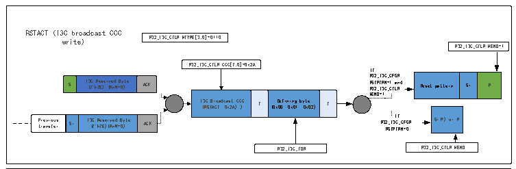

<!-- source-page: 277 -->

[← p.276](0276.md) · [index](../README.md) · [PDF p.277](https://ch32-riscv-ug.github.io/CH32V407/datasheet_zh/CH32V407RM.PDF#page=277) · [p.278 →](0278.md)

<!-- header: CH32V407应用手册 https://wch.cn -->

图19-4 I3C广播、直接读/写RSTACT CCC（作为主设备）  
 <!-- rendered from the PDF; verify at https://ch32-riscv-ug.github.io/CH32V407/datasheet_zh/CH32V407RM.PDF#page=277 -->

🖼 Text parsed from the figure above

RSTACT (I3C broadcast CCC  
write) R32_I3C_CTLR.MTYPE[3:0]=0110  
R32_I3C_CTLR.MEND=1  
R32_I3C_CTLR.CCC[7:0]=0x2A  
If  
S  I3C Reserved Byte (7&#x27;h7E) (RnW=0)  ACK  
Reset pattern  Sr  P  
R32_I3C_CFGR.  
S I ( 3 7 C &#x27; h R 7 e E s ) e r ( v R e n d W = B 0 y ) te ACK R R S 32 TP _ T I R 3 N C = _ 1 C TL an R. d Reset pattern Sr P  
I3C Broadcast CCC (RSTACT, 0x2A) )  T  Defining byte (0x00, 0x01, 0x02)  T  
MEND=1  
P t r r e a v n i s o f u e s r Sr I3 ( C 7 &#x27; R h e 7E s ) er (R v n ed W= B 0 y ) te ACK R32 RS _I TP 3 I T C f R _ N CF =0 G R. Sr(*) or P  
Previous transfer  Sr  I3C Reserved Byte (7&#x27;h7E)(RnW=0)  ACK  
R32_I3C_TDR R32_I3C_CTLR.MEND  

<!-- p277-table-005 (table-18-1@1) -->
<table><tr><th style="text-align:left">RSTACT (I3C direct CCC write), first part R32_I3C_CTLR.MTYPE[3:0]=0110 R32_I3C_CTLR.CCC[7:0]=0x9A R32_I3C_CTLR.DCNT[15:0]=1 R32_I3C_CTLR.MEND=0 S I ( 3 7 C &#x27; h R 7 e E s ) e r ( v R e n d W = B 0 y ) te ACK I ( 3 R C S T D A i C r T e , c t 0 x C 9 C A C ) T (0x D 0 e 0 f , i n 0 i x n 0 g 1 , b y 0 t x e 0 2) T Sr P t r r e a v n i s o f u e s r Sr I ( 3 7 C &#x27; R h e 7 s E e ) r ( v R e n d W = B 0 y ) te ACKR32_I3C_TDR</th></tr><tr><td style="text-align:left">RSTACT (I3C direct CCC write): n x second part R32_I3C_CTLR.MTYPE[3:0]=0011 R32_I3C_CTLR.ADD[6:0] R32_I3C_CTLR.RNW=0 R32_I3C_CTLR.MEND=1If R32_I3C_CFGR. RSTPTRN=1 and R32_I3C_CTLR. Reset pattern Sr P I3C sl (R a n ve W= 0 Ad ) dress ACK MEND=1If R32_I3C_CFGR. RSTPTRN=0 Sr(*) or P If Sr Repeat for each addressed slave R32_I3C_CTLR.MEND</td></tr></table>

<!-- p277-table-006 (table-18-1@1) -->
<table><tr><th>S</th><th style="text-align:left">I3C Reserved Byte (7&#x27;h7E) (RnW=0)</th><th>ACK</th></tr></table>

<!-- p277-table-007 (table-18-1@1) -->
<table><tr><th style="text-align:left">I3C Direct CCC (RSTACT, 0x9A)</th><th>T</th><th style="text-align:left">Defining byte (0x00, 0x01, 0x02)</th><th>T</th></tr></table>

<!-- p277-table-008 (table-18-1@1) -->
<table><tr><th style="text-align:left">Previous transfer</th><th>Sr</th><th style="text-align:left">I3CReserved Byte (7&#x27;h7E)(RnW=0)</th><th>ACK</th></tr></table>

<!-- p277-table-009 (table-18-1@1) -->
<table><tr><th>Reset pattern</th><th>Sr P</th></tr></table>

<!-- p277-table-010 (table-18-1@1) -->
<table><tr><th style="text-align:left">I3C slave Address (RnW=0)</th><th>ACK</th></tr></table>

> ⚠ Table extraction recorded 1 issue(s) (overlapping merged cells); verify against [the PDF, p.277](https://ch32-riscv-ug.github.io/CH32V407/datasheet_zh/CH32V407RM.PDF#page=277).

<!-- p277-table-011 (table-18-1@1) -->
<table><tr><th colspan="3" style="text-align:left">RSTACT (I3C direct CCC read), first part R32_I3C_CTLR.MTYPE[3:0]=0110 R32_I3C_CTLR.CCC[7:0]=0x9A R32_I3C_CTLR.DCNT[15:0]=1 R32_I3C_CTLR.MEND=0 S I ( 3 7 C &#x27; h R 7 e E s ) e r ( v R e n d W = B 0 y ) te ACK I 3 ( C RS D T i AC re T c ,0 t x C 9A CC ) T (0x D 0 e 0 f , i n 0 i x n 0 g 1 , b y 0 t x e 0 2) T Sr P t r r e a v n i s o f u e s r Sr I ( 3 7 C &#x27; h Re 7E s ) e ( r R v n ed W= 0 By ) te ACKR32_I3C_TDR</th></tr><tr><td rowspan="2" colspan="2" style="text-align:left">RSTACT (I3C direct CCC read): n x second part R32_I3C_CTLR.MTYPE[3:0]=0011</td><td></td></tr><tr><td style="text-align:left">RSTACT (I3C direct CCC read): n x second part</td><td></td></tr></table>

<!-- p277-table-012 (table-18-1@1) -->
<table><tr><th>S</th><th style="text-align:left">I3C Reserved Byte (7&#x27;h7E) (RnW=0)</th><th>ACK</th></tr></table>

<!-- p277-table-013 (table-18-1@1) -->
<table><tr><th style="text-align:left">I3C Direct CCC (RSTACT,0x9A)</th><th>T</th><th style="text-align:left">Defining byte (0x00, 0x01, 0x02)</th><th>T</th><th>Sr</th></tr></table>

<!-- p277-table-014 (table-18-1@1) -->
<table><tr><th style="text-align:left">Previous transfer</th><th>Sr</th><th style="text-align:left">I3C Reserved Byte (7&#x27;h7E)(RnW=0)</th><th>ACK</th></tr></table>

R32_I3C_CTLR.ADD[6:0] R32_I3C_CTLR.RNW=1 If  

<!-- p277-table-015 (table-18-1@1) -->
<table><tr><th>Reset pattern</th><th>Sr</th><th>P</th></tr></table>

R32_I3C_CFGR.  
MEND=1  

<!-- p277-table-016 (table-18-1@1) -->
<table><tr><th>ACK</th><th>Read Data byte</th><th>T</th></tr></table>

If R32_I3C_CFGR.RSTPTRN=0 Sr(*) or P  
If Sr  
Repeat for each addressed slave R32_I3C_RDR  
R32_I3C_CTLR.MEND  

<!-- p277-table-017 (table-18-1@1) -->
<table><tr><th></th></tr><tr><td></td></tr><tr><td></td></tr><tr><td></td></tr><tr><td>ACK</td></tr><tr><td>ACK</td></tr><tr><td>T</td></tr><tr><td>T</td></tr></table>

Master (&amp; slave) drive(s) SDA low/high Z in open-drain (arbitrable header)  
Master drives SDA in open drain  
Master drives SDA in push-pull  
slave drives SDA in push-pull  
ACK Acknowledge from the addressed slave(s) (which drive(s) SDA low in open drain) with hand-off (ie switch back SDA control to Master)  
ACK Acknowledge from the addressed slave(s) (which drive(s) SDA low in open-drain) without hand-off (ie continues driving SDA)  
T Transition bit (parity bit for write data) from Master (drives SDA in push-pull)  
T Transition bit (end of data for read data) from Master and/ or from slave (drive SDA low/highZ in open-drain)  
Sr(* ): Sr is followed by 7&#x27;h7E+W broadcast address at the end of a direct CCC message  
<!-- image: p277-draw-image-00001 bbox=[507.84, 786.36, 527.28, 796.68] -->
<!-- footer: V1.2 275 -->
