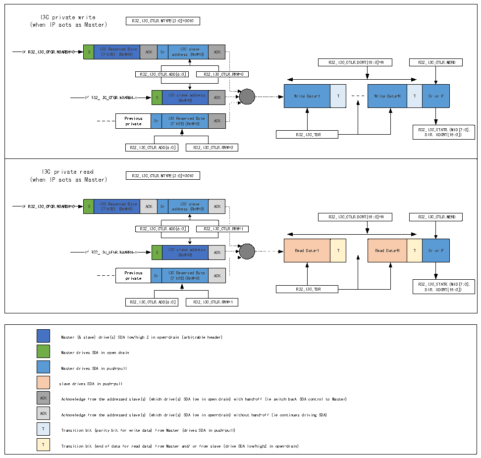

<!-- source-page: 278 -->

[← p.277](0277.md) · [index](../README.md) · [PDF p.278](https://ch32-riscv-ug.github.io/CH32V407/datasheet_zh/CH32V407RM.PDF#page=278) · [p.279 →](0279.md)

<!-- header: CH32V407应用手册 https://wch.cn -->

#### 19.3.3.4 I3C私有读/写传输（作为主设备）

图19-5 I3C私有读/写消息（作为主设备）  
 <!-- rendered from the PDF; verify at https://ch32-riscv-ug.github.io/CH32V407/datasheet_zh/CH32V407RM.PDF#page=278 -->

🖼 Text parsed from the figure above

I3C private write (when IP acts as Master) R32_I3C_CTLR.MTYPE[3:0]=0010 If R32_I3C_CFGR.NOARBH=0 S I ( 3 7 C &#x27; h R 7 e E s ) e r ( v R e n d W = B 0 y ) te ACK Sr add r I e 3 s C s s ( l R a n v W e = 0) ACK R32_I3C_CTLR.DCNT[15:0]=N R32_I3C_CTLR.MEND R32_I3C_CTLR.ADD[6:0] R32_I3C_CTLR.RNW=0 S I3C s ( l R a n v W e = 0 a ) ddress ACK Write Data-1 T Write Data-N T Sr or P P p r r e i v v i a o t u e s Sr I3 ( C 7 &#x27; R h e 7E s ) e ( r R v n ed W= 0 By ) te ACKR32_I3C_STATR.(MID[7:0], R32_I3C_TDR DIR, XDCNT[15:0]) R32_I3C_CTLR.ADD[6:0] R32_I3C_CTLR.RNW=0  I3C private read (when IP acts as Master) R32_I3C_CTLR.MTYPE[3:0]=0010 If R32_I3C_CFGR.NOARBH=0 S I ( 3 7 C &#x27; h R 7 e E s ) e r ( v R e n d W = B 0 y ) te ACK Sr add r I e 3 s C s s ( l R a n v W e = 0) ACK R32_I3C_CTLR.DCNT[15:0]=N R32_I3C_CTLR.MEND R32_I3C_CTLR.ADD[6:0] R32_I3C_CTLR.RNW=1 S I3C s ( l R a n v W e = 0 a ) ddress ACK Read Data-1 T Read Data-N T Sr or P P p r r e i v v i a o t u e s Sr I3 ( C 7 &#x27; R h e 7E s ) e ( r R v n ed W= 0 By ) te ACKR32_I3C_STATR.(MID[7:0], R32_I3C_TDR DIR, XDCNT[15:0]) R32_I3C_CTLR.ADD[6:0] R32_I3C_CTLR.RNW=1  
S  I3C Reserved Byt (7&#x27;h7E) (RnW=0)  t ) e ACK  Sr  I3C slave address (RnW=0)  ACK  
S  I3C slave address (RnW=0)  ACK  
Previous private  Sr  I3C Reserved Byte (7&#x27;h7E)(RnW=0)  ACK  
S  I3C Reserved Byt (7&#x27;h7E) (RnW=0)  t ) e ACK  Sr  I3C slave address (RnW=0)  ACK  
Read Data-1  T  
Read Data-N  T  Sr or P  
S  I3C slave address (RnW=0)  ACK  
ACK  ACK  T  T  
Master (&amp; slave) drive(s) SDA low/high Z in open-drain (arbitrable header)  
Master drives SDA in open drain  
Master drives SDA in push-pull  
slave drives SDA in push-pull  
ACK Acknowledge from the addressed slave(s) (which drive(s) SDA low in open drain) with hand-off (ie switch back SDA control to Master)  
ACK Acknowledge from the addressed slave(s) (which drive(s) SDA low in open-drain) without hand-off (ie continues driving SDA)  
T Transition bit (parity bit for write data) from Master (drives SDA in push-pull)  
T Transition bit (end of data for read data) from Master and/ or from slave (drive SDA low/highZ in open-drain)  

<!-- image: p278-draw-image-00001 bbox=[507.84, 786.36, 527.28, 796.68] -->
<!-- footer: V1.2 276 -->
