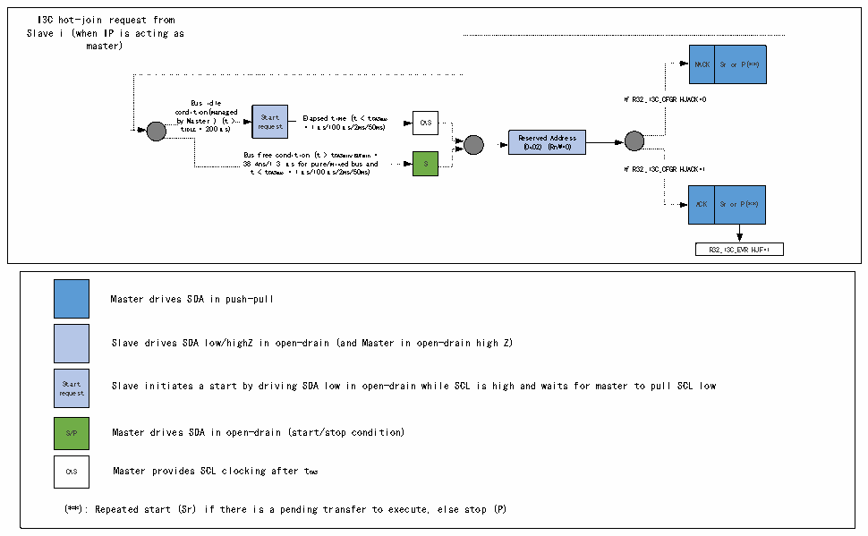

<!-- source-page: 281 -->

[← p.280](0280.md) · [index](../README.md) · [PDF p.281](https://ch32-riscv-ug.github.io/CH32V407/datasheet_zh/CH32V407RM.PDF#page=281) · [p.282 →](0282.md)

<!-- header: CH32V407应用手册 https://wch.cn -->

图19-8 I3C热加入请求传输（作为主设备）  
 <!-- rendered from the PDF; verify at https://ch32-riscv-ug.github.io/CH32V407/datasheet_zh/CH32V407RM.PDF#page=281 -->

🖼 Text parsed from the figure above

I3C hot-join request from  
Slave i (when IP is acting as  
master)  
NACK  Sr or P(**)  
Bus idle If R32_I3C_C FGR.HJACK=0  
c b o y t n I d D M i L a E t s i = t o e n 2 r ( 0 m 0 ) a μ n ( a s t g ) e &gt; d re St qu a e rt st E = l a 1 p μ se s d / 1 t 0 i 0 m μ e s ( / t 2 m &lt; s / t 5 C 0 A m S s ma ) x CAS  
Reserved Address  
(0x02) (RnW=0)  
Bus free condition (t &gt; tCASmin/BUFmin =  
38.4ns/1.3 μs for pure/mixed bus and S  
t &lt; tCASmax = 1μs/100μs/2ms/50ms) If R32_I3C_CFGR.HJACK=1  
ACK  Sr or P(**)  
R32_I3C_EVR.HJF=1  
Master drives SDA in push-pull  
Slave drives SDA low/highZ in open-drain (and Master in open-drain high Z)  
Start Slave initiates a start by driving SDA low in open-drain while SCL is high and waits for master to pull SCL low  
request  
S/P Master drives SDA in open-drain (start/stop condition)  
CAS Master provides SCL clocking after tCAS  
(**): Repeated start (Sr) if there is a pending transfer to execute, else stop (P)  

<!-- image: p281-draw-image-00001 bbox=[507.84, 786.36, 527.28, 796.68] -->
<!-- footer: V1.2 279 -->
