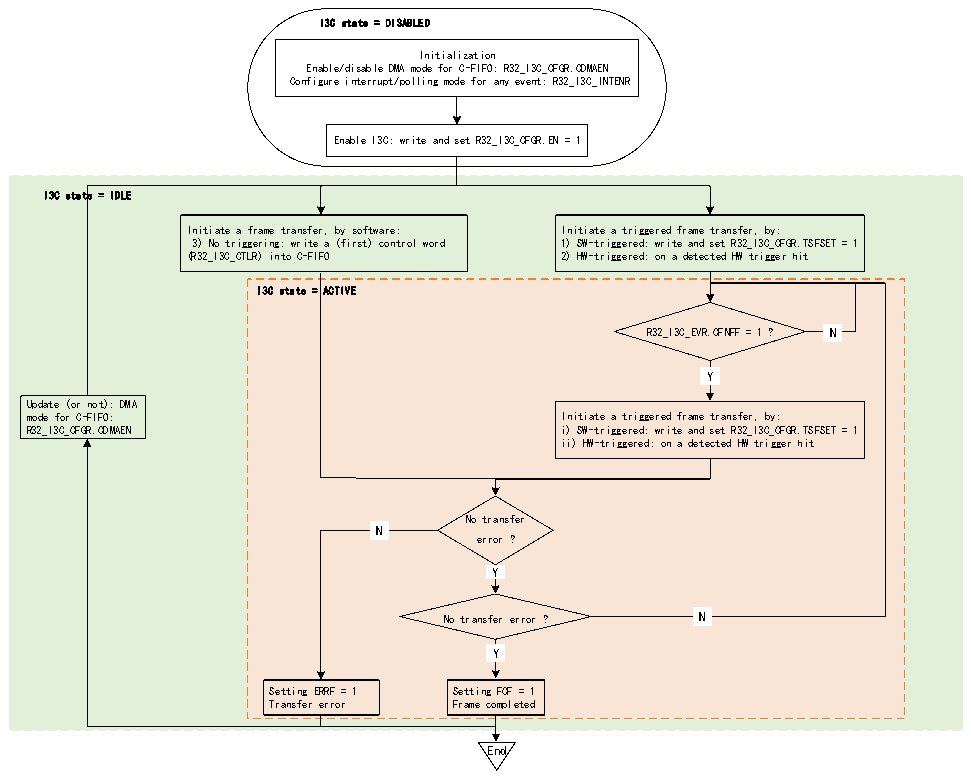

<!-- source-page: 282 -->

[← p.281](0281.md) · [index](../README.md) · [PDF p.282](https://ch32-riscv-ug.github.io/CH32V407/datasheet_zh/CH32V407RM.PDF#page=282) · [p.283 →](0283.md)

<!-- header: CH32V407应用手册 https://wch.cn -->

### 19.3.4 I3C FIFO管理

<!-- p282-table-001 (table-19-1@1) -->
<table><caption>表19-1 I3C FIFO实现</caption><tr><th>FIFO</th><th>内容</th><th>单位</th><th>大小</th><th>用作主设备（基本原理）</th></tr><tr><td>C-FIFO</td><td>32位控制字</td><td>字</td><td>2</td><td style="text-align:left">主设备（一个帧可基于多个控制字；而用作从设备时则不然）</td></tr><tr><td>TX-FIFO</td><td>发送的数据</td><td rowspan="2">字节</td><td rowspan="2">8</td><td rowspan="2">主设备</td></tr><tr><td>RX-FIFO</td><td>接收的数据</td></tr></table>

#### 19.3.4.1 C-FIFO管理（作为主设备）

用作主设备时，可以在C-FIFO广播CCC、直接读/写CCC、私有读/写、传统I2C读/写、软件发  
起的错误恢复期间使用。  
图19-9说明了当I3C外设用作主设备时，如何管理C-FIFO以对I3C总线上的控制字进行排队。  

图19-9 C-FIFO管理（作为主设备）  
 <!-- rendered from the PDF; verify at https://ch32-riscv-ug.github.io/CH32V407/datasheet_zh/CH32V407RM.PDF#page=282 -->

🖼 Text parsed from the figure above

I3C state = DISABLED  
Initialization  
Enable/disable DMA mode for C-FIFO: R32_I3C_CFGR.CDMAEN  
Configure interrupt/polling mode for any event: R32_I3C_INTENR  
Enable I3C: write and set R32_I3C_CFGR.EN = 1  
I3C state = IDLE  
Initiate a frame transfer, by software: Initiate a triggered frame transfer, by:  
3) No triggering: write a (first) control word 1) SW-triggered: write and set R32_I3C_CFGR.TSFSET = 1  
(R32_I3C_CTLR) into C-FIFO 2) HW-triggered: on a detected HW trigger hit  
I3C state = ACTIVE  
N  N  
R32_I3C_EVR.CFNFF = 1 ? N  
Y  Y  
Update (or not): DMA  
mode for C-FIFO: Initiate a triggered frame transfer, by:  
R32_I3C_CFGR.CDMAEN i) SW-triggered: write and set R32_I3C_CFGR.TSFSET = 1  
ii) HW-triggered: on a detected HW trigger hit  
No transfer  
N  N  
error ?  
Y  Y  
N  N  
No transfer error ? N  
Y  Y  
Setting ERRF = 1 Setting FCF = 1  
Transfer error Frame completed  
End  

首先，软件必须通过R32_I3C_CFGR寄存器CDMAEN来初始化C-FIFO管理，具体步骤如下：  
● 软件直接按控制字进行写入（当CDMAEN=0时）：  
– 通过轮询模式（设置 R32_I3C_INTENR 寄存器中的 CFNFIE=0）：在向 R32_I3C_CTLR 寄存器显式  
写入之前，等待硬件请求下一个控制字（R32_I3C_INTENR寄存器中的CFNFF=1）  
– 通过使能的中断通知（当CFNFIE=1时）：  
● 由分配的DMA通道写入（当CDMAEN=1时），以使能相应的I3C外设DMA请求：  
– 根据模块级别的配置，DMA会自动将控制字从其存储器源缓冲区推入/写入R32_I3C_CTLR寄存器，  
<!-- image: p282-draw-image-00001 bbox=[507.84, 786.36, 527.28, 796.68] -->
<!-- footer: V1.2 280 -->
