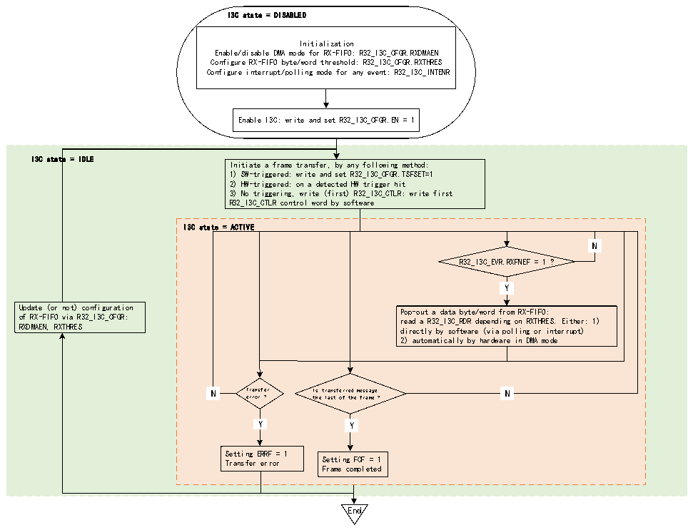

<!-- source-page: 285 -->

[← p.284](0284.md) · [index](../README.md) · [PDF p.285](https://ch32-riscv-ug.github.io/CH32V407/datasheet_zh/CH32V407RM.PDF#page=285) · [p.286 →](0286.md)

<!-- header: CH32V407应用手册 https://wch.cn -->
统I2C读期间使用RX-FIFO。  
图19-11说明了当I3C外设用作主设备时，如何管理RX-FIFO以对要在I3C总线接收到的数据  
字节或字进行排队和弹出。  

图19-11 RX-FIFO管理（作为主设备）  
 <!-- rendered from the PDF; verify at https://ch32-riscv-ug.github.io/CH32V407/datasheet_zh/CH32V407RM.PDF#page=285 -->

🖼 Text parsed from the figure above

I3C state = DISABLED  
Initialization  
Enable/disable DMA mode for RX-FIFO: R32_I3C_CFGR.RXDMAEN  
Configure RX-FIFO byte/word threshold: R32_I3C_CFGR.RXTHRES  
Configure interrupt/polling mode for any event: R32_I3C_INTENR  
Enable I3C: write and set R32_I3C_CFGR.EN = 1  
I3C state = IDLE  
Initiate a frame transfer, by any following method:  
1) SW-triggered: write and set R32_I3C_CFGR.TSFSET=1  
2) HW-triggered: on a detected HW trigger hit  
3) No triggering, write (first) R32_I3C_CTLR: write first  
R32_I3C_CTLR control word by software  
I3C state = ACTIVE  
N  N  
R32_I3C_EVR.RXFNEF = 1 ?  
Y  Y  
Update (or not) configuration Pop-out a data byte/word from RX-FIFO:  
of RX-FIFO via R32_I3C_CFGR: read a R32_I3C_RDR depending on RXTHRES. Either: 1)  
RXDMAEN, RXTHRES directly by software (via polling or interrupt)  
2) automatically by hardware in DMA mode  
N  N  
N Transfer Is transferred message N  
error ? the last of the frame ?  
Y  Y  
Y  Y  
Y Y  
Setting ERRF = 1  
Transfer error Setting FCF = 1  
Frame completed  
End  

首先，软件必须通过R32_I3C_CFGR寄存器的以下位域初始化RX-FIFO管理：  
● RXDMAEN：使能/禁止RX-FIFO的DMA模式  
● RXTHRES：从RX-FIFO弹出数据字节或字  
然后，根据RXDMAEN位读取RX-FIFO：  
● 软件直接按字节/字读取（RXDMAEN=0）：  
–通过轮询模式（R32_I3C_INTENR 寄存器中的 RXFNEIE=0）：在显式读取 R32_I3C_RDR 或  
R32_I3C_RDWR 寄存器之前等待硬件请求下一个数据字节/字（R32_I3C_INTENR 寄存器中的  
RXFNEF=1），具体取决于R32_I3C_CGFR寄存器中的RXTHRES位  
–通过使能的中断通知（如果R32_I3C_INTENR寄存器RXFNEIE=1）  
● 由分配的DMA通道读取（如果RXDMAEN=1），以使能相应的I3C外设DMA请求：  
–根据DMA模块级别的配置，DMA会自动从R32_I3C_RDR或R32_I3C_RDWR寄存器弹出/读取数  
据字节/字（具体取决于RXTHRES位），并将它们写入其存储器从设备缓冲区，直到帧完成（在帧的  
最后一条消息后，I3C总线上会发出停止位），但发生传输错误时除外。  
I3C 消息以起始位或重复起始位开始，以停止位或重复起始位结束。在消息级别，从 I3C 总线  
接收到的最后一个数据字节/字由I3C_EVR寄存器中的IRXLASTF=1进行指示。当I3C帧包含多条消  
息（由重复起始位分隔）时，软件可以使用该事件来更新相应的指针，使之指向用于存储下一条消  
息的数据字节/字的缓冲区。  
<!-- image: p285-draw-image-00001 bbox=[507.84, 786.36, 527.28, 796.68] -->
<!-- footer: V1.2 283 -->
