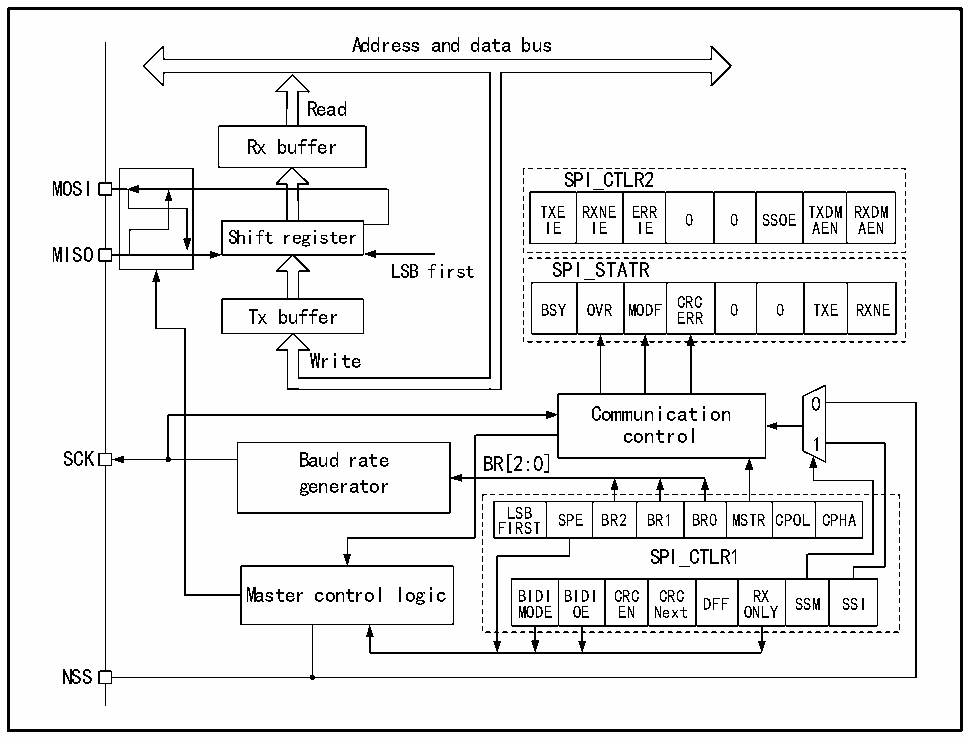

<!-- source-page: 306 -->

[← p.305](0305.md) · [index](../README.md) · [PDF p.306](https://ch32-riscv-ug.github.io/CH32V407/datasheet_zh/CH32V407RM.PDF#page=306) · [p.307 →](0307.md)

<!-- header: CH32V407应用手册 https://wch.cn -->

## 20.2 SPI 功能描述

### 20.2.1 概述

图20-1 SPI结构框图  
 <!-- rendered from the PDF; verify at https://ch32-riscv-ug.github.io/CH32V407/datasheet_zh/CH32V407RM.PDF#page=306 -->

🖼 Text parsed from the figure above

Address and data bus  
<!-- image: p306-draw-image-00004 inside the figure -->
Read  
Rx buffer  
SPI_CTLR2  
MOSI  
TXE RXNE ERR TXDM RXDM  
0 0 SSOE  
IE IE IE AEN AEN  
Shift register  
MISO  
LSB first SPI_STATR  
OVR  MODF  CRCERR  0  0  TXE  
Tx buffer BSY OVR MODF ERR 0 0 TXE RXNE  
Write  
<!-- image: p306-draw-image-00002 inside the figure -->
<!-- image: p306-draw-image-00003 inside the figure -->
0  
Communication  
control  
1  
SCK Baud rate BR[2:0]  
generator  
LSB  
SPE BR2 BR1 BR0 MSTR CPOL CPHA  
FIRST  
SPI_CTLR1  
Master control logic BIDI BIDI CRC CRC RX  
DFF SSM SSI  
MODE OE EN Next ONLY  
NSS  

由图20-1可以看出，与SPI相关的主要是MISO、MOSI、SCK和NSS四个引脚。其中MISO引脚  
在SPI模块工作在主模式下时，是数据输入引脚；工作在从模式下时，是数据输出引脚。MOSI引脚  
工作在主模式下时，是数据输出引脚；工作在从模式时，是数据输入引脚。SCK 是时钟引脚，时钟  
信号一直由主机输出，从机接收时钟信号并同步数据收发。NSS引脚是片选引脚，有以下用法：  
1） NSS由软件控制：此时SSM被置位，内部NSS信号由SSI决定输出高还是低，这种情况一般用  
于SPI主模式；  
2） NSS由硬件控制：在NSS输出使能时，即SSOE置位时，在SPI主机向外发送输出时会主动拉低  
NSS 引脚，如果不能成功拉低 NSS 脚，说明主线上还有其他主设备正在通信，则会产生一个硬  
件错误；SSOE 不置位，则可以用于多主机模式，如果它被拉低则会强行进入从机模式，MSTR  
位会被自动清除。  
可以通过CPHA和CPOL配置SPI的工作模式。CPHA置位表示模块在时钟的第二个边沿进行数据  
采样，数据被锁存，CPHA 不置位表示 SPI 模块在时钟的第一个边沿进行采样，数据被锁存。CPOL  
则表示无数据时时钟保持高电平还是低电平。具体见下图20-2。  
<!-- image: p306-draw-image-00001 bbox=[507.84, 786.36, 527.28, 796.68] -->
<!-- footer: V1.2 304 -->
