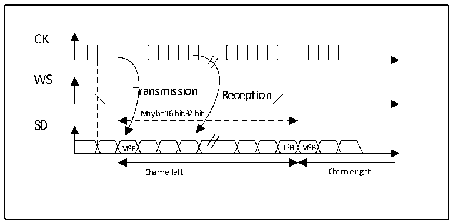
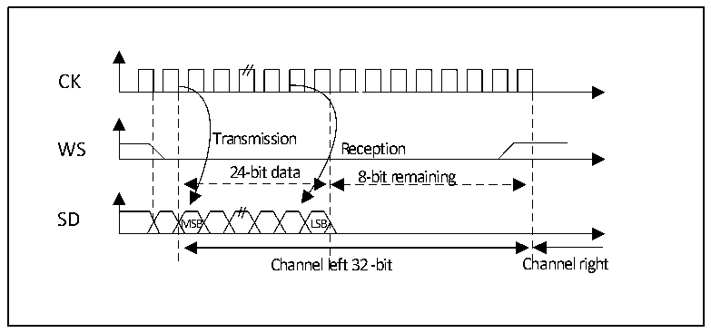

<!-- source-page: 311 -->

[← p.310](0310.md) · [index](../README.md) · [PDF p.311](https://ch32-riscv-ug.github.io/CH32V407/datasheet_zh/CH32V407RM.PDF#page=311) · [p.312 →](0312.md)

<!-- header: CH32V407应用手册 https://wch.cn -->

图20-4 飞利浦协议波形（16/32全精度，CPOL=0）  
 <!-- rendered from the PDF; verify at https://ch32-riscv-ug.github.io/CH32V407/datasheet_zh/CH32V407RM.PDF#page=311 -->

🖼 Text parsed from the figure above

CK  
WS  
Transmission  
Reception  
May be 16-bit,32-bit  
SD  
MSB LSB MSB  
Channel left Channle right  

图20-5 飞利浦协议波形（24位帧，CPOL=0）  
 <!-- rendered from the PDF; verify at https://ch32-riscv-ug.github.io/CH32V407/datasheet_zh/CH32V407RM.PDF#page=311 -->

🖼 Text parsed from the figure above

Transmission  Reception  24-bit data MSB LSB  8-bit remaining  
CK  
SD  
Channel left 32 -bit Channel right  

此模式需要对寄存器SPI_DATAR进行2次读或写操作。在发送模式下：如果需要发送0x8EAA33（24  
位）：  
First write to Data register Second write to Data register  
0x8EAA 0x33XX  
Only the 8 MSB are sent to complete the 24 bits  
8 LSB bit have no meaning and could be  
anything  
在接收模式下：如果接收0x8EAA33：  
First read from Data register Second read from Data register  
0x8EAA 0x3300  
Only the 8MSB are right  
The 8 LSB will always be 00  
<!-- image: p311-draw-image-00001 bbox=[507.84, 786.36, 527.28, 796.68] -->
<!-- footer: V1.2 309 -->
