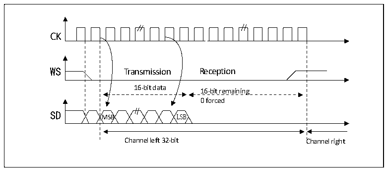
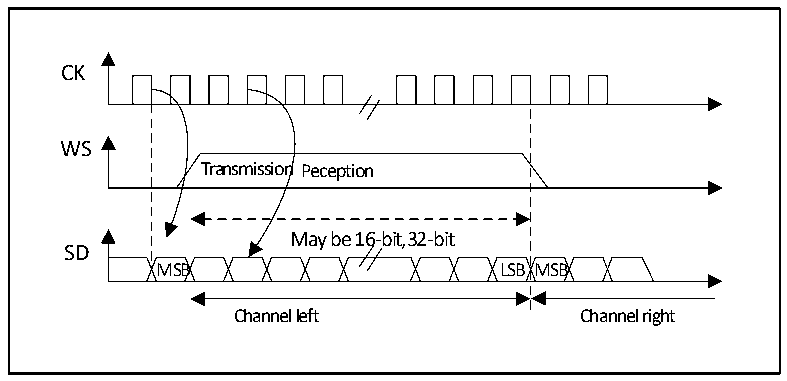

<!-- source-page: 312 -->

[← p.311](0311.md) · [index](../README.md) · [PDF p.312](https://ch32-riscv-ug.github.io/CH32V407/datasheet_zh/CH32V407RM.PDF#page=312) · [p.313 →](0313.md)

<!-- header: CH32V407应用手册 https://wch.cn -->

图20-6 飞利浦协议标准波形（16位扩展至32位包帧，CPOL=0）  
 <!-- rendered from the PDF; verify at https://ch32-riscv-ug.github.io/CH32V407/datasheet_zh/CH32V407RM.PDF#page=312 -->

🖼 Text parsed from the figure above

Transmission  Reception  16-bit data MSB LSB  16-bit remaining 0 forced  
CK  
SD  
Channel left 32-bit Channel right  

在I2S配置阶段，如果选择将16位数据扩展到32位声道帧，只需要访问一次寄存器DATAR用  
来扩展到32位的低16位被硬件置为0x0000。如果待传输或接收的数据是0x76A3（扩展到32位是  
0x76A30000），只需要操作一次 DATAR。在发送时需要将 MSB 写入寄存器 DATAR；标志位 TXE 为 1  
表示可以写入新的数据，如果允许了相应的中断，则可以产生中断。发送是由硬件完成的，即使还  
未发送出后16位的0x0000，也会设置TXE并产生相应的中断。接收时，每次收到高16位半字（MSB）  
后，标志位RXNE置1，如果允许了相应的中断，则可以产生中断。这样，在2次读和写之间有更多  
的时间，可以防止下溢或上溢的情况发生。  

#### 20.3.2.2 MSB对齐标准

在此标准下，WS信号和第一个数据位，即最高位（MSB）同时产生。  

图20-7 MSB对齐16位或32位全精度（CPOL = 0）  
 <!-- rendered from the PDF; verify at https://ch32-riscv-ug.github.io/CH32V407/datasheet_zh/CH32V407RM.PDF#page=312 -->

🖼 Text parsed from the figure above

CK  
Transmission Peception  
WS  
May be 16-bit,32-bit  
SD  
MSB LSB MSB  
Channel left Channel right  

发送方在时钟信号的下降沿改变数据；接收方是在上升沿读取数据。  
<!-- image: p312-draw-image-00001 bbox=[507.84, 786.36, 527.28, 796.68] -->
<!-- footer: V1.2 310 -->
