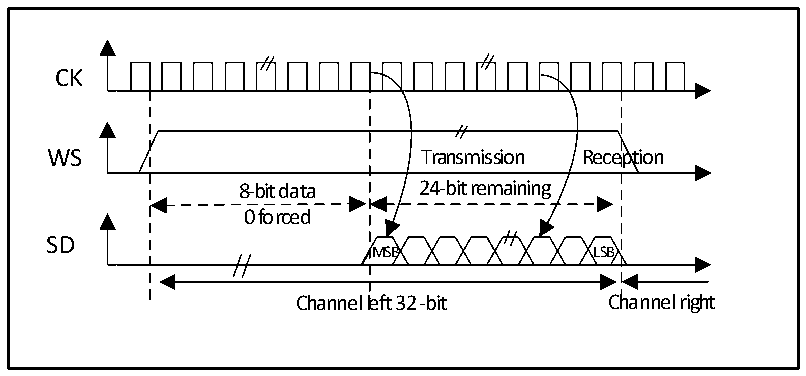
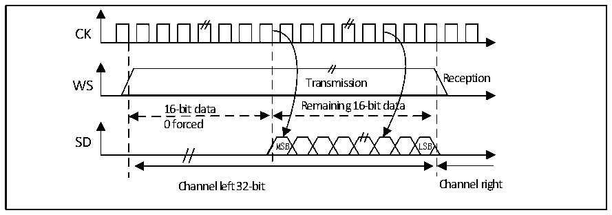

<!-- source-page: 314 -->

[← p.313](0313.md) · [index](../README.md) · [PDF p.314](https://ch32-riscv-ug.github.io/CH32V407/datasheet_zh/CH32V407RM.PDF#page=314) · [p.315 →](0315.md)

<!-- header: CH32V407应用手册 https://wch.cn -->

图20-11 LSB对齐24位数据，CPOL = 0  
 <!-- rendered from the PDF; verify at https://ch32-riscv-ug.github.io/CH32V407/datasheet_zh/CH32V407RM.PDF#page=314 -->

🖼 Text parsed from the figure above

CK  
WS Transmission Reception  
8-bit data 24-bit remaining  
0 forced  
SD  
MSB LSB  
Channel left 32 -bit Channel right  

在发送模式下如果要发送数据0x3478AE，需要通过软件或DMA对寄存器DATAR进行2次写操作。  
TEX=&#x27;1 &#x27; when the data register is written TEX=&#x27;1 &#x27; when the data register is written  
for the first time for the second time  
0xXX34 0x78AE  
Only the lower 8 bits in the halfword have meaning, the higher 8 bits are forced to  
be set to 0x00  
在接收模式下如果要接收数据 0x3478AE，需要在 2个连续的 RXNE事件发生时，分别对寄存器  
DATAR进行1次读操作。  
RXNE=&#x27;1&#x27; when the data register is read out RXNE=&#x27;1&#x27; when the data register is read out  
for the first time for the second time  
0xXX34 0x78AE  
Only the lower 8 bits in the halfword have meaning, the higher 8 bits are forced to  
be set to 0x00  

图20-12 LSB对齐16位数据扩展到32位包帧， CPOL = 0  
 <!-- rendered from the PDF; verify at https://ch32-riscv-ug.github.io/CH32V407/datasheet_zh/CH32V407RM.PDF#page=314 -->

🖼 Text parsed from the figure above

CK  
WS Transmission Reception  
16-bit data Remaining 16-bit data  
0 forced  
SD  
MSB LSB  
Channel left 32-bit Channel right  

在I2S配置阶段，如果选择将16位数据扩展到32声道帧，只需要访问一次寄存器DATAR。此  
时，扩展到32位后的高半字（16位MSB）被硬件置为0x0000。  
如果待传输或接收的数据是 0x76A3（扩展到32 位是 0x000076A3），只需要操作一次 DATAR，  
在发送时，如果TXE为1，用户需要写入待发送的数据（即0x76A3）。用来扩展到32位的0x0000  
<!-- image: p314-draw-image-00001 bbox=[507.84, 786.36, 527.28, 796.68] -->
<!-- footer: V1.2 312 -->
