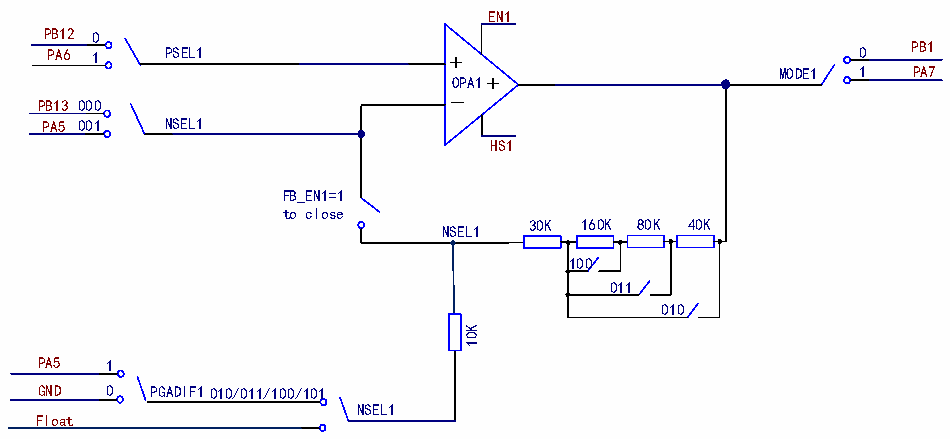

<!-- source-page: 327 -->

[← p.326](0326.md) · [index](../README.md) · [PDF p.327](https://ch32-riscv-ug.github.io/CH32V407/datasheet_zh/CH32V407RM.PDF#page=327) · [p.328 →](0328.md)

<!-- header: CH32V407应用手册 https://wch.cn -->

# 第 21 章 运算放大器（OPA）

运算放大器模块（OPA），包含1个可独立配置的运算放大器。运算放大器的输入和输出均连接  
至I/O口且引脚可选择，运算放大器（OPA或PGA）支持增益选择。  

## 21.1 主要特性

● 输入引脚可选择  
● 输出引脚可选择  
● 支持PGA增益选择  

## 21.2 功能描述

在R32_OPA_CTLR寄存器中：置位EN1，即可使能对应的OPA1；配置MODE1，可选择OPA1的输  
出通道通道；配置PSEL1，可选择OPA1的正向输入引脚；配置NSEL1，可选择OPA1的负端输入通道、  
或作为PGA使用时的增益；置位FB_EN1，使能OPA1的PGA模式；置位PGADIF1，使能差分输入PGA  
模式；置位HS1，使能OPA1高速模式。  

图21-1 OPA结构框图  
 <!-- rendered from the PDF; verify at https://ch32-riscv-ug.github.io/CH32V407/datasheet_zh/CH32V407RM.PDF#page=327 -->

🖼 Text parsed from the figure above

EN1  
PB12  
0  
PB1 PA6  
1 PSEL1 + 0  
_OPA1+ MODE1 1  
PA7  
000  
PB13  
001 NSEL1  
PA5  
HS1  
FB_EN1=1  
to close  
30K 160K 80K 40K  
NSEL1  
100  
011  
010  
10K  
PA5  
1  
GND 010/011/100/101  
0 PGADIF1  
NSEL1  
Float  

## 21.3 寄存器描述

<!-- p327-table-001 (table-21-1@1) -->
<table><caption>表21-1 OPA相关寄存器列表</caption><tr><th>名称</th><th>访问地址</th><th>描述</th><th>复位值</th></tr><tr><td>R32_OPA_CTLR</td><td>0x40023804</td><td>OPA配置寄存器</td><td>0x00000000</td></tr></table>

### 21.3.1 OPA配置寄存器（OPA_CTLR）

偏移地址：0x04  

<!-- p327-table-002 (table-21-1@1) -->
<table class="bitfield"><colgroup><col style="width:6.2500%"><col style="width:6.2500%"><col style="width:6.2500%"><col style="width:6.2500%"><col style="width:6.2500%"><col style="width:6.2500%"><col style="width:6.2500%"><col style="width:6.2500%"><col style="width:6.2500%"><col style="width:6.2500%"><col style="width:6.2500%"><col style="width:6.2500%"><col style="width:6.2500%"><col style="width:6.2500%"><col style="width:6.2500%"><col style="width:6.2500%"></colgroup><tr><th>31</th><th>30</th><th>29</th><th>28</th><th>27</th><th>26</th><th>25</th><th>24</th><th>23</th><th>22</th><th>21</th><th>20</th><th>19</th><th>18</th><th>17</th><th>16</th></tr><tr><td colspan="16">Reserved</td></tr></table>

> ⬇ **Bit numbers for the register diagram at the top of [page 328](0328.md)**. <!-- p327-line-00050 -->

<!-- image: p327-draw-image-00001 bbox=[507.84, 786.36, 527.28, 796.68] -->
<!-- footer: V1.2 325 -->
