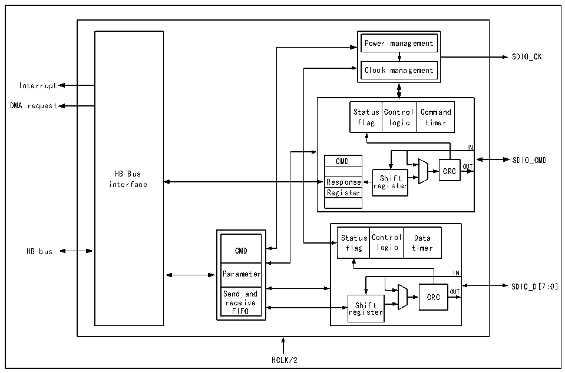

<!-- source-page: 361 -->

[← p.360](0360.md) · [index](../README.md) · [PDF p.361](https://ch32-riscv-ug.github.io/CH32V407/datasheet_zh/CH32V407RM.PDF#page=361) · [p.362 →](0362.md)

<!-- header: CH32V407应用手册 https://wch.cn -->

图24-1 SDIO的结构图  
 <!-- rendered from the PDF; verify at https://ch32-riscv-ug.github.io/CH32V407/datasheet_zh/CH32V407RM.PDF#page=361 -->

🖼 Text parsed from the figure above

Power management  
SDIO_CK  
Clock management  
Interrupt  
DMA request  
Status flag  Control logic  Command timer  
IN  
CMD  Respons  Respons  Registe  
CMD SDIO_CMD  
OUT  
HB Bus CRC  
interface Response re S g h i i s f t t e r  
Register  
Status flag  Control logic  Data timer  
CMD  Parameter  Send and receive FIFO  
Parameter IN  
SDIO_D[7:0]  
Send and CRC OUT  
receive Shift  
FIFO register  
HCLK/2  

SDIO 是微控制器作为主机直接操作 SDIO设备的外设，其大概由 HB接口、时钟控制部分、CMD  
线控制部分，数据线控制部分和控制寄存器部分这五个模块组成，SDIO 是一个半双工的外设，CPU  
向控制寄存器写入需要发送的命令和数据，命令线和数据线控制模块负责将命令或数据推到IO上，  
并加上CRC。SDIO的数据流由通用DMA负责完成从RAM到SDIO的FIFO的搬移，SDIO的FIFO有32  
个32位的大小。  

### 24.2.2 引脚及其配置

SDIO需要配置的引脚及其模式见表24-1。  

<!-- p361-table-005 (table-24-1@1) -->
<table><caption>表24-1 SDIO的引脚配置</caption><tr><th>SDIO复用功能</th><th>需要配置成的引脚模式</th><th>需要配置成的引脚速度</th></tr><tr><td>SDIO_D[0:3]</td><td>推挽复用输出</td><td>50MHz</td></tr><tr><td>SDIO_CK</td><td>推挽复用输出</td><td>50MHz</td></tr><tr><td>SDIO_CMD</td><td>推挽复用输出</td><td>50MHz</td></tr><tr><td>SDIO_D4</td><td>推挽复用输出</td><td>50MHz</td></tr><tr><td>SDIO_D5</td><td>推挽复用输出</td><td>50MHz</td></tr><tr><td>SDIO_D6</td><td>推挽复用输出</td><td>50MHz</td></tr><tr><td>SDIO_D7</td><td>推挽复用输出</td><td>50MHz</td></tr></table>

注：从机模式时，SDIO_CK引脚应配置为浮空输入。  

### 24.2.3 时钟

SDIO的时钟引脚为SDIO_CK，其输出时钟由HCLK分频得到，分频系数可配置为2-261之间的任  
意整数值。SDIO 设备在初始化的时候一般只支持最高 400kHz 时钟的单总线模式，在初始化后，主  
机一般会发起切换至低电压的操作，同时将时钟提升至微控制器和 SDIO 设备双方能接受的最大时  
钟。不同版本和速度等级的SD卡所支持时钟速度和切换流程有所区别，用户需要自行了解。  
<!-- image: p361-draw-image-00001 bbox=[507.84, 786.36, 527.28, 796.68] -->
<!-- footer: V1.2 359 -->
