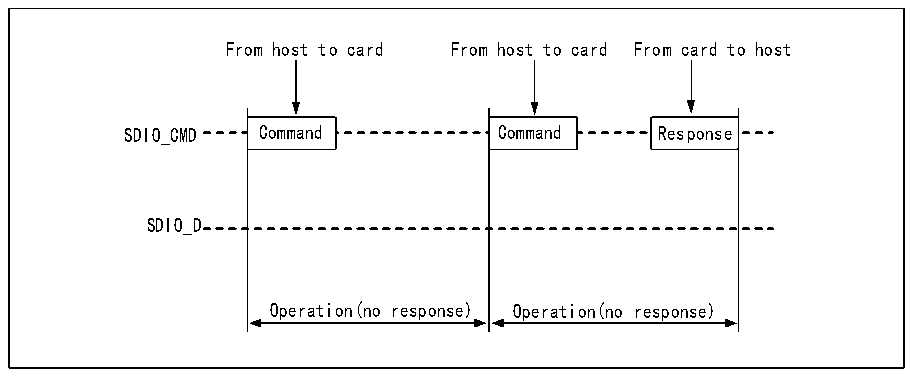
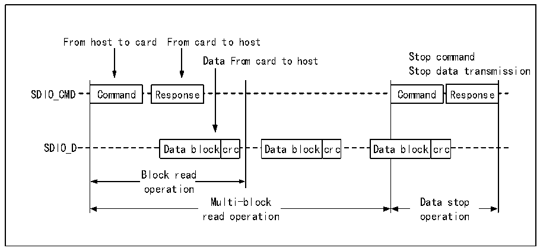

<!-- source-page: 363 -->

[← p.362](0362.md) · [index](../README.md) · [PDF p.363](https://ch32-riscv-ug.github.io/CH32V407/datasheet_zh/CH32V407RM.PDF#page=363) · [p.364 →](0364.md)

<!-- header: CH32V407应用手册 https://wch.cn -->

## 24.3 SDIO 协议简述

SDIO上的通讯以传输为最小单位，每个传输总是以主机在CMD线上发送命令为起始，有的命令  
发送之后，SDIO设备同样会在CMD线上发送一段数据回复主机，称为“响应”，有时还会伴随着数  
据的传输，数据的传输是在D线上。命令和响应的格式是固定的，各域各位的定义根据不同的命令  
或响应而确定。响应和数据传输需要在命令或响应结束后规定的时间内发出或停止，否则将产生超  
时错误。  
本小节的目的是以较小的篇幅让用户对使用SDIO所必要的一些规范的细节有初步的了解，并不  
保证详尽和更新及时。微控制器的SDIO也仅仅保证其实现了SD 2.0，SDIO 2.0及MMC 4.5规范的  
硬件操作基础，对于更高版本规范定义的功能，例如双边沿采样等，并不一定支持。用户在做具体  
开发时应以SD规范，SDIO规范和MMC规范为依据进行SDIO交互编程。  

### 24.3.1 总线时序

SD卡的传输都是以主机发起CMD发起的，SD卡可能不回复响应，可能回复短响应和长响应，有  
的响应后面还会伴随数据传输。而在SDIO卡或MMC卡的通讯中，还可能会有SDIO设备主动报中断  
的情况。时序如下图组所示。  

图24-4 SDIO的无响应时序和无数据时序（以SD卡为例）  
 <!-- rendered from the PDF; verify at https://ch32-riscv-ug.github.io/CH32V407/datasheet_zh/CH32V407RM.PDF#page=363 -->

🖼 Text parsed from the figure above

From host to card From host to card From card to host  
SDIO_CMD Command Command Response  
SDIO_D  
Operation(no response) Operation(no response)  

图24-5 SDIO的多块读时序（以SD卡为例）  
 <!-- rendered from the PDF; verify at https://ch32-riscv-ug.github.io/CH32V407/datasheet_zh/CH32V407RM.PDF#page=363 -->

🖼 Text parsed from the figure above

From host to card From card to host  
Stop command  
Data From card to host  
Stop data transmission  
Command  Response  
SDIO_CMD Command Response Command Response  
Data block  crc  
Data block  crc  
Data  block  crc  
SDIO_D Data blockcrc Data blockcrc Data block crc  
Block read  operation  
Multi-block Data stop  
Multi-block  read operation  
Data stop  operation  
read operation operation  

<!-- image: p363-draw-image-00001 bbox=[507.84, 786.36, 527.28, 796.68] -->
<!-- footer: V1.2 361 -->
