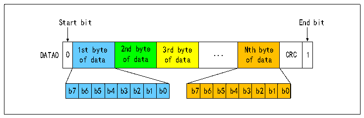
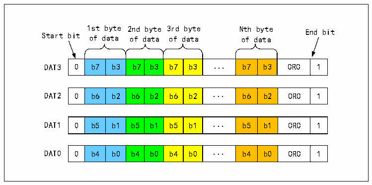
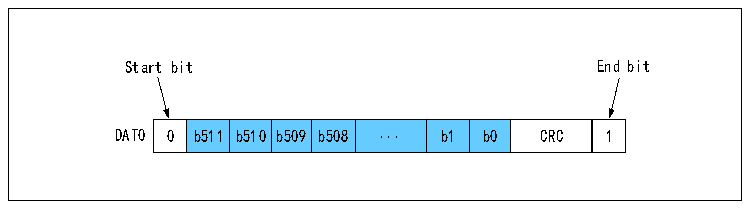
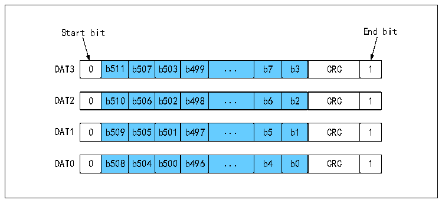

<!-- source-page: 369 -->

[← p.368](0368.md) · [index](../README.md) · [PDF p.369](https://ch32-riscv-ug.github.io/CH32V407/datasheet_zh/CH32V407RM.PDF#page=369) · [p.370 →](0370.md)

<!-- header: CH32V407应用手册 https://wch.cn -->
MMC卡还支持数据流传输模式，此时不附带CRC。下图为数据传输的格式。  

图24-9 SD卡单总线数据传输字节的格式  
 <!-- rendered from the PDF; verify at https://ch32-riscv-ug.github.io/CH32V407/datasheet_zh/CH32V407RM.PDF#page=369 -->

🖼 Text parsed from the figure above

Start bit End bit  
0  1st byte of data  2nd byte of data  3rd byte of data  ...  Nth byte of data  CRC  1  b7  b6  b5  b4  b3  b2  b1  b0  b7  b6  b5  b4  b3  b2  b1  b0  

图24-10 SD卡4总线数据传输字节的格式  
 <!-- rendered from the PDF; verify at https://ch32-riscv-ug.github.io/CH32V407/datasheet_zh/CH32V407RM.PDF#page=369 -->

🖼 Text parsed from the figure above

1st byte 2nd byte 3rd byte Nth byte End bit  
Start bit of data of data of data of data  
0  b7  b3  b7  b3  b7  b3  ...  b7  b3  CRC  1  
0  b6  b2  b6  b2  b6  b2  ...  b6  b2  CRC  1  
0  b5  b1  b5  b1  b5  b1  ...  b5  b1  CRC  1  
0  b4  b0  b4  b0  b4  b0  ...  b4  b0  CRC  1  

图24-11 SD卡单总线数据传输一个512位字的格式  
 <!-- rendered from the PDF; verify at https://ch32-riscv-ug.github.io/CH32V407/datasheet_zh/CH32V407RM.PDF#page=369 -->

🖼 Text parsed from the figure above

Start bit End bit  
0  b511  b510  b509  b508  ...  b1  b0  CRC  1  

图24-12 SD卡4总线数据传输一个512位字的格式  
 <!-- rendered from the PDF; verify at https://ch32-riscv-ug.github.io/CH32V407/datasheet_zh/CH32V407RM.PDF#page=369 -->

🖼 Text parsed from the figure above

Start bit End bit  
0  b511  b507  b503  b499  ...  b7  b3  CRC  1  
0  b510  b506  b502  b498  ...  b6  b2  CRC  1  
0  b509  b505  b501  b497  ...  b5  b1  CRC  1  
0  b508  b504  b500  b496  ...  b4  b0  CRC  1  

<!-- image: p369-draw-image-00001 bbox=[507.84, 786.36, 527.28, 796.68] -->
<!-- footer: V1.2 367 -->
