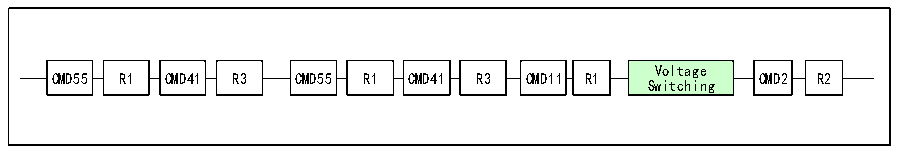

<!-- source-page: 372 -->

[← p.371](0371.md) · [index](../README.md) · [PDF p.372](https://ch32-riscv-ug.github.io/CH32V407/datasheet_zh/CH32V407RM.PDF#page=372) · [p.373 →](0373.md)

<!-- header: CH32V407应用手册 https://wch.cn -->

> ⬆ **Table continued** — rendered in full at [page 371](0371.md). <!-- p372-table-001 -->

#### 24.4.1.4 RCA寄存器

相对卡地址寄存器存储了卡的地址，为16位，默认值为0。  

### 24.4.2 电压切换

在SD卡初始化后期，需要进行接口电平切换，将SD卡的时钟线数据线和命令线的IO电平切换  
到1.8V水平。对于压摆率不是足够优秀的器件，使用更低的电平标准有助于提升频率。但是SD的  
供电电压并不一定变化，只在较新版本的协议才出现了低电压供电的SD卡。  
切换电压的步骤如下图。  

图24-13 电压切换序列  
 <!-- rendered from the PDF; verify at https://ch32-riscv-ug.github.io/CH32V407/datasheet_zh/CH32V407RM.PDF#page=372 -->

🖼 Text parsed from the figure above

CMD55  R1  
Voltage  
CMD55 R1 CMD41 R3 CMD55 R1 CMD41 R3 CMD11 R1 CMD2 R2  
Switching  

### 24.4.3 时钟切换

初始化时 SD 卡的时钟只有 400kHz，在电压完成切换之后可以将时钟提升至较高的水平，例如  
SDHC卡UHS-I模式第一档速度，总线时钟可以达到80MHz，鉴于微控制器的IO输出能力，应将时钟  
限制在50MHz之内。  

## 24.5 中断

### 24.5.1 SDIO 中断

SDIO 支持多种中断源，如中断使能寄存器（R32_SDIO_IER）所示的有 24 种情况都可以触发中  
断，用户可酌情自行开启。  

### 24.5.2 SDIO 设备中断

需要注意的是不光SDIO外设可以向CPU报中断，外接SDIO卡和MMC卡也能向SDIO外设报中断。  
在4位总线模式下，中断线是D1，在8位总线模式下，中断线是D7，低电平有效。如果在空闲状态  
<!-- image: p372-draw-image-00001 bbox=[507.84, 786.36, 527.28, 796.68] -->
<!-- footer: V1.2 370 -->
