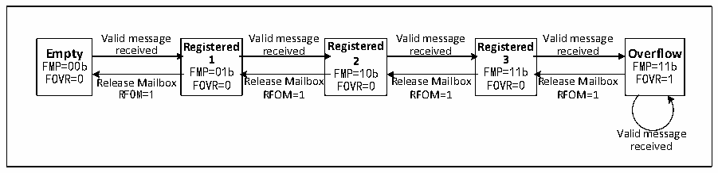

<!-- source-page: 387 -->

[← p.386](0386.md) · [index](../README.md) · [PDF p.387](https://ch32-riscv-ug.github.io/CH32V407/datasheet_zh/CH32V407RM.PDF#page=387) · [p.388 →](0388.md)

<!-- header: CH32V407应用手册 https://wch.cn -->
时器在接收和发送的帧起始位的采样点位置被采样并产生时间戳。若使用增强模式，需要将配置  
CAN1_TTCTLR寄存器的MODE位为1，来开启增强模式，使用该模式，在整个CAN网络中，必须存在  
三个或三个以上的节点，其中一个节点发送时间基准，其他节点收到该基准节点的时间戳后，通过  
向CAN1_TTCTLR寄存器的TIMRST位写1复位内部计数器，将内部计数器进行同步，这样除了发送时  
间基准的节点之外，其余CAN节点实现了时间同步，之后将待发送的数据写入发送邮箱，依次配置  
各节点的时间触发计数值（CAN1_TTCNT寄存器的TIMCNT）和内部计数器计数终值（CAN1_TTCTLR寄  
存器TIMCMV），时间触发计数值和内部计数器计数终值由CAN节点的个数、CAN通信速率和一帧数  
据位数决定，配置完成后，各节点等待内部计数器计数到时间触发计数值后，触发发送动作。  

### 25.5.5 接收处理流程

CAN 总线报文的接收，由控制器硬件来完成，无需MCU 的干涉，减轻了 MCU的处理负荷。所接  
收到的报文，根据寄存器CAN1_FAFIFOR的设置，分别被存储到两个具有3级邮箱深度的FIFO中，  
应用层如需获取报文，只能通过接收FIFO邮箱来读取有效接收报文。  
初始时，接收FIFO为空，接收FIFO寄存器CAN1_RFIFOx的FMR[1:0]值为二进制00b，接到一  
个有效接收报文后，变为挂号1状态，控制器自动把接收FIFO寄存器CAN1_RFIFOx的FMR[1:0]设  
置二进制01b；若此时读取邮箱数据寄存器CAN1_RXMDLyR和CAN1_RXMDHyR，通过对接收FIFO寄存  
器CAN1_RFIFOx的RFOM位置1来释放邮箱，接收FIFO状态又变为空；如果在挂号1状态时不释放  
邮箱，下一个有效接收报文被接到后，接收 FIFO 状态切换为挂号 2 状态，此时接收 FIFO 寄存器  
CAN1_RFIFOx的FMR[1:0]自动置二进制10b；若读取邮箱数据寄存器并释放邮箱，则状态回到挂号1；  
如果在挂号2状态不释放邮箱，则接收FIFO进入挂号3状态；同样在挂号3状态下读取报文并释放  
邮箱，则返回挂号2状态；若在挂号3状态不释放邮箱，则在接收到下一个有效报文时，必然导致  
报文丢失情况出现。  

图25-3 接收FIFO状态切换图  
 <!-- rendered from the PDF; verify at https://ch32-riscv-ug.github.io/CH32V407/datasheet_zh/CH32V407RM.PDF#page=387 -->

🖼 Text parsed from the figure above

Valid message Valid message Valid message Valid message  
Empty received Registered received Registered received Registered received Overflow  
FMP=00b 1 2 3 FMP=11b  
FMP=01b FMP=10b FMP=11b  
FOVR=0 Release Mailbox FOVR=0 Release Mailbox FOVR=0 Release Mailbox FOVR=0 Release Mailbox FOVR=1  
RFOM=1 RFOM=1 RFOM=1 RFOM=1  
Valid message  
received  

上文中的报文丢失情况，即接收 FIFO 为满，报文溢出导致报文丢失，接收 FIFO 寄存器  
CAN1_RFIFOx的FOVR位会硬件自动置1，以供溢出查询。寄存器CAN1_CTLR的RFLM位置1，则接收  
FIFO锁定功能启用，丢弃的报文为新接收报文；寄存器CAN1_CTLR的RFLM位清0，则接收FIFO锁  
定功能停用，接收FIFO的三个原报文中，最后接收的报文会被新报文覆盖。  
当寄存器CAN1_INTENR相关位置位，可以使接收FIFO状态切换时产生中断，以便更高效的处理  
接收报文，详见25.6节CAN中断。  

### 25.5.6 接收报文标识符过滤

模块中有着多达14个过滤器组，通过设置过滤器组，每个CAN节点都可以接收到符合过滤规则  
的报文，不符合过滤规则的报文被硬件丢弃，无需软件干涉。  
每个过滤器组由2个32位寄存器CAN1_FxR0和CAN1_FxR1组成。过滤器组的位宽都可以通过设  
置寄存器CAN1_FSCFGR的各个位独立配置成1个32位过滤器或两个16位过滤器。每个过滤器组可  
通过设置寄存器CAN1_FMCFGR的各个位配置为屏蔽位或标识符列表模式，各个过滤器组可以通过设  
置寄存器CAN1_FWR的各个位选择启用或禁用。设置寄存器CAN1_FAFIFOR的各个位可以把选择通过  
过滤器的报文存放到哪个接收FIFO。  
如下表25-1所示，屏蔽位模式下，两个寄存器分别为标识符寄存器和屏蔽寄存器，两者需要配  
<!-- image: p387-draw-image-00001 bbox=[507.84, 786.36, 527.28, 796.68] -->
<!-- footer: V1.2 385 -->
