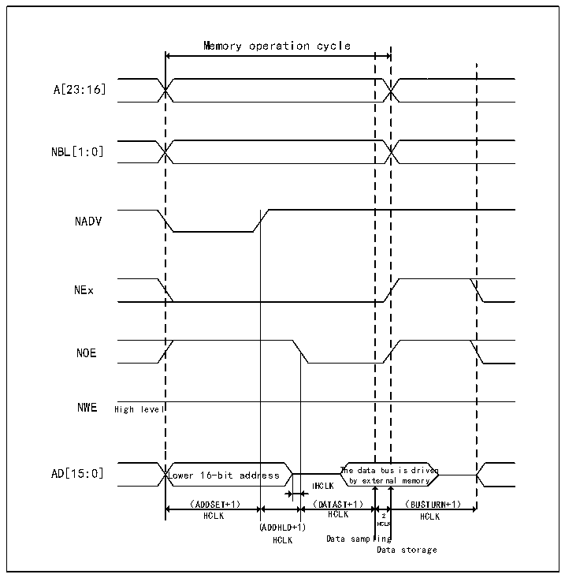
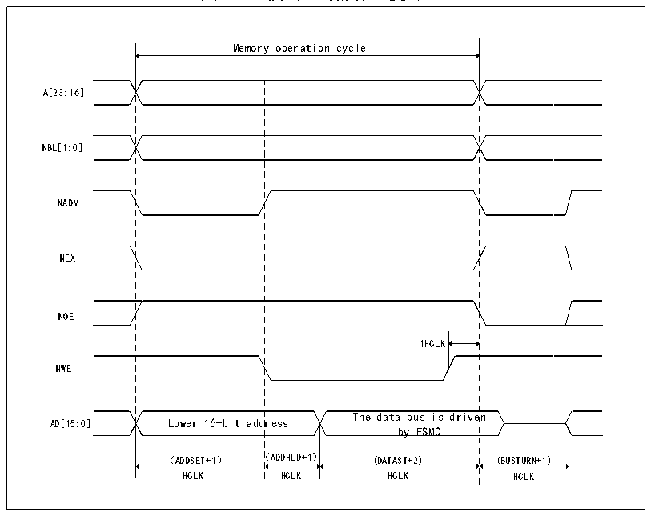

<!-- source-page: 415 -->

[← p.414](0414.md) · [index](../README.md) · [PDF p.415](https://ch32-riscv-ug.github.io/CH32V407/datasheet_zh/CH32V407RM.PDF#page=415) · [p.416 →](0416.md)

<!-- header: CH32V407应用手册 https://wch.cn -->

图26-5 模式A读操作（复用）  
 <!-- rendered from the PDF; verify at https://ch32-riscv-ug.github.io/CH32V407/datasheet_zh/CH32V407RM.PDF#page=415 -->

🖼 Text parsed from the figure above

Memory operation cycle  
A[23:16]  
NBL[1:0]  
NADV  
NEx  
NOE  
NWE High level  
ress  
AD[15:0] Lower 16-bit address The data bus is driven  
by external memory  
1HCLK  
（ADDSET+1） （DATAST+1） （BUSTURN+1）  
HCLK HCLK 2 HCLK  
(ADDHLD+1) HCLK  
HCLK Data sampling  
Data storage  

图26-6 模式A写操作（复用）  
 <!-- rendered from the PDF; verify at https://ch32-riscv-ug.github.io/CH32V407/datasheet_zh/CH32V407RM.PDF#page=415 -->

🖼 Text parsed from the figure above

Memory operation cycle  
1HCLK The data bus is drive Lower 16-bit address by FSMC （ADDSET+1） （ADDHLD+1） (DATAST+2)  Lower 16-bit addr （ADDSET+1） （  en (BUSTURN+1)  
A[23:16]  
NBL[1:0]  
NADV  
NEX  
NOE  
NWE  
HCLK HCLK HCLK HCLK  

<!-- image: p415-draw-image-00001 bbox=[507.84, 786.36, 527.28, 796.68] -->
<!-- footer: V1.2 413 -->
