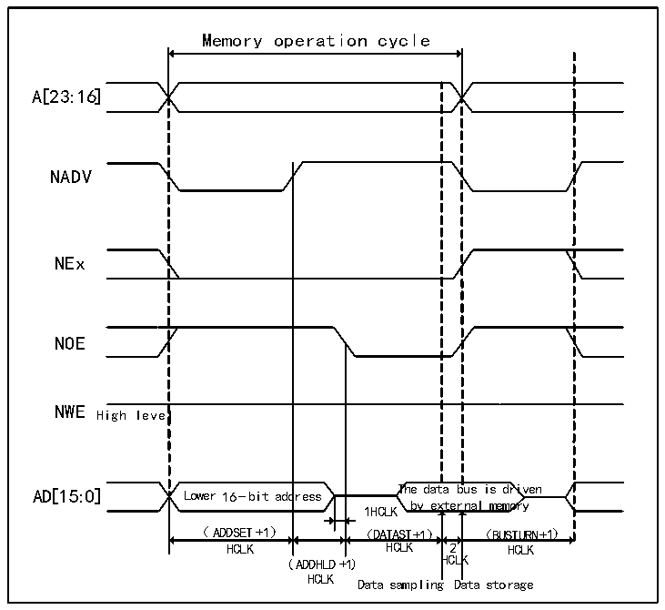
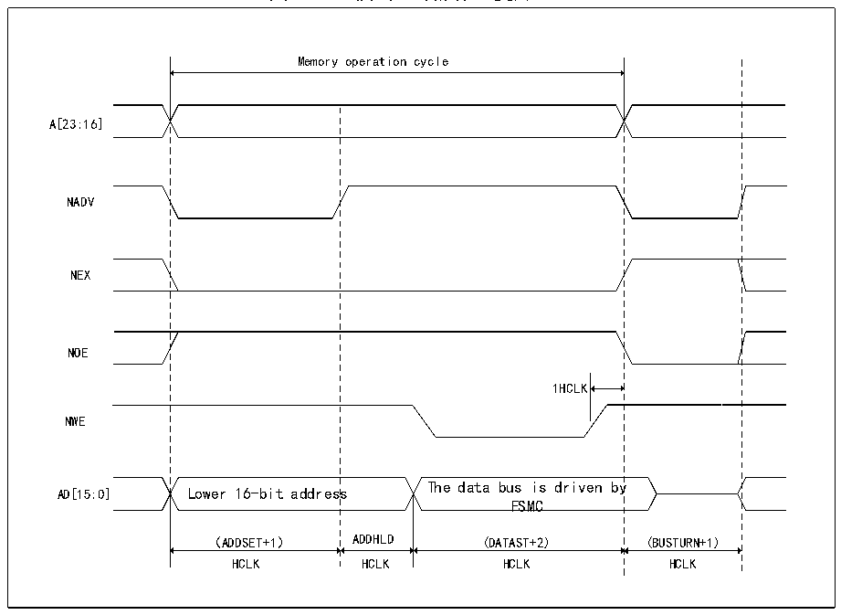

<!-- source-page: 422 -->

[← p.421](0421.md) · [index](../README.md) · [PDF p.422](https://ch32-riscv-ug.github.io/CH32V407/datasheet_zh/CH32V407RM.PDF#page=422) · [p.423 →](0423.md)

<!-- header: CH32V407应用手册 https://wch.cn -->

> ⬆ **Table continued** — rendered in full at [page 421](0421.md). <!-- p422-table-001 -->

图26-11 模式D读操作（复用）  
 <!-- rendered from the PDF; verify at https://ch32-riscv-ug.github.io/CH32V407/datasheet_zh/CH32V407RM.PDF#page=422 -->

🖼 Text parsed from the figure above

Memory operation cycle  
l Lower 16-bit add （ADDSET+1）  dress  
A[23:16]  
NADV  
NEx  
NOE  
NWE High level  
by external memory  
HCLK HCLK 2 HCLK  
(ADDHLD+1) HCLK  
HCLK  
Data sampling Data storage  

图26-12 模式D写操作（复用）  
 <!-- rendered from the PDF; verify at https://ch32-riscv-ug.github.io/CH32V407/datasheet_zh/CH32V407RM.PDF#page=422 -->

🖼 Text parsed from the figure above

Memory operation cycle  
A[23:16]  
NADV  
NEX  
Lower 16-bit address （ADDSET+1）  
NOE  
1HCLK  
y (BUSTURN+1)  FSMC (DATAST+2)  
NWE  
HCLK HCLK HCLK HCLK  

<!-- image: p422-draw-image-00001 bbox=[507.84, 786.36, 527.28, 796.68] -->
<!-- footer: V1.2 420 -->
