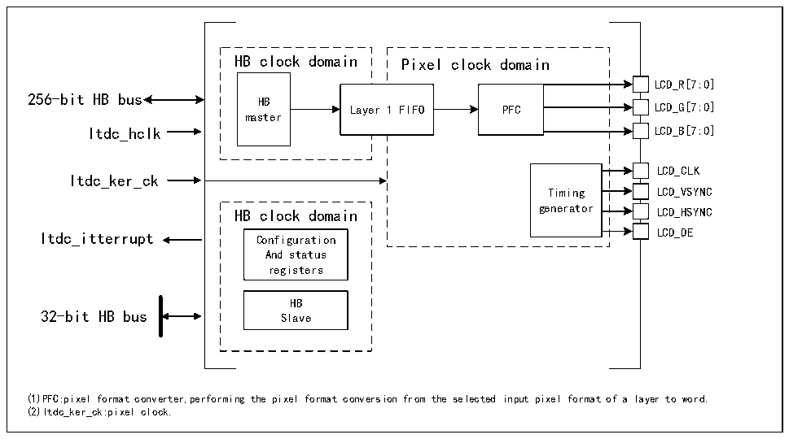

<!-- source-page: 439 -->

[← p.438](0438.md) · [index](../README.md) · [PDF p.439](https://ch32-riscv-ug.github.io/CH32V407/datasheet_zh/CH32V407RM.PDF#page=439) · [p.440 →](0440.md)

<!-- header: CH32V407应用手册 https://wch.cn -->

# 第 27 章 LCD-TFT 显示控制器（LTDC）

LCD-TFT（薄膜晶体管-液晶屏显示器）显示控制器（LTDC）主要提供并行数字RGB以及水平同  
步、垂直同步、像素时钟和数据使能的信号，可作为输出信号到不同LCD和TFT面板接口。  

## 27.1 主要特征

● 提供1个显示层，包含了专有的8*32位FIFO  
● 支持查色表（CLUT），图层高达256种颜色  
● 支持可编程不同显示面板的时序  
● 支持可编程背景色  
● 支持可编程HSYNC，VSYNC和数据使能信号的极性  
● 显示层可选择高达8个输入颜色的格式  
● 支持可编程窗口位置和大小  
● 支持薄膜晶体管（TFT）彩色显示器  
● 支持高达3个可编程中断时间  

## 27.2 概述

图27-1 LTDC结构框图  
 <!-- rendered from the PDF; verify at https://ch32-riscv-ug.github.io/CH32V407/datasheet_zh/CH32V407RM.PDF#page=439 -->

🖼 Text parsed from the figure above

HB clock domain Pixel clock domain  
LCD_R[7:0]  
Lay  er  1 FIFO  
PFC  
256-bit HB bus HB  
master  
Itdc_hclk LCD_B[7:0]  
LCD_CLK  
Itdc_ker_ck  
Timing LCD_VSYNC  
HB clock domain generator LCD_HSYNC  
Itdc_itterrupt Configuration LCD_DE  
And status  
registers  
HB  
32-bit HB bus Slave  
(1)PFC:pixel format converter,performing the pixel format conversion from the selected input pixel format of a layer to word.  
(2)Itdc_ker_ck:pixel clock.  

## 27.3 功能描述

### 27.3.1 LTDC 同步时序

LTCD接口是一个同步数据接口，包括像素时钟，像素数据以及水平和垂直同步信号。图27-2  
展示了LTDC同步时序发生器模块生成的可配置时序参数。  
<!-- image: p439-draw-image-00001 bbox=[507.84, 786.36, 527.28, 796.68] -->
<!-- footer: V1.2 437 -->
