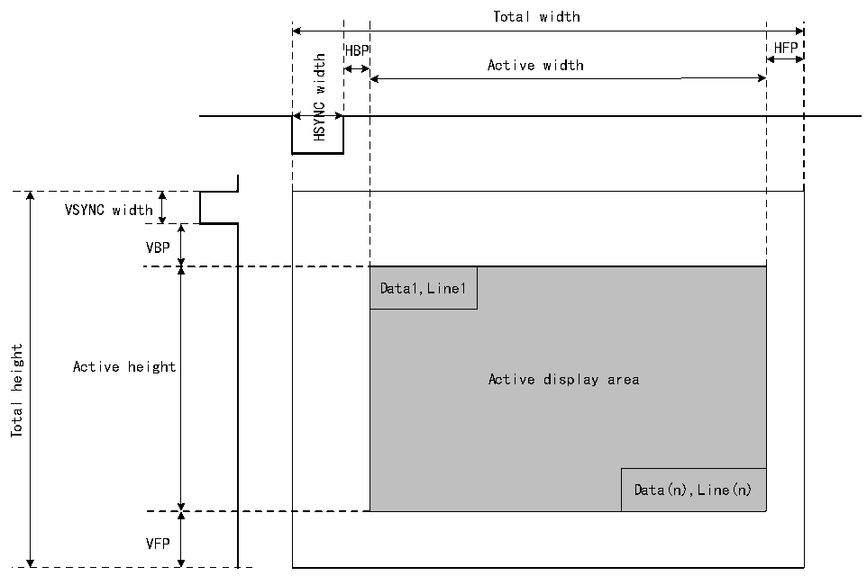

<!-- source-page: 440 -->

[← p.439](0439.md) · [index](../README.md) · [PDF p.440](https://ch32-riscv-ug.github.io/CH32V407/datasheet_zh/CH32V407RM.PDF#page=440) · [p.441 →](0441.md)

<!-- header: CH32V407应用手册 https://wch.cn -->

图27-2 LTDC同步时序  
 <!-- rendered from the PDF; verify at https://ch32-riscv-ug.github.io/CH32V407/datasheet_zh/CH32V407RM.PDF#page=440 -->

🖼 Text parsed from the figure above

Total width  
HBP  Active width  Data1,Line1  
VSYNC width  
VBP  
height  
Active height  
Total  
VFP  

注：（1）HSYNC和VSYNC宽度分别为水平和垂直同步宽度；HBP和HFP分别为水平后沿周期和水平  
前沿周期；VBP和VFP分别为垂直后沿周期和垂直前沿周期。  
（2）使能LTDC时，产生的时序以X/Y=0/0位置作为垂直同步区域中的第一个水平同步像素，随后  
是后沿、有效数据显示区域和前沿。  
（3）禁止LTDC时，时序发生器模块复位为X=总宽度-1、Y=总高度-1，并在垂直同步阶段和FIFO  
刷新前保持上一个像素。因此，仅连续输出消隐数据。  
同步时序配置示例如下所示：  
1）LCD-TFT时序（应从面板数据手册中提取）；  
2）水平和垂直同步宽度：0xA像素，0x2行；  
3）水平和垂直后沿：0x14像素，0x2行；  
4）有效宽度和有效高度：0x140像素，0xF0行（320x240）；  
5）水平前沿：0xA像素；  
6）垂直前沿：0x4行；  
LTDC时序寄存器中编程的值将为：  
1）R32_LTDC_SSCR寄存器：将编程为0x00090001。（HSW[11:0]为0x9且VSH[10:0]为0x1）；  
2）R32_LTDC_BPCR寄存器：将编程为0x001D0003。（AHBP[11:0]为0x1D（0xA + 0x13），AVBP[10:0]  
为0x3（0x2 + 0x1））；  
3）R32_LTDC_AWCR寄存器：将编程为0x015D00F3；（AAW[11:0]为0x15D（0Xa + 0x14 + 0x13F），  
AAH[10:0]为0xF3（0x2 + 0x2 + 0xEF））；  
4）R32_LTDC_TWCR寄存器：将编程为0x00000167。（TOTALW[11:0]为0x16（7 0xA + 0x14 + 0x140+0x9））；  
5）R32_LTDC_THCR寄存器：将编程为0x000000F7。（TOTALH[10:0]为0xF7（0x2+0x2 + 0xF0 + 3））。  

### 27.3.2 像素格式

<!-- image: p440-draw-image-00001 bbox=[507.84, 786.36, 527.28, 796.68] -->
<!-- footer: V1.2 438 -->
