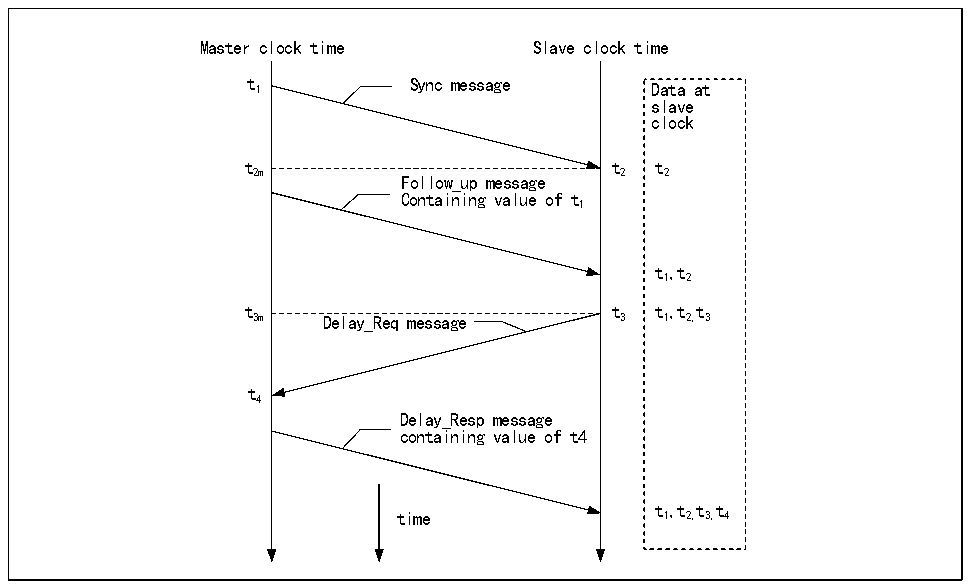

<!-- source-page: 463 -->

[← p.462](0462.md) · [index](../README.md) · [PDF p.463](https://ch32-riscv-ug.github.io/CH32V407/datasheet_zh/CH32V407RM.PDF#page=463) · [p.464 →](0464.md)

<!-- header: CH32V407应用手册 https://wch.cn -->

图29-1 IEEE1588 PTP协议同步报文时序图  
 <!-- rendered from the PDF; verify at https://ch32-riscv-ug.github.io/CH32V407/datasheet_zh/CH32V407RM.PDF#page=463 -->

🖼 Text parsed from the figure above

Master clock time Slave clock time  
t 1 Sync message Data at  
slave  
clock  
t2m t2 t2  
Follow_up message  
Containing value of t1  
t12,t  
t t t,t t  
3m Delay_Req message 3 1 2, 3  
t4  
Delay_Resp message  
containing value of t4  
t,t t t  
time 1 2, 3, 4  

分步描述：  
● 主机向从机发送syn消息，从机接收到此消息，记录下接收到syn消息时的本地时间t2；  
● 主机向从机发送follow_up消息，包含主机发送syn消息时的主机时间t1；  
● 从机向主机发送delay_req消息，从机记录下发送时间t3；  
● 主机向从机发送delay_resq消息，包含delay_req消息的接收时间t4；  
实际使用中，主机是每隔两秒对外发一次syn消息的，而每隔一个syn消息都可以认为是上个  
syn 消息的 follow_up 消息，他们都会附带上一次syn 消息的发送时间。从机经过这个过程可以得  
知主机网络到从机网络延迟时间Tdelay，然后算出主机时间和从机时间的时间偏移。  
(t2-t1) + (t4-t3)  
Tdelay =  
2  
任一主机发出的时间减去偏移即是主机的时间。  
PTP的同步流程一般通过UDP协议实现，当然用户也可以自定协议实现。PTP高度依赖内网的延  
迟稳定性。  

#### 29.1.9.2 本地时间更新与校正

为了实现PTP的主机，设备本地是需要有一个高精度的时间计数器的，起码要精确到纳秒级。  
微控制器的千兆以太网计数器的PTP模块拥有一个32位以秒为单位的计数器，和一个31位的亚秒  
计数器，当亚秒计数器溢出时会引起秒计数器自增，因此本地时间的分辨率可以做到0.46纳秒左右。  
本地时间的更新方式分为两种，即粗调和精调。粗调方式的更新时机是由外部决定的，在需要  
进行时间更新时，将时间戳控制寄存器的时间更新位（PTPTSCR:TSSTU）置位，微控制器的PTP模块  
会将秒计数器和亚秒计数器减去或加上时间戳更新寄存器（TSHUR、TSLUR）的值。粗调是一种较为  
简单且方便的时间更新机制，但是精确较差。  
精调的时间更新方式是更常用的。其更新流程如下：  
<!-- image: p463-draw-image-00001 bbox=[507.84, 786.36, 527.28, 796.68] -->
<!-- footer: V1.2 461 -->
