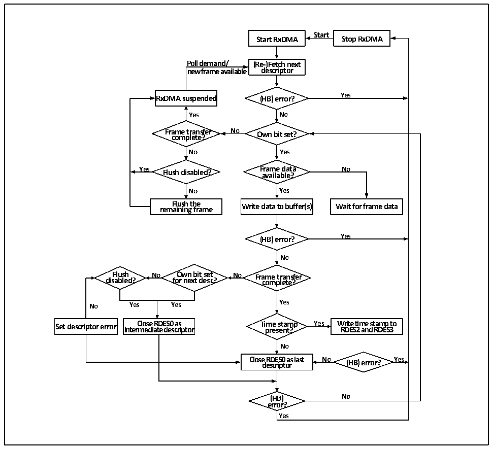

<!-- source-page: 474 -->

[← p.473](0473.md) · [index](../README.md) · [PDF p.474](https://ch32-riscv-ug.github.io/CH32V407/datasheet_zh/CH32V407RM.PDF#page=474) · [p.475 →](0475.md)

<!-- header: CH32V407应用手册 https://wch.cn -->
5） 如果使能了PTP时间戳，再DMA控制器转存数据，写描述符状态域时，同时也会将当前的时间  
戳写进描述符的后两个字。用户应及时将时间戳读出并补全原写在后两个字的缓冲区地址和下  
一描述符地址。  
下图展示了默认接收流转机制：  

图29-5 接收流程  
 <!-- rendered from the PDF; verify at https://ch32-riscv-ug.github.io/CH32V407/datasheet_zh/CH32V407RM.PDF#page=474 -->

🖼 Text parsed from the figure above

<strong>Start</strong>  
<strong>Start RxDMA Stop RxDMA</strong>  
<strong>Poll demand/ (Re-)Fetch next</strong>  
<strong>new frame available descriptor</strong>  
<strong>RxDMA suspended (HB) error? Yes</strong>  
<strong>Yes No</strong>  
<strong>Frame transfer No Own bit set?</strong>  
<strong>complete?</strong>  
<strong>No Yes</strong>  
<strong>Yes Flush disabled? Frame data No</strong>  
<strong>available?</strong>  
<strong>No Yes</strong>  
<strong>rem F a l i u n s i h ng t h fr e a me Write data to buffer(s) Wait for frame data</strong>  
<strong>(HB) error? Yes</strong>  
<strong>No</strong>  
<strong>Flush No Own bit set No Frame transfer</strong>  
<strong>disabled? for next desc? complete?</strong>  
<strong>No Yes Yes Yes</strong>  
<strong>Set descriptor error inter C m lo e s d e i a R t D e E d S e 0 s c a r s i ptor Ti p m re e s s e t n a t m ? p Yes W R r D it E e S t 2 im an e d s t R a D m E p S 3 to</strong>  
<strong>No</strong>  
<strong>Close d e R s D c E ri S p 0 t o a r s last No (HB) error? Yes</strong>  
<strong>(HB) No</strong>  
<strong>error?</strong>  
<strong>Yes</strong>  

### 29.1.11 中断

以太网收发器拥有两个中断向量，一个是以太网唤醒事件，另一个是普通的收发事件。当检测  
到唤醒帧或魔法帧的时候，会触发以太网唤醒事件。普通的以太网收发中断事件包括DMA中断和ETH  
中断。  

## 29.2 寄存器描述

MAC控制相关寄存器地址映射  
MAC控制相关寄存器物理起始地址为：0x4002 8000  

<!-- p474-table-001 (table-29-15@1) pages 474-475 -->
<table><caption>表29-15以太网收发器相关寄存器列表</caption><tr><th>名称</th><th>访问地址</th><th>描述</th><th>复位值</th></tr><tr><td>R32_ETH_MACCR</td><td>0x40028000</td><td>MAC控制寄存器</td><td>0x00000000</td></tr><tr><td>R32_ETH_MACFFR</td><td>0x40028004</td><td>MAC帧过滤寄存器</td><td>0x00000000</td></tr><tr><td>R32_ETH_MACHTHR</td><td>0x40028008</td><td>哈希值列表寄存器高位</td><td>0x00000000</td></tr><tr><td>R32_ETH_MACHTLR</td><td>0x4002800C</td><td>哈希值列表寄存器低位</td><td>0x00000000</td></tr><tr><td>R32_ETH_MACMIIAR</td><td>0x40028010</td><td>MII地址寄存器</td><td>0x00000000</td></tr><tr><td>R32_ETH_MACMIIDR</td><td>0x40028014</td><td>MII数据寄存器</td><td>0x00000000</td></tr><tr><td>R32_ETH_MACFCR</td><td>0x40028018</td><td>MAC流控寄存器</td><td>0x00000000</td></tr><tr><td>R32_ETH_MACVLAN</td><td>0x4002801C</td><td>VLAN标签寄存器</td><td>0x00000000</td></tr><tr><td>R32_ETH_MACRWUFFR</td><td>0x40028028</td><td>唤醒帧过滤器寄存器</td><td>0x00000000</td></tr><tr><td>R32_ETH_MACPMTCSR</td><td>0x4002802C</td><td>PMT控制和状态寄存器</td><td>0x00000000</td></tr><tr><td>R32_ETH_MACSR</td><td>0x40028038</td><td>MAC中断状态寄存器</td><td>0x00000000</td></tr><tr><td>R32_ETH_MACIMR</td><td>0x4002803C</td><td>MAC中断屏蔽寄存器</td><td>0x00000000</td></tr><tr><td>R32_ETH_MACA0HR</td><td>0x40028040</td><td>MAC地址寄存器0高32位</td><td>0x8000FFFF</td></tr><tr><td>R32_ETH_MACA0LR</td><td>0x40028044</td><td>MAC地址寄存器0低32位</td><td>0xFFFFFFFF</td></tr><tr><td>R32_ETH_MACA1HR</td><td>0x40028048</td><td>MAC地址寄存器1高32位</td><td>0x0000FFFF</td></tr><tr><td>R32_ETH_MACA1LR</td><td>0x4002804C</td><td>MAC地址寄存器1低32位</td><td>0xFFFFFFFF</td></tr><tr><td>R32_ETH_MACA2HR</td><td>0x40028050</td><td>MAC地址寄存器2高32位</td><td>0x0000FFFF</td></tr><tr><td>R32_ETH_MACA2LR</td><td>0x40028054</td><td>MAC地址寄存器2低32位</td><td>0xFFFFFFFF</td></tr><tr><td>R32_ETH_MACA3HR</td><td>0x40028058</td><td>MAC地址寄存器3高32位</td><td>0x0000FFFF</td></tr><tr><td>R32_ETH_MACA3LR</td><td>0x4002805C</td><td>MAC地址寄存器3低32位</td><td>0xFFFFFFFF</td></tr><tr><td>R32_ETH_PHY_CR</td><td>0x40028080</td><td>PHY配置寄存器</td><td>0x40000001</td></tr></table>

<!-- image: p474-draw-image-00001 bbox=[507.84, 786.36, 527.28, 796.68] -->
<!-- footer: V1.2 472 -->
