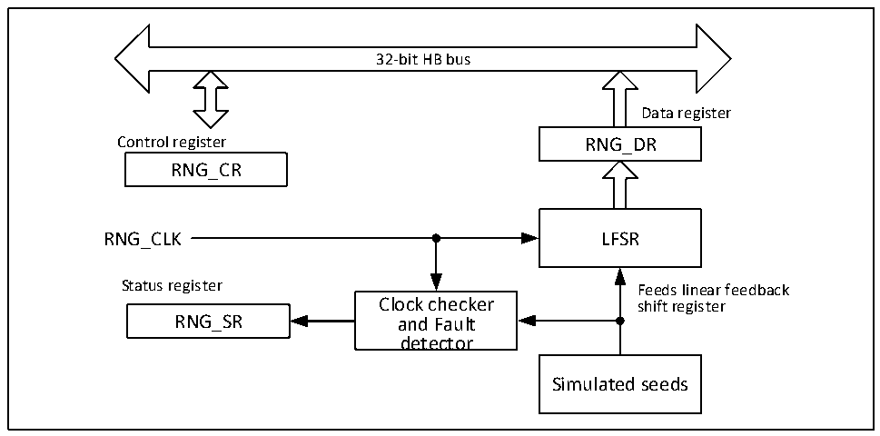

<!-- source-page: 509 -->

[← p.508](0508.md) · [index](../README.md) · [PDF p.509](https://ch32-riscv-ug.github.io/CH32V407/datasheet_zh/CH32V407RM.PDF#page=509) · [p.510 →](0510.md)

<!-- header: CH32V407应用手册 https://wch.cn -->

# 第 30 章 随机数发生器（RNG）

随机数发生器（RNG），以连续模拟噪声为基础，在主机读取数据时提供32bit的随机数。  

## 30.1 主要特性

● 可产生32bit随机数  
● 可实现错误管理  
● 可被单独禁止，降低功耗  

图30-1 RNG模块框图  
 <!-- rendered from the PDF; verify at https://ch32-riscv-ug.github.io/CH32V407/datasheet_zh/CH32V407RM.PDF#page=509 -->

🖼 Text parsed from the figure above

32-bit HB bus  
Data register  
Control register RNG_DR  
RNG_CR  
RNG_CLK LFSR  
Status register Feeds linear feedback  
Clock checker shift register  
RNG_SR and Fault  
detector  
Simulated seeds  

## 30.2 功能描述

随机发送器采用模拟电路实现，该电路产生线性反馈移位寄存器（RNG_LFSR）的种子，用于生  
成 32 位随机数。RNG_LFSR 由专用时钟（PLL48CLK）按照恒定频率提供时钟信息，故随机数质量与  
HCLK时钟有关。当有大量种子引入RNG_LFSR后，RNG_LFSR的内容会传入数据寄存器（RNG_DR）。  

### 30.2.1 RNG操作

RNG具体操作步骤如下：  
1） 若使能中断，需通过将RNG_CR寄存器中的IE位置1（当准备好随机数或出现错误时产生该中  
断）。  
2） 通过配置RNG_CR寄存器的RNGEN位使能随机数产生，同时激活模拟部分、RNG_LFSR和错误检  
测器。  
3） 若使能中断，每次产生中断时，通过查询RNG_SR寄存器中的SEIS和CEIS位为0确定未出现错  
误且DRDY为1确定随机数已准备就绪。之后即可读取RNG_DR寄存器中的内容。  

### 30.2.2 错误管理

RNG出错包括时钟错误和种子错误。当出现时钟错误时，RNG无法再产生随机数，此时需检查时  
钟控制器是否正确配置，是否可提供RNG时钟，然后将CEIS位清零。当CECS位为0时，RNG可正  
常工作。当产生时钟错误时，对上一个随机数没有影响，可正常使用。当出现种子错误时，此时RNG_DR  
寄存器中的值不可使用该随机数，若用重新使用RNG，需要先将SEIS位清零，然后将RNGEN位清零  
<!-- image: p509-draw-image-00001 bbox=[507.84, 786.36, 527.28, 796.68] -->
<!-- footer: V1.2 507 -->
