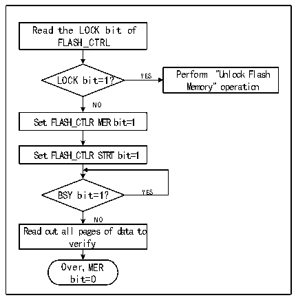

<!-- source-page: 522 -->

[← p.521](0521.md) · [index](../README.md) · [PDF p.522](https://ch32-riscv-ug.github.io/CH32V407/datasheet_zh/CH32V407RM.PDF#page=522) · [p.523 →](0523.md)

<!-- header: CH32V407应用手册 https://wch.cn -->
3）向FLASH_ADDR寄存器写入选择擦除的页首地址。  
4）设置FLASH_CTLR寄存器的STRT位为‘1’，启动一次擦除动作。  
5）等待BSY位变为‘0’或FLASH_STATR寄存器的EOP位为‘1’表示擦除结束，将EOP位清0。  
6）读擦除页的数据进行校验。  
7）继续扇区擦除可以重复3-5步骤，结束擦除将PER位清0。  
注：擦除成功后，字读- 0xe339e339，半字读- 0xe339，偶地址字节读- 0x39，奇地址读0xe3。  

图32-3 FLASH整片擦除  
 <!-- rendered from the PDF; verify at https://ch32-riscv-ug.github.io/CH32V407/datasheet_zh/CH32V407RM.PDF#page=522 -->

🖼 Text parsed from the figure above

Read the LOCK bit of  
FLASH_CTRL  
LOCK bit=1? YES Perform &quot;Unlock Flash  
Memory&quot; operation  
NO  
Set FLASH_CTLR MER bit=1  
Set FLASH_CTLR STRT bit=1  
BSY bit=1？ YES  
NO  
Read out all pages of data to  
verify  
Over，MER  
bit=0  

1）检查FLASH_CTLR寄存器LOCK位，如果为1，需要执行“解除闪存锁”操作。  
2）设置FLASH_CTLR寄存器的MER位为‘1’，开启整片擦除模式。  
3）设置FLASH_CTLR寄存器的STRT位为‘1’，启动擦除动作。  
4）等待BSY位变为‘0’或FLASH_STATR寄存器的EOP位为‘1’表示擦除结束，将EOP位清0。  
5）读擦除页的数据进行校验。  
6）将MER位清0。  

### 32.5.5 快速编程模式解锁

通过写入序列到 FLASH_MODEKEYR 寄存器可解锁快速编程模式操作。解锁后，FLASH_CTLR 寄存  
器的 FLOCK 位将清 0，表示可以进行快速擦除和编程操作。通过将 FLASH_CTLR 寄存器的“FLOCK”  
位软件置1来再次锁定。  
解锁序列：  
1）向FLASH_MODEKEYR寄存器写入KEY1 = 0x45670123；  
2）向FLASH_MODEKEYR寄存器写入KEY2 = 0xCDEF89AB。  
上述操作必须按序并连续执行，否则属于错误操作会锁定，直到下次系统复位才能重新解锁。  
注：快速编程操作需要解除“LOCK”和“FLOCK”两层锁定。  

### 32.5.6 主存储器快速编程

快速编程按页（256字节）进行编程。  
1）检查FLASH_CTLR寄存器LOCK位，如果为‘1’，需要执行“解除闪存锁”操作。  
2）检查FLASH_CTLR寄存器FLOCK位，如果为‘1’，需要执行“快速编程模式解锁”操作。  
3）检查FLASH_STATR寄存器的BSY位，以确认没有其他正在进行的编程操作。  
4）设置FLASH_CTLR寄存器的FTPG位为‘1’，使能快速页编程模式。  
5）使用32位方式向FLASH地址写入数据，例如  
<!-- image: p522-draw-image-00001 bbox=[507.84, 786.36, 527.28, 796.68] -->
<!-- footer: V1.2 520 -->
