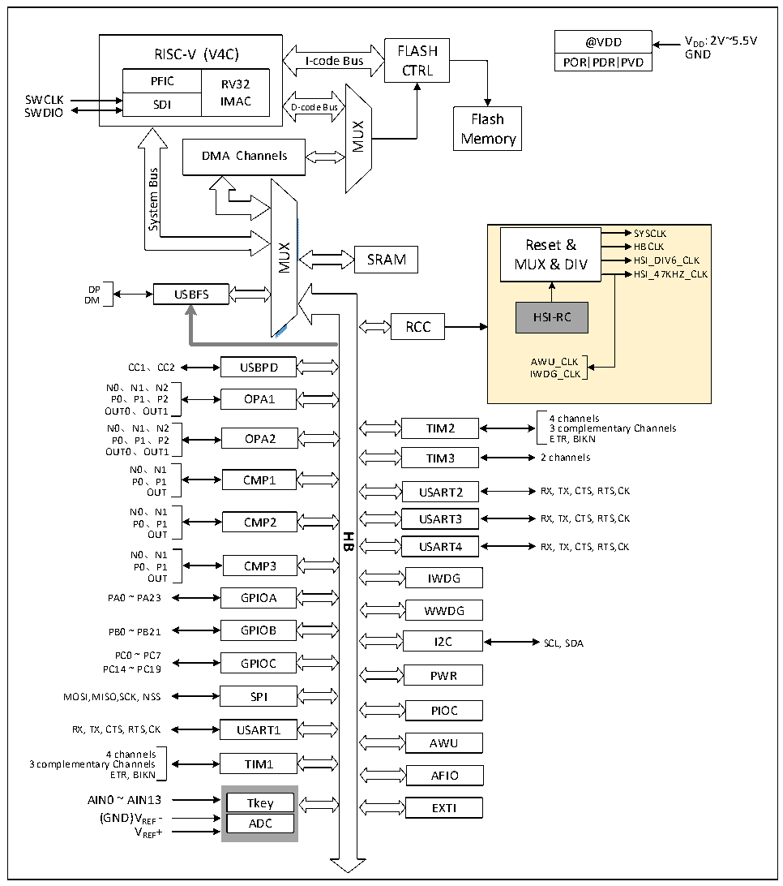

<!-- source-page: 3 -->

[← p.2](0002.md) · [index](../README.md) · [PDF p.3](https://ch32-riscv-ug.github.io/CH32X035/datasheet_en/CH32X035DS0.PDF#page=3) · [p.4 →](0004.md)

<!-- header: CH32X035 Datasheet https://wch-ic.com -->

# Chapter 1 Specification Information

## 1.1 System Structure

The microcontroller is designed on the basis of the RISC-V instruction set, and its architecture integrates the  
barley microprocessor core, arbitration unit, DMA module, SRAM storage and other components through multiple  
bus groups to achieve interaction. A general-purpose DMA controller is integrated to reduce the CPU load and  
improve access efficiency, and a multi-level clock management mechanism is applied to reduce the power  
consumption of peripherals. The following diagram shows the overall internal architecture of the series chip.  

Figure 1-1 System Block Diagram  
 <!-- rendered from the PDF; verify at https://ch32-riscv-ug.github.io/CH32X035/datasheet_en/CH32X035DS0.PDF#page=3 -->

🖼 Text parsed from the figure above

@VDD VDD: 2V~5.5V  
RISC-V (V4C)  PFIC  RV32IMAC  SDI  
@VDD  POR  PDR  PVD  
RISC-V (V4C) FLASH  
GND  
I-code Bus  
CTRL  
SWCLK SWDIO  
Flash  
MUX  
Memory  
DMA Channels  
Bus  
<!-- image: p3-draw-image-00002 inside the figure -->
System  
SYSCLK  
Reset &amp; HBCLK  
MUX  
SRAM  
MUX &amp; DIV HSI_DIV6_CLK  
HSI_47KHZ_CLK  
DP  
USBFS  
DM  
HSI-RC  
RCC  
CC1、CC2 AWU_CLK  
USBPD  
IWDG_CLK  
N0、N1、N2  
P0、P1、P2 OPA1  
OUT0、OUT1  
4 channels  
N0、N1、N2  
TIM2 3 complementary Channels  
P0、P1、P2 OPA2  
ETR, BIKN  
OUT0、OUT1  
TIM3 2 channels  
N0、N1  
P0、P1 CMP1  
USART2 RX, TX, CTS, RTS,CK  
OUT  
N0、N1  
USART3 RX, TX, CTS, RTS,CK  
P0、P1 CMP2  
OUT  
<strong>HB</strong>  
USART4  
RX, TX, CTS, RTS,CK  
N0、N1  
P0、P1 CMP3  
IWDG  
OUT  
PA0 ~ PA23 GPIOA  
WWDG  
GPIOB  
PB0 ~ PB21  
I2C SCL, SDA  
PC0 ~ PC7  
GPIOC  
PC14 ~ PC19  
PWR  
MOSI,MISO,SCK, NSS SPI  
PIOC  
RX, TX, CTS, RTS,CK USART1  
AWU  
4 channels  
3 complementary Channels TIM1  
AFIO  
ETR, BIKN  
AIN0 ~ AIN13 Tkey  
EXTI  
(GND)V -  
REF ADC  
VREF+  

<!-- image: p3-draw-image-00001 bbox=[511.32, 783.6, 530.76, 793.8] -->
<!-- footer: V2.2 1 -->
