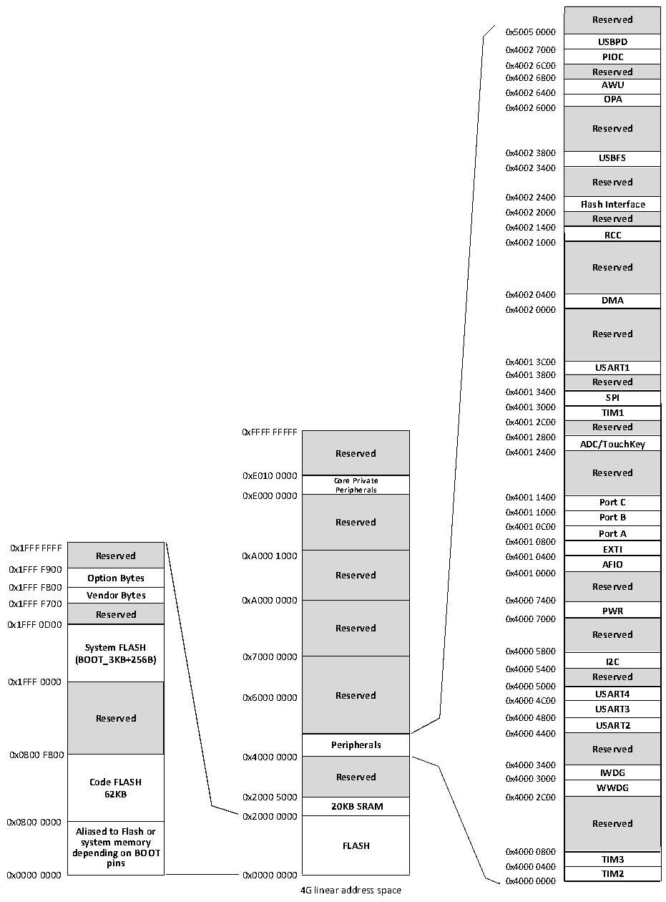

<!-- source-page: 4 -->

[← p.3](0003.md) · [index](../README.md) · [PDF p.4](https://ch32-riscv-ug.github.io/CH32X035/datasheet_en/CH32X035DS0.PDF#page=4) · [p.5 →](0005.md)

<!-- header: CH32X035 Datasheet https://wch-ic.com -->

## 1.2 Memory Map

Figure 1-2 Memory address map  
 <!-- rendered from the PDF; verify at https://ch32-riscv-ug.github.io/CH32X035/datasheet_en/CH32X035DS0.PDF#page=4 -->

🖼 Text parsed from the figure above

Reserved  USBPD  PIOC  Reserved  AWU  OPA  Reserved  USBFS  Reserved  Flash Interface  Reserved  RCC  Reserved  DMA  Reserved  USART1  Reserved  SPI  TIM1  Reserved  Reserved ADC/TouchKey  Reserved  Port C  Port B  Port A  EXTI  AFIO  AFIOReserved  PWR  Reserved  I2C  Reserved  USART4  USART3  USART2  Reserved  IWDG  WWDG  Reserved  TIM3  TIM2  
0x5005 0000  
0x4002 7000  
0x4002 6C00  
0x4002 6800  
0x4002 6400  
0x4002 6000  
0x4002 3800  
0x4002 3400  
0x4002 2400  
0x4002 2000  
0x4002 1400  
0x4002 1000  
0x4002 0400  
0x4002 0000  
0x4001 3C00  
0x4001 3800  
0x4001 3400  
0x4001 3000  
0x4001 2C00  
0xFFFF FFFFF  
Reserved  Core Private Peripherals  Peripherals Reserved  Reserved  Reserved  Reserved  Peripherals  Reserved  20KB SRAM  FLASH  
0x4001 2800  
Reserved 0x4001 2400  
<strong>0xE010 0000 Reserved</strong>  
0x4001 1000  
0x4001 0C00  
0x4001 0800  
Reserved  Option Bytes  Vendor Bytes  Vendor Bytes Reserved  System FLASH (BOOT_3KB+256B)  Reserved  Code FLASH62KB  Aliased to Flash or system memory depending on BOOT pins  
0x1FFF F900 Option Bytes Reserved 0x4001 0000  
0x1FFF F700 0xA000 0000 0x4000 7400  
0x4000 7000  
0x1FFF 0D00 Reserved  
0x4000 5800  
0x4000 5400  
0x1FFF 0000  
0x4000 5000  
0x6000 0000 Reserved 0x4000 4C00 USART4  
0x4000 4400  
<strong>Peripherals Reserved</strong>  
0x4000 3400  
0x2000 0000  
<strong>system memory FLASH</strong>  
0x0000 0000 0x0000 0000 TIM2  
0x4000 0000  
4G linear address space  

<!-- image: p4-draw-image-00001 bbox=[511.32, 783.6, 530.76, 793.8] -->
<!-- footer: V2.2 2 -->
