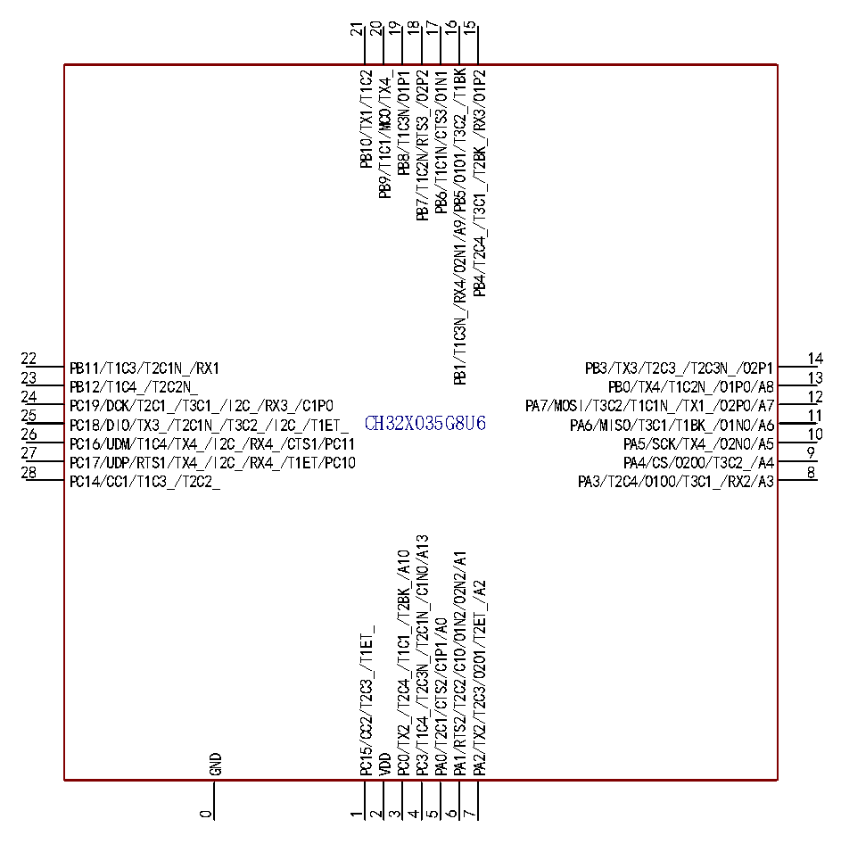

<!-- source-page: 14 -->

[← p.13](0013.md) · [index](../README.md) · [PDF p.14](https://ch32-riscv-ug.github.io/CH32X035/datasheet_en/CH32X035DS0.PDF#page=14) · [p.15 →](0015.md)

<!-- header: CH32X035 Datasheet https://wch-ic.com -->

 <!-- p14-cluster-01 uncaptioned graphics, rendered from the PDF; verify at https://ch32-riscv-ug.github.io/CH32X035/datasheet_en/CH32X035DS0.PDF#page=14 -->

🖼 Text parsed from the figure above

21  
20  
19  
18  
17  
16  
15  
PB1/T1C3N_/RX4/O2N1/A9/PB5/O1O1/T3C2_/T1BK  
PB4/T2C4_/T3C1_/T2BK_/RX3/O1P2  
PB7/T1C2N/RTS3_/O2P2  
PB6/T1C1N/CTS3/O1N1  
PB9/T1C1/MCO/TX4_  
PB8/T1C3N/O1P1  
PB10/TX1/T1C2  
22  
14  
PB11/T1C3/T2C1N_/RX1  
PB3/TX3/T2C3_/T2C3N_/O2P1  
23 13  
PB12/T1C4_/T2C2N_ PB0/TX4/T1C2N_/O1P0/A8  
24  
12  
PC19/DCK/T2C1_/T3C1_/I2C_/RX3_/C1P0  
PA7/MOSI/T3C2/T1C1N_/TX1_/O2P0/A7  
25 PC18/DIO/TX3_/T2C1N_/T3C2_/I2C_/T1ET_  
11 PA6/MISO/T3C1/T1BK_/O1N0/A6  
CH32X035G8U6  
26  
10  
PC16/UDM/T1C4/TX4_/I2C_/RX4_/CTS1/PC11  
PA5/SCK/TX4_/O2N0/A5  
27  
9  
PC17/UDP/RTS1/TX4_/I2C_/RX4_/T1ET/PC10  
PA4/CS/O2O0/T3C2_/A4  
28  
8  
PC14/CC1/T1C3_/T2C2_  
PA3/T2C4/O1O0/T3C1_/RX2/A3  
PC3/T1C4_/T2C3N_/T2C1N_/C1N0/A13  
PC0/TX2_/T2C4_/T1C1_/T2BK_/A10  
PA1/RTS2/T2C2/C1O/O1N2/O2N2/A1  
PA2/TX2/T2C3/O2O1/T2ET_/A2  
PA0/T2C1/CTS2/C1P1/A0  
PC15/CC2/T2C3_/T1ET_  
GND  
VDD  
0  
1  
2  
3  
4  
5  
6  
7  

<!-- p14-table-001 (unlabelled-p14-1) -->
<table><tr><th style="text-align:left">1234567891011121314</th><th style="text-align:left">PC19/DCK/T2C1_/T3C1_/I2C_/RX3_/C1P0 PC18/DIO/TX3_/T2C1N_/T3C2_/I2C_ PC16/UDM/T1C4/TX4_/I2C_/RX4_/CTS1/PC11 PB12/T1C4_/T2C2N_ PC17/UDP/RTS1/TX4_/I2C_/RX4_/T1ET/PC10 PB11/T1C3/T2C1N_/RX1 PA12/T2C2_/T2C1N_/C2P0/PC14/CC1/T1C3_/T2C2_ PB10/TX1/T1C2 PA13/T2C3_/T2C2N_/C3P0/PC15/CC2/T2C3_ PB9/T1C1/MCO/TX4_ VDD PB8/T1C3N/O1P1 GND PB7/T1C2N/RTS3_/O2P2 PC3/RST/T2C3N_/T2C1N_/C1N0/C2N1/C3N1/A13 PB6/T1C1N/CTS3/O1N1 PA0/T2C1/CTS2/C1P1/A0 PB1/T1C3N_/RX4/O2N1/A9/PB5/O1O1/T3C2_/T1BK PA1/RTS2/T2C2/C1O/O1N2/O2N2/A1 PB4/T2C4_/T3C1_/T2BK_/RX3/O1P2 PA2/TX2/T2C3/O2O1/T2ET_/C3N0/A2 PB3/TX3/C3O/T2C3_/T2C3N_/O2P1 PA3/T2C4/O1O0/T3C1_/RX2/A3 PA7/MOSI/T3C2/T1C1N_/TX1_/O2P0/A7 PA6/MISO/T3C1/T1BK_/O1N0/A6 PA5/SCK/TX4_/O2N0/A5 PB0/TX4/T1C2N_/O1P0/A8 PA4/CS/O2O0/T3C2_/A4CH32X035G8R6</th><th style="text-align:left">2827262524232221201918171615</th></tr></table>

<!-- image: p14-draw-image-00001 bbox=[515.88, 783.6, 535.32, 793.8] -->
<!-- footer: V2.2 12 -->
