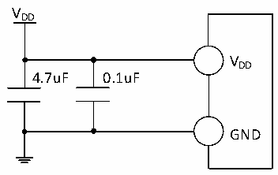

<!-- source-page: 25 -->

[← p.24](0024.md) · [index](../README.md) · [PDF p.25](https://ch32-riscv-ug.github.io/CH32X035/datasheet_en/CH32X035DS0.PDF#page=25) · [p.26 →](0026.md)

<!-- header: CH32X035 Datasheet https://wch-ic.com -->

# Chapter 3 Electrical Characteristics

## 3.1 Test Conditions

All voltages are referenced to GND unless otherwise stated and labelled.  
All minimum and maximum values are guaranteed in the worst conditions of ambient temperature, supply voltage and  
clock frequency. Typical values are based on normal temperature (25℃) and VDD= 5V environment, which are given  
only as design guidelines.  
The data based on comprehensive evaluation, design simulation or technology characteristics are not tested in  
production. On the basis of comprehensive evaluation, the minimum and maximum values refer to sample tests. Unless  
otherwise specified that is tested, the characteristic parameters are guaranteed by comprehensive evaluation or design.  
Power supply scheme:  

Figure 3-1 Typical circuit for conventional power supply  
 <!-- rendered from the PDF; verify at https://ch32-riscv-ug.github.io/CH32X035/datasheet_en/CH32X035DS0.PDF#page=25 -->

🖼 Text parsed from the figure above

VDD  
VDD  
4.7uF 0.1uF  
GND  

## 3.2 Absolute Maximum Ratings

Critical or exceeding the absolute maximum value may cause the chip to operate improperly or even be damaged.  

<!-- p25-table-001 (table-3-1@1) -->
<table><caption>Table 3-1 Absolute maximum ratings</caption><tr><th>Symbol</th><th>Description</th><th>Min.</th><th>Max.</th><th>Unit</th></tr><tr><td style="text-align:left">TA</td><td>Ambient temperature during operation</td><td>-40</td><td>85</td><td>℃</td></tr><tr><td style="text-align:left">TS</td><td>Ambient temperature during storage</td><td>-40</td><td>125</td><td>℃</td></tr><tr><td style="text-align:left">VDD</td><td>Voltage on external mains supply pin VDD</td><td>-0.3</td><td>6.0</td><td>V</td></tr><tr><td style="text-align:left">VIN</td><td>Voltage on I/O pins</td><td>-0.3</td><td style="text-align:left">V +0.3DD</td><td>V</td></tr><tr><td style="text-align:left">|△V | DD_x</td><td style="text-align:left">Voltage difference between each VDD of the main supply pins</td><td></td><td>20</td><td>mV</td></tr><tr><td style="text-align:left">|△GND | _x</td><td style="text-align:left">Voltage difference between each GND of the common ground pins</td><td></td><td>20</td><td>mV</td></tr><tr><td style="text-align:left">VESD(HBM)</td><td style="text-align:left">ESD electrostatic discharge voltage (HBM) on common I/O pins</td><td colspan="2">4K</td><td>V</td></tr><tr><td style="text-align:left">IVDD</td><td style="text-align:left">Total combined current of all VDD main supply pins</td><td></td><td>150</td><td>mA</td></tr><tr><td style="text-align:left">IGND</td><td style="text-align:left">Total combined current on all GND common ground pins</td><td></td><td>200</td><td>mA</td></tr><tr><td rowspan="2" style="text-align:left">IIO</td><td>Sink current on any I/O pins</td><td></td><td>40</td><td>mA</td></tr><tr><td>Source current on any I/O pins</td><td></td><td>30</td><td>mA</td></tr></table>

<!-- image: p25-draw-image-00001 bbox=[515.88, 783.6, 535.32, 793.8] -->
<!-- footer: V2.2 23 -->
