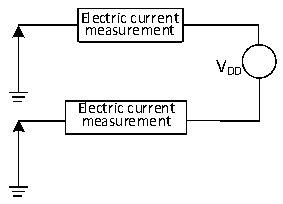

<!-- source-page: 27 -->

[← p.26](0026.md) · [index](../README.md) · [PDF p.27](https://ch32-riscv-ug.github.io/CH32X035/datasheet_en/CH32X035DS0.PDF#page=27) · [p.28 →](0028.md)

<!-- header: CH32X035 Datasheet https://wch-ic.com -->

### 3.3.3 Embedded Reference Voltage

<!-- p27-table-001 (table-3-5@1) -->
<table><caption>Table 3-5 Embedded reference voltage</caption><tr><th>Symbol</th><th>Parameter</th><th>Condition</th><th>Min.</th><th>Typ.</th><th>Max.</th><th>Unit</th></tr><tr><td style="text-align:left">VREFINT</td><td>Internal reference voltage</td><td style="text-align:left">T = -40℃~85℃ A</td><td>1.16</td><td>1.2</td><td>1.24</td><td>V</td></tr><tr><td style="text-align:left">TS_vrefint</td><td style="text-align:left">ADC sampling time when reading the internal reference voltage</td><td>Slow sampling recommended</td><td></td><td></td><td>11</td><td style="text-align:left">1/f ADC</td></tr></table>

### 3.3.4 Supply Current Characteristics

Current consumption is a comprehensive index of a variety of parameters and factors. These parameters and  
factors include operating voltage, ambient temperature, I/O pin load, software configuration of the product, the  
operating frequency, flip rate of the I/O pin, the location of the program in memory and the executed code, etc.  
The current consumption measurement method is as follows:  

Figure 3-2 Current consumption measurement  
 <!-- rendered from the PDF; verify at https://ch32-riscv-ug.github.io/CH32X035/datasheet_en/CH32X035DS0.PDF#page=27 -->

🖼 Text parsed from the figure above

Electric current  
measurement  
VDD  
Electric current  
measurement  

The microcontroller is in the following conditions:  
When tested at room temperature VDD = 3.3V: all I/O ports configured with pull-up inputs, HSI = 48M. power  
consumption of all peripheral clocks enabled or disabled.  
<em>Note: For pins not packaged in small package models or pins that are packaged but unused, it is recommended to</em>  
<em>configure them as pull-up inputs or pull-down inputs. Failure to do so may affect current specifications. For</em>  
<em>specific procedures, please refer to the EVT low-power example code.</em>  

<!-- p27-table-002 (table-3-6@1) -->
<table><caption>Table 3-6 Typical current consumption in Run mode, the data processing code runs from the internal Flash</caption><tr><th rowspan="3">Symbol</th><th rowspan="3">Parameter</th><th rowspan="3" colspan="2">Condition</th><th colspan="2">Typ.</th><th rowspan="3">Unit</th></tr><tr><td rowspan="2" style="text-align:left">Enable all peripherals</td><td>Disable all</td></tr><tr><td>peripherals</td></tr><tr><td rowspan="4" style="text-align:left">I (1) DD</td><td rowspan="4" style="text-align:left">Current in Run mode</td><td rowspan="4" style="text-align:left">Runs on the high-speed internal RC oscillator (HSI). Uses HB prescaler to reduce the frequency.</td><td style="text-align:left">F = HCLK48MHz</td><td>4.2</td><td>3.0</td><td rowspan="4">mA</td></tr><tr><td style="text-align:left">F = HCLK24MHz</td><td>3.2</td><td>2.6</td></tr><tr><td style="text-align:left">F = HCLK16MHz</td><td>2.5</td><td>2.1</td></tr><tr><td style="text-align:left">F = 8MHz HCLK</td><td>2.2</td><td>2.0</td></tr></table>

<em>Note: The above are measured parameters.</em>  
<!-- image: p27-draw-image-00001 bbox=[515.88, 783.6, 535.32, 793.8] -->
<!-- footer: V2.2 25 -->
