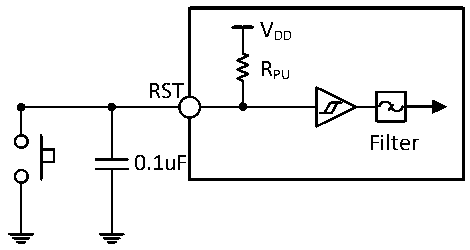

<!-- source-page: 30 -->

[← p.29](0029.md) · [index](../README.md) · [PDF p.30](https://ch32-riscv-ug.github.io/CH32X035/datasheet_en/CH32X035DS0.PDF#page=30) · [p.31 →](0031.md)

<!-- header: CH32X035 Datasheet https://wch-ic.com -->
Output Drive Current Characteristics  
The GPIOs (General-purpose Input/Output) can absorb or output up to ±8mA of current. In user applications, the  
total current driven by all IO pins must not exceed the absolute maximum ratings given in section 3.2.  

<!-- p30-table-001 (table-3-14@1) -->
<table><caption>Table 3-14 Input/output AC characteristics</caption><tr><th>Pin</th><th>Symbol</th><th>Parameter</th><th>Condition</th><th>Min.</th><th>Max.</th><th>Unit</th></tr><tr><td rowspan="6">PA</td><td rowspan="2" style="text-align:left">F max(IO)out</td><td rowspan="2">Maximum frequency</td><td style="text-align:left">CL=50pF，V =2.9~4.0VDD</td><td></td><td>40</td><td>MHz</td></tr><tr><td style="text-align:left">CL=50pF，V =4.0~5.5VDD</td><td></td><td>56</td><td>MHz</td></tr><tr><td rowspan="2" style="text-align:left">t f(IO)out</td><td rowspan="2" style="text-align:left">Output high to low fall time</td><td style="text-align:left">CL=50pF，V =2.9~4.0VDD</td><td></td><td>6</td><td>ns</td></tr><tr><td style="text-align:left">CL=50pF，V =4.0~5.5VDD</td><td></td><td>4.2</td><td>ns</td></tr><tr><td rowspan="2" style="text-align:left">t r(IO)out</td><td rowspan="2" style="text-align:left">Output low to high rise time</td><td style="text-align:left">CL=50pF，V =2.9~4.0VDD</td><td></td><td>8.4</td><td>ns</td></tr><tr><td style="text-align:left">CL=50pF，V =4.0~5.5VDD</td><td></td><td>6</td><td>ns</td></tr><tr><td rowspan="6">PB</td><td rowspan="2" style="text-align:left">F max(IO)out</td><td rowspan="2">Maximum frequency</td><td style="text-align:left">CL=50pF，V =2.9~4.0VDD</td><td></td><td>16</td><td>MHz</td></tr><tr><td style="text-align:left">CL=50pF，V =4.0~5.5VDD</td><td></td><td>24</td><td>MHz</td></tr><tr><td rowspan="2" style="text-align:left">t f(IO)out</td><td rowspan="2" style="text-align:left">Output high to low fall time</td><td style="text-align:left">CL=50pF，V =2.9~4.0VDD</td><td></td><td>6</td><td>ns</td></tr><tr><td style="text-align:left">CL=50pF，V =4.0~5.5VDD</td><td></td><td>4.2</td><td>ns</td></tr><tr><td rowspan="2" style="text-align:left">t r(IO)out</td><td rowspan="2" style="text-align:left">Output low to high rise time</td><td style="text-align:left">CL=50pF，V =2.9~4.0VDD</td><td></td><td>18</td><td>ns</td></tr><tr><td style="text-align:left">CL=50pF，V =4.0~5.5VDD</td><td></td><td>13.2</td><td>ns</td></tr><tr><td rowspan="6">PC</td><td rowspan="2" style="text-align:left">F max(IO)out</td><td rowspan="2">Maximum frequency</td><td style="text-align:left">CL=50pF，V =2.9~4.0VDD</td><td></td><td>28</td><td>MHz</td></tr><tr><td style="text-align:left">CL=50pF，V =4.0~5.5VDD</td><td></td><td>36</td><td>MHz</td></tr><tr><td rowspan="2" style="text-align:left">t f(IO)out</td><td rowspan="2" style="text-align:left">Output high to low fall time</td><td style="text-align:left">CL=50pF，V =2.9~4.0VDD</td><td></td><td>8.4</td><td>ns</td></tr><tr><td style="text-align:left">CL=50pF，V =4.0~5.5VDD</td><td></td><td>7.2</td><td>ns</td></tr><tr><td rowspan="2" style="text-align:left">t r(IO)out</td><td rowspan="2" style="text-align:left">Output low to high rise time</td><td style="text-align:left">CL=50pF，V =2.9~4.0VDD</td><td></td><td>13.2</td><td>ns</td></tr><tr><td style="text-align:left">CL=50pF，V =4.0~5.5VDD</td><td></td><td>9.6</td><td>ns</td></tr></table>

<em>Note: The above are guaranteed design parameters.</em>  

### 3.3.9 RST Pin Characteristics

<!-- p30-table-002 (table-3-15@1) -->
<table><caption>Table 3-15 External reset pin characteristics</caption><tr><th>Symbol</th><th>Parameter</th><th>Condition</th><th>Min.</th><th>Typ.</th><th>Max.</th><th>Unit</th></tr><tr><td style="text-align:left">VF(RST)</td><td>RST input pulse width</td><td></td><td>300</td><td></td><td></td><td>ns</td></tr></table>

Circuit reference design and requirements:  

Figure 3-3 Typical circuit for external reset pin  
 <!-- rendered from the PDF; verify at https://ch32-riscv-ug.github.io/CH32X035/datasheet_en/CH32X035DS0.PDF#page=30 -->

🖼 Text parsed from the figure above

VDD  
RPU  
RST  
Filter  
0.1uF  

<!-- image: p30-draw-image-00001 bbox=[515.88, 783.6, 535.32, 793.8] -->
<!-- footer: V2.2 28 -->
