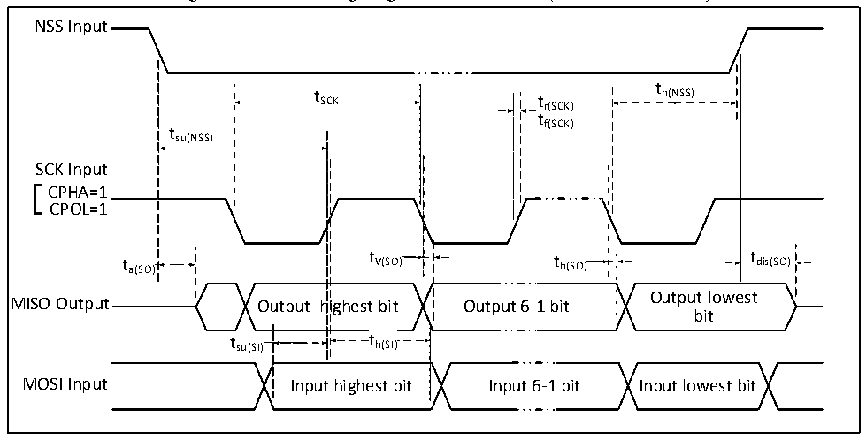

<!-- source-page: 35 -->

[← p.34](0034.md) · [index](../README.md) · [PDF p.35](https://ch32-riscv-ug.github.io/CH32X035/datasheet_en/CH32X035DS0.PDF#page=35) · [p.36 →](0036.md)

<!-- header: CH32X035 Datasheet https://wch-ic.com -->

Figure 3-7-2 SPI timing diagram in Slave mode (CPHA=1, CPOL=1)  
 <!-- rendered from the PDF; verify at https://ch32-riscv-ug.github.io/CH32X035/datasheet_en/CH32X035DS0.PDF#page=35 -->

🖼 Text parsed from the figure above

NSS Input  
t  
t SCK t r(SCK) h(NSS)  
tf(SCK)  
tsu(NSS)  
SCK Input  
CPHA=1  
CPOL=1  
t a(SO) t V(SO) t h(SO) t dis(SO)  
Output lowest  
MISO Output Output highest bit Output 6-1 bit  
bit  
t su(SI)  
t h(SI  th(SI  
MOSI Input Input highest bit Input 6-1 bit Input lowest bit  

<!-- p35-table-003 (table-3-19@1) -->
<table><caption>Table 3-19 SPI interface characteristics</caption><tr><th>Symbol</th><th>Parameter</th><th>Condition</th><th>Min.</th><th>Max.</th><th>Unit</th></tr><tr><td rowspan="2" style="text-align:left">f /t SCK SCK</td><td rowspan="2">SPI clock frequency</td><td>Master mode</td><td></td><td>24</td><td>MHz</td></tr><tr><td>Slave mode</td><td></td><td>24</td><td>MHz</td></tr><tr><td style="text-align:left">t /t r(SCK) f(SCK)</td><td>SPI clock rise and fall time</td><td>Load capacitance: C = 30pF</td><td></td><td>20</td><td>ns</td></tr><tr><td style="text-align:left">t SU(NSS)</td><td>NSS setup time</td><td>Slave mode</td><td style="text-align:left">2t HCLK</td><td></td><td>ns</td></tr><tr><td style="text-align:left">t h(NSS)</td><td>NSS hold time</td><td>Slave mode</td><td style="text-align:left">2t HCLK</td><td></td><td>ns</td></tr><tr><td style="text-align:left">t /t w(SCKH) w(SCKL)</td><td style="text-align:left">SCK high-level and low-level time</td><td style="text-align:left">Master mode, f = 24MHz, PCLK Prescaler factor = 4</td><td>70</td><td>100</td><td>ns</td></tr><tr><td style="text-align:left">t SU(MI)</td><td rowspan="2">Data input setup time</td><td>Master mode</td><td>5</td><td></td><td>ns</td></tr><tr><td style="text-align:left">t SU(SI)</td><td>Slave mode</td><td>5</td><td></td><td>ns</td></tr><tr><td style="text-align:left">t h(MI)</td><td rowspan="2">Data input hold time</td><td>Master mode</td><td>5</td><td></td><td>ns</td></tr><tr><td style="text-align:left">t h(SI)</td><td>Slave mode</td><td>4</td><td></td><td>ns</td></tr><tr><td style="text-align:left">t a(SO)</td><td>Data output access time</td><td style="text-align:left">Slave mode, f = 20MHz PCLK</td><td>0</td><td style="text-align:left">1t HCLK</td><td>ns</td></tr><tr><td style="text-align:left">t dis(SO)</td><td>Data output disable time</td><td>Slave mode</td><td>0</td><td>10</td><td>ns</td></tr><tr><td style="text-align:left">t V(SO)</td><td rowspan="2">Data output valid time</td><td>Slave mode (After enable edge)</td><td></td><td>25</td><td>ns</td></tr><tr><td style="text-align:left">t V(MO)</td><td>Master mode (After enable edge)</td><td></td><td>5</td><td>ns</td></tr><tr><td style="text-align:left">t h(SO)</td><td rowspan="2">Data output hold time</td><td>Slave mode (After enable edge)</td><td>15</td><td></td><td>ns</td></tr><tr><td style="text-align:left">t h(MO)</td><td>Master mode (After enable edge)</td><td>0</td><td></td><td>ns</td></tr></table>

### 3.3.14 USB Interface Characteristics

<!-- p35-table-004 (table-3-20@1) pages 35-36 -->
<table><caption>Table 3-20 USB interface I/O characteristics</caption><tr><th>Symbol</th><th>Parameter</th><th>Condition</th><th>Min.</th><th>Typ.</th><th>Max.</th><th>Unit</th></tr><tr><td style="text-align:left">VDD</td><td>USB operating voltage</td><td style="text-align:left">Selection of USB parameters according to VDD voltage</td><td>3.0</td><td></td><td>5.3</td><td>V</td></tr><tr><td style="text-align:left">VSE</td><td>Single-ended receiver threshold</td><td>Nominal voltage</td><td>1.2</td><td></td><td>1.9</td><td>V</td></tr><tr><td style="text-align:left">VOL</td><td>Static output low level</td><td></td><td></td><td></td><td>0.3</td><td>V</td></tr><tr><td style="text-align:left">VOH</td><td>Static output high level</td><td></td><td>2.8</td><td></td><td></td><td>V</td></tr><tr><td style="text-align:left">VBC_REF</td><td>BC comparator reference voltage</td><td></td><td></td><td>0.4</td><td></td><td>V</td></tr><tr><td style="text-align:left">VBC_SRC</td><td>BC protocol output voltage</td><td></td><td></td><td>0.6</td><td></td><td>V</td></tr></table>

<!-- image: p35-draw-image-00001 bbox=[515.88, 783.6, 535.32, 793.8] -->
<!-- footer: V2.2 33 -->
