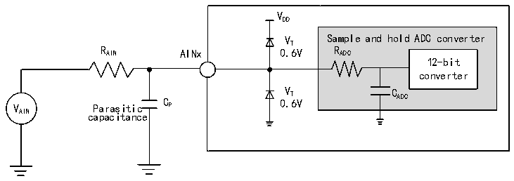
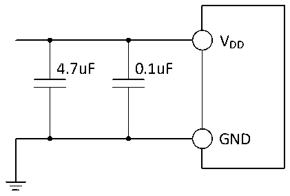

<!-- source-page: 37 -->

[← p.36](0036.md) · [index](../README.md) · [PDF p.37](https://ch32-riscv-ug.github.io/CH32X035/datasheet_en/CH32X035DS0.PDF#page=37) · [p.38 →](0038.md)

<!-- header: CH32X035 Datasheet https://wch-ic.com -->

> ⬆ **Table continued** — rendered in full at [page 36](0036.md). <!-- p37-table-001 -->

<em>Note: All the above are design parameter guarantees.</em>  

<!-- p37-table-002 (table-3-23@1) -->
<table><caption>Table 3-23 ADC error</caption><tr><th>Symbol</th><th>Parameter</th><th>Condition</th><th>Min.</th><th>Typ.</th><th>Max.</th><th>Unit</th></tr><tr><td>EO</td><td>Dysregulation error</td><td rowspan="3" style="text-align:left">f = 3MHz, ADC R &lt; 10kΩ, AIN V = 5VDD</td><td></td><td>±4</td><td></td><td rowspan="3">LSB</td></tr><tr><td>ED</td><td>Differential nonlinearity error</td><td></td><td>±1</td><td>±10</td></tr><tr><td>EL</td><td>Integral nonlinearity error</td><td></td><td>±4</td><td>±20</td></tr></table>

<em>Note: The above are guaranteed design parameters.</em>  
Cp represents the parasitic capacitance on the PCB and the pad (about 5pF), which may be related to the quality of  
the pad and PCB layout. A larger Cp value will reduce the conversion accuracy, the solution is to reduce the fADC  
value.  

Figure 3-8 ADC typical connection diagram  
 <!-- rendered from the PDF; verify at https://ch32-riscv-ug.github.io/CH32X035/datasheet_en/CH32X035DS0.PDF#page=37 -->

🖼 Text parsed from the figure above

VDD  
VT Sample and hold ADC converter  
R AIN AINx 0.6V R ADC  
12-bit  
converter  
V Parasitic C P 0 V . T 6V C ADC  
AIN capacitance  

Figure 3-9 Analog power supply and decoupling circuit reference  
 <!-- rendered from the PDF; verify at https://ch32-riscv-ug.github.io/CH32X035/datasheet_en/CH32X035DS0.PDF#page=37 -->

🖼 Text parsed from the figure above

VDD  
4.7uF 0.1uF  
GND  

### 3.3.16 OPA Characteristics

<!-- p37-table-003 (table-3-24@1) pages 37-38 -->
<table><caption>Table 3-24 OPA characteristics</caption><tr><th>Symbol</th><th>Parameter</th><th style="text-align:left">Condition: V = 5VDD</th><th>Min.</th><th>Typ.</th><th>Max.</th><th>Unit</th></tr><tr><td style="text-align:left">VDD</td><td>Supply voltage</td><td>Recommended not less than 2.5V</td><td>2</td><td>5</td><td>5.5</td><td>V</td></tr><tr><td style="text-align:left">VCM</td><td style="text-align:left">Common mode input voltage</td><td></td><td>0</td><td></td><td style="text-align:left">VDD</td><td>V</td></tr><tr><td rowspan="2" style="text-align:left">VIOFFSET</td><td rowspan="2">Input offset voltage</td><td style="text-align:left">Common mode input V = 0.5VCM</td><td></td><td>±5</td><td>±13</td><td rowspan="2">mV</td></tr><tr><td style="text-align:left">Common mode input V = CM V /2DD</td><td></td><td>±3</td><td>±10</td></tr><tr><td style="text-align:left">Common mode input V = CM V -0.5VDD</td><td></td><td>±5</td><td>±17</td></tr><tr><td style="text-align:left">ILOAD</td><td>Drive current</td><td style="text-align:left">R = 5kΩLOAD</td><td></td><td></td><td>1</td><td>mA</td></tr><tr><td style="text-align:left">ILOAD_PGA</td><td style="text-align:left">PGA mode drive current</td><td></td><td></td><td></td><td>400</td><td>uA</td></tr><tr><td style="text-align:left">IDDOPAMP</td><td>Current consumption</td><td>No load, static mode</td><td></td><td>210</td><td></td><td>uA</td></tr><tr><td style="text-align:left">C (1) MRR</td><td style="text-align:left">Common mode rejection ratio</td><td>@1kHz</td><td></td><td>110</td><td></td><td>dB</td></tr><tr><td style="text-align:left">P (1) SRR</td><td style="text-align:left">Power supply rejection ratio</td><td>@1kHz</td><td></td><td>71</td><td></td><td>dB</td></tr><tr><td>Av(1)</td><td>Open loop gain</td><td style="text-align:left">C = 5pFLOAD</td><td></td><td>110</td><td></td><td>dB</td></tr><tr><td style="text-align:left">G (1) BW</td><td>Unit gain bandwidth</td><td style="text-align:left">C = 5pFLOAD</td><td></td><td>13</td><td></td><td>MHz</td></tr><tr><td style="text-align:left">P (1) M</td><td>Phase margin</td><td style="text-align:left">C = 5pFLOAD</td><td></td><td>88</td><td></td><td></td></tr><tr><td style="text-align:left">S (1) R</td><td>Slew rate limited</td><td style="text-align:left">C = 5pFLOAD</td><td></td><td>5</td><td></td><td>V/us</td></tr><tr><td style="text-align:left">t (1) WAKUP</td><td style="text-align:left">Setup time from shutdown to wake up, 0.1%</td><td style="text-align:left">Input V /2, DD C = 50pF，R = 5kΩ LOAD LOAD</td><td></td><td></td><td>1</td><td>us</td></tr><tr><td style="text-align:left">RLOAD</td><td>Resistive load</td><td></td><td>5</td><td></td><td></td><td>kΩ</td></tr><tr><td style="text-align:left">CLOAD</td><td>Capacitive load</td><td></td><td></td><td></td><td>50</td><td>pF</td></tr><tr><td rowspan="2" style="text-align:left">V (2) OHSAT</td><td rowspan="2" style="text-align:left">High saturation output voltage</td><td style="text-align:left">R = 5kΩLOAD</td><td style="text-align:left">V -300DD</td><td></td><td></td><td rowspan="2">mV</td></tr><tr><td style="text-align:left">R = 20kΩLOAD</td><td style="text-align:left">V -50DD</td><td></td><td></td></tr><tr><td rowspan="2" style="text-align:left">V (2) OLSAT</td><td rowspan="2" style="text-align:left">Low saturation output voltage</td><td style="text-align:left">R = 5kΩLOAD</td><td></td><td></td><td>10</td><td rowspan="2">mV</td></tr><tr><td style="text-align:left">R = 20kΩLOAD</td><td></td><td></td><td>7</td></tr><tr><td rowspan="5" style="text-align:left">PGAGain(1)</td><td style="text-align:left">NSEL=010b mode in phase</td><td>Gain =16, PA1=GND</td><td>-3</td><td></td><td>3</td><td>%</td></tr><tr><td rowspan="4">Internal in-phase PGA</td><td style="text-align:left">Gain = 4 V &lt; (V /7) INP DD</td><td>-1</td><td></td><td>1</td><td>%</td></tr><tr><td style="text-align:left">Gain = 8 V &lt; (V /15) INP DD</td><td>-1</td><td></td><td>1</td><td>%</td></tr><tr><td style="text-align:left">Gain = 16 V &lt; (V /31) INP DD</td><td>-1</td><td></td><td>1</td><td>%</td></tr><tr><td style="text-align:left">Gain = 32 V &lt; (V /63) INP DD</td><td>-1</td><td></td><td>1</td><td>%</td></tr><tr><td>Delta R</td><td style="text-align:left">Absolute change in resistance</td><td></td><td>-15</td><td></td><td>15</td><td>%</td></tr><tr><td rowspan="2">EN(1)</td><td rowspan="2" style="text-align:left">Equivalent input voltage noise</td><td style="text-align:left">R = 5kΩ@1kHz LOAD</td><td></td><td>100</td><td></td><td rowspan="2" style="text-align:left">nV/ sqrt(Hz )</td></tr><tr><td style="text-align:left">R = 20kΩ@1KHz LOAD</td><td></td><td>60</td><td></td></tr></table>

<!-- image: p37-draw-image-00001 bbox=[515.88, 783.6, 535.32, 793.8] -->
<!-- footer: V2.2 35 -->
