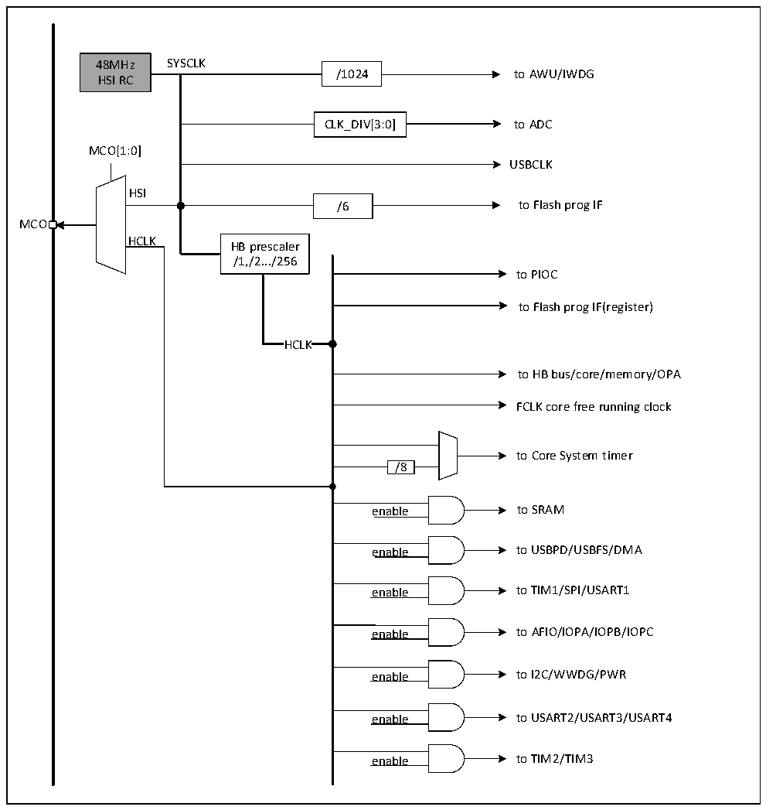

<!-- source-page: 5 -->

[← p.4](0004.md) · [index](../README.md) · [PDF p.5](https://ch32-riscv-ug.github.io/CH32X035/datasheet_zh/CH32X035DS0.PDF#page=5) · [p.6 →](0006.md)

<!-- header: CH32X035数据手册 https://wch.cn -->

## 1.3 时钟树

系统时钟源：内部高频RC振荡器（HSI）。  

图1-3 时钟树框图  
 <!-- rendered from the PDF; verify at https://ch32-riscv-ug.github.io/CH32X035/datasheet_zh/CH32X035DS0.PDF#page=5 -->

🖼 Text parsed from the figure above

48MHz SYSCLK  
/1024 to AWU/IWDG  
HSI RC  
CLK_DIV[3:0] to ADC  
MCO[1:0]  
USBCLK  
HSI  
/6 to Flash prog IF  
MCO  
HCLK  
HB prescaler  
/1,/2.../256  
to PIOC  
to Flash prog IF(register)  
HCLK  HCLK  
to HB bus/core/memory/OPA  
FCLK core free running clock  
to Core System timer  
/8  /8  
enable to SRAM  
enable to USBPD/USBFS/DMA  
enable to TIM1/SPI/USART1  
enable to AFIO/IOPA/IOPB/IOPC  
enable to I2C/WWDG/PWR  
enable to USART2/USART3/USART4  
enable to TIM2/TIM3  

<!-- image: p5-draw-image-00001 bbox=[507.72, 779.28, 527.16, 789.6] -->
<!-- footer: V2.2 3 -->
