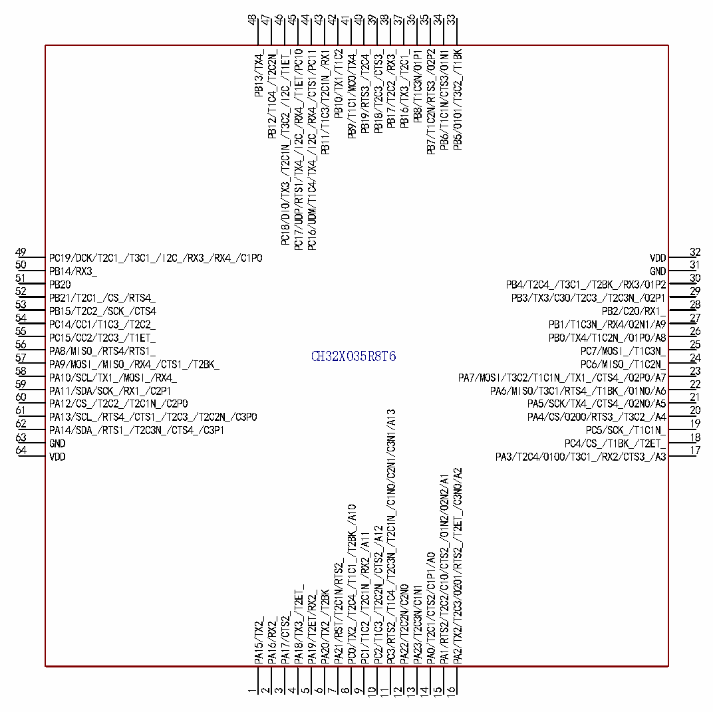

<!-- source-page: 11 -->

[← p.10](0010.md) · [index](../README.md) · [PDF p.11](https://ch32-riscv-ug.github.io/CH32X035/datasheet_zh/CH32X035DS0.PDF#page=11) · [p.12 →](0012.md)

<!-- header: CH32X035数据手册 https://wch.cn -->

# 第 2 章 引脚信息

## 2.1 引脚排列

 <!-- p11-cluster-01 uncaptioned graphics, rendered from the PDF; verify at https://ch32-riscv-ug.github.io/CH32X035/datasheet_zh/CH32X035DS0.PDF#page=11 -->

🖼 Text parsed from the figure above

48  
47  
46  
45  
44  
43  
42  
41  
40  
39  
38  
37  
36  
35  
34  
33  
PC17/UDP/RTS1/TX4_/I2C_/RX4_/T1ET/PC10  
PC16/UDM/T1C4/TX4_/I2C_/RX4_/CTS1/PC11  
PC18/DIO/TX3_/T2C1N_/T3C2_/I2C_/T1ET_  
PB11/T1C3/T2C1N_/RX1  
PB7/T1C2N/RTS3_/O2P2  
PB6/T1C1N/CTS3/O1N1  
PB5/O1O1/T3C2_/T1BK  
PB12/T1C4_/T2C2N_  
PB9/T1C1/MCO/TX4_  
PB19/RTS3_/T2C4_  
PB18/T2C3_/CTS3_  
PB17/T2C2_/RX3_  
PB16/TX3_/T2C1_  
PB10/TX1/T1C2  
PB8/T1C3N/O1P1  
PB13/TX4_  
49  
32  
PC19/DCK/T2C1_/T3C1_/I2C_/RX3_/RX4_/C1P0  
VDD  
50  
31  
PB14/RX3_  
GND  
51  
30  
PB20  
PB4/T2C4_/T3C1_/T2BK_/RX3/O1P2  
52  
29  
PB21/T2C1_/CS_/RTS4_  
PB3/TX3/C3O/T2C3_/T2C3N_/O2P1  
53  
28  
PB15/T2C2_/SCK_/CTS4  
PB2/C2O/RX1_  
54  
27  
PC14/CC1/T1C3_/T2C2_  
PB1/T1C3N_/RX4/O2N1/A9  
55  
26  
PC15/CC2/T2C3_/T1ET_  
PB0/TX4/T1C2N_/O1P0/A8  
56  
25  
PA8/MISO_/RTS4/RTS1_ 57  
PC7/MOSI_/T1C3N_ 24  
CH32X035R8T6  
PA9/MOSI_/MISO_/RX4_/CTS1_/T2BK_  
PC6/MISO_/T1C2N_  
58 23  
PA10/SCL/TX1_/MOSI_/RX4_ PA7/MOSI/T3C2/T1C1N_/TX1_/CTS4_/O2P0/A7  
59 22  
PA11/SDA/SCK_/RX1_/C2P1 PA6/MISO/T3C1/RTS4_/T1BK_/O1N0/A6  
60 21  
PA12/CS_/T2C2_/T2C1N_/C2P0 PA5/SCK/TX4_/CTS4_/O2N0/A5  
61 20  
PC3/RTS2_/T1C4_/T2C3N_/T2C1N_/C1N0/C2N1/C3N1/A13  
PA13/SCL_/RTS4_/CTS1_/T2C3_/T2C2N_/C3P0 PA4/CS/O2O0/RTS3_/T3C2_/A4  
62  
19  
PA14/SDA_/RTS1_/T2C3N_/CTS4_/C3P1  
PC5/SCK_/T1C1N_  
63  
18  
GND  
PC4/CS_/T1BK_/T2ET_  
64  
17  
VDD  
PA3/T2C4/O1O0/T3C1_/RX2/CTS3_/A3  
PA2/TX2/T2C3/O2O1/RTS2_/T2ET_/C3N0/A2  
PA1/RTS2/T2C2/C1O/CTS2_/O1N2/O2N2/A1  
PC0/TX2_/T2C4_/T1C1_/T2BK_/A10  
PC2/T1C3_/T2C2N_/CTS2_/A12  
PC1/T1C2_/T2C1N_/RX2_/A11  
PA0/T2C1/CTS2/C1P1/A0  
PA21/RST/T2C1N/RTS2_  
PA18/TX3_/T2ET_  
PA22/T2C2N/C2N0  
PA23/T2C3N/C1N1  
PA19/T2ET/RX2_  
PA20/TX2_/T2BK  
PA17/CTS2_  
PA15/TX2_  
PA16/RX2_  
1  
2  
3  
4  
5  
6  
7  
8  
9  
10  
11  
12  
13  
14  
15  
16  

<!-- image: p11-draw-image-00001 bbox=[496.32, 779.28, 515.76, 789.6] -->
<!-- footer: V2.2 9 -->
