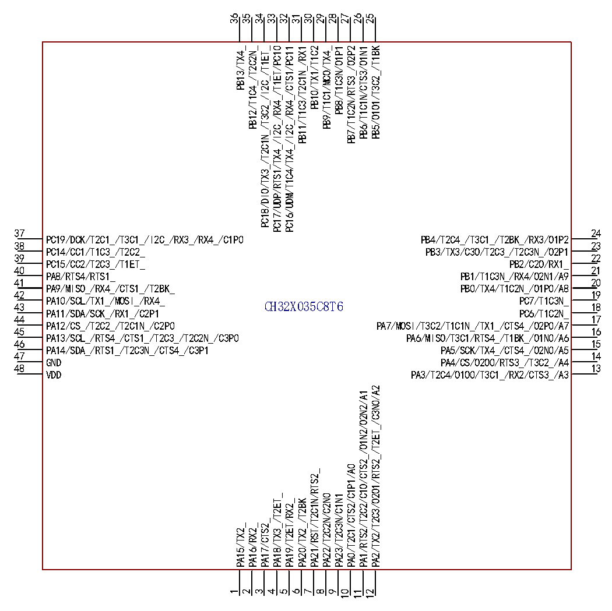

<!-- source-page: 12 -->

[← p.11](0011.md) · [index](../README.md) · [PDF p.12](https://ch32-riscv-ug.github.io/CH32X035/datasheet_zh/CH32X035DS0.PDF#page=12) · [p.13 →](0013.md)

<!-- header: CH32X035数据手册 https://wch.cn -->

 <!-- p12-cluster-01 uncaptioned graphics, rendered from the PDF; verify at https://ch32-riscv-ug.github.io/CH32X035/datasheet_zh/CH32X035DS0.PDF#page=12 -->

🖼 Text parsed from the figure above

36  
35  
34  
33  
32  
31  
30  
29  
28  
27  
26  
25  
PC18/DIO/TX3_/T2C1N_/T3C2_/I2C_/T1ET_  
PC17/UDP/RTS1/TX4_/I2C_/RX4_/T1ET/PC10  
PC16/UDM/T1C4/TX4_/I2C_/RX4_/CTS1/PC11  
PB11/T1C3/T2C1N_/RX1  
PB7/T1C2N/RTS3_/O2P2  
PB12/T1C4_/T2C2N_  
PB9/T1C1/MCO/TX4_  
PB6/T1C1N/CTS3/O1N1  
PB5/O1O1/T3C2_/T1BK  
PB10/TX1/T1C2  
PB8/T1C3N/O1P1  
PB13/TX4_  
37  
24  
PC19/DCK/T2C1_/T3C1_/I2C_/RX3_/RX4_/C1P0  
PB4/T2C4_/T3C1_/T2BK_/RX3/O1P2  
38  
23  
PC14/CC1/T1C3_/T2C2_  
PB3/TX3/C3O/T2C3_/T2C3N_/O2P1  
39  
22  
PC15/CC2/T2C3_/T1ET_  
PB2/C2O/RX1_  
40  
21  
PA8/RTS4/RTS1_  
PB1/T1C3N_/RX4/O2N1/A9  
41  
20  
PA9/MISO_/RX4_/CTS1_/T2BK_  
PB0/TX4/T1C2N_/O1P0/A8  
42  
19  
PA10/SCL/TX1_/MOSI_/RX4_  
PC7/T1C3N_  
CH32X035C8T6 18  
43  
PA11/SDA/SCK_/RX1_/C2P1  
PC6/T1C2N_  
44 17  
PA12/CS_/T2C2_/T2C1N_/C2P0 PA7/MOSI/T3C2/T1C1N_/TX1_/CTS4_/O2P0/A7  
45 16  
PA13/SCL_/RTS4_/CTS1_/T2C3_/T2C2N_/C3P0 PA6/MISO/T3C1/RTS4_/T1BK_/O1N0/A6  
46 15  
PA14/SDA_/RTS1_/T2C3N_/CTS4_/C3P1 PA5/SCK/TX4_/CTS4_/O2N0/A5  
47  
14  
GND  
PA4/CS/O2O0/RTS3_/T3C2_/A4  
48  
13  
VDD  
PA3/T2C4/O1O0/T3C1_/RX2/CTS3_/A3  
PA2/TX2/T2C3/O2O1/RTS2_/T2ET_/C3N0/A2  
PA1/RTS2/T2C2/C1O/CTS2_/O1N2/O2N2/A1  
PA0/T2C1/CTS2/C1P1/A0  
PA21/RST/T2C1N/RTS2_  
PA18/TX3_/T2ET_  
PA22/T2C2N/C2N0  
PA23/T2C3N/C1N1  
PA19/T2ET/RX2_  
PA20/TX2_/T2BK  
PA17/CTS2_  
PA15/TX2_  
PA16/RX2_  
1  
2  
3  
4  
5  
6  
7  
8  
9  
10  
11  
12  

<!-- p12-table-001 (unlabelled-p12-1) -->
<table><tr><th style="text-align:left">12345678910</th><th style="text-align:left">PB12/T1C4_/T2C2N_ PC19/DCK/T2C1_/T3C1_/I2C_/RX3_/C1P0 PC14/CC1/T1C3_/T2C2_ PC18/DIO/TX3_/T2C1N_/T3C2_/I2C_/T1ET_ PC15/CC2/T2C3_/T1ET_ PC17/UDP/TX4_/I2C_/RX4_/T1ET/PC10 PC3/RST/T1C4_/T2C3N_/C1N0/A13 PC16/UDM/T1C4/TX4_/I2C_/RX4_/PC11 PC1/T1C2_/T2C1N_/RX2_/A11 VDD PA0/T2C1/CTS2/C1P1/A0 GND PA1/RTS2/T2C2/C1O/O2N2/A1 PB1/T1C3N_/RX4/O2N1/A9 PA2/TX2/T2C3/O2O1/T2ET_/A2 PA7/MOSI/T3C2/T1C1N_/TX1_/O2P0/A7 PA3/T2C4/T3C1_/RX2/A3 PA6/MISO/T3C1/T1BK_/A6 PA4/CS/O2O0/T3C2_/A4 PA5/SCK/TX4_/O2N0/A5CH32X035F7P6</th><th style="text-align:left">20191817161514131211</th></tr></table>

<!-- image: p12-draw-image-00001 bbox=[500.88, 779.28, 520.32, 789.6] -->
<!-- footer: V2.2 10 -->
