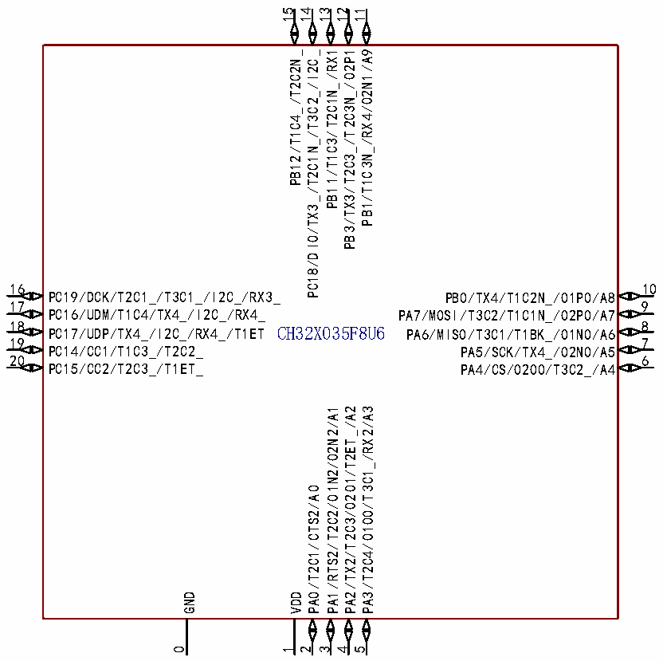
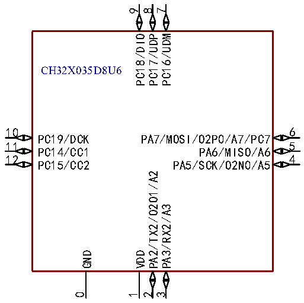

<!-- source-page: 14 -->

[← p.13](0013.md) · [index](../README.md) · [PDF p.14](https://ch32-riscv-ug.github.io/CH32X035/datasheet_zh/CH32X035DS0.PDF#page=14) · [p.15 →](0015.md)

<!-- header: CH32X035数据手册 https://wch.cn -->

 <!-- p14-cluster-01 uncaptioned graphics, rendered from the PDF; verify at https://ch32-riscv-ug.github.io/CH32X035/datasheet_zh/CH32X035DS0.PDF#page=14 -->

 <!-- p14-cluster-02 uncaptioned graphics, rendered from the PDF; verify at https://ch32-riscv-ug.github.io/CH32X035/datasheet_zh/CH32X035DS0.PDF#page=14 -->

🖼 Text parsed from the figure above

15  
14 13 12 11  
PB12/T1C4_/T2C2N_ PC18/DIO/TX3_/T2C1N_/T3C2_/I2C_ PB11/T1C3/T2C1N_/RX1 PB3/TX3/T2C3_/T2C3N_/O2P1 PB1/T1C3N_/RX4/O2N1/A9  
16  
10  
PC19/DCK/T2C1_/T3C1_/I2C_/RX3_  
PB0/TX4/T1C2N_/O1P0/A8  
17  
9  
PC16/UDM/T1C4/TX4_/I2C_/RX4_  
PA7/MOSI/T3C2/T1C1N_/O2P0/A7  
18 CH32X035F8U6  
8 PC17/UDP/TX4_/I2C_/RX4_/T1ET  
PA6/MISO/T3C1/T1BK_/O1N0/A6  
19  
7  
PC14/CC1/T1C3_/T2C2_  
PA5/SCK/TX4_/O2N0/A5  
20  
6  
PC15/CC2/T2C3_/T1ET_  
PA4/CS/O2O0/T3C2_/A4  
PA1/RTS2/T2C2/O1N2/O2N2/A1  
PA2/TX2/T2C3/O2O1/T2ET_/A2  
PA3/T2C4/O1O0/T3C1_/RX2/A3  
PA0/T2C1/CTS2/A0  
GND  
VDD  
0  
1  
2  
3  
4  
5  
9  
8  
7  
PC18/DIO  
PC17/UDP  
PC16/UDM  
CH32X035D8U6  
6  
10  
PC19/DCK  
PA7/MOSI/O2P0/A7/PC7  
5  
11  
PC14/CC1  
PA6/MISO/A6  
4  
12  
PC15/CC2  
PA5/SCK/O2N0/A5  
PA2/TX2/O2O1/A2  
PA3/RX2/A3  
GND VDD  
0 1  
2 3  

<!-- image: p14-draw-image-00001 bbox=[500.88, 779.28, 520.32, 789.6] -->
<!-- footer: V2.2 12 -->
