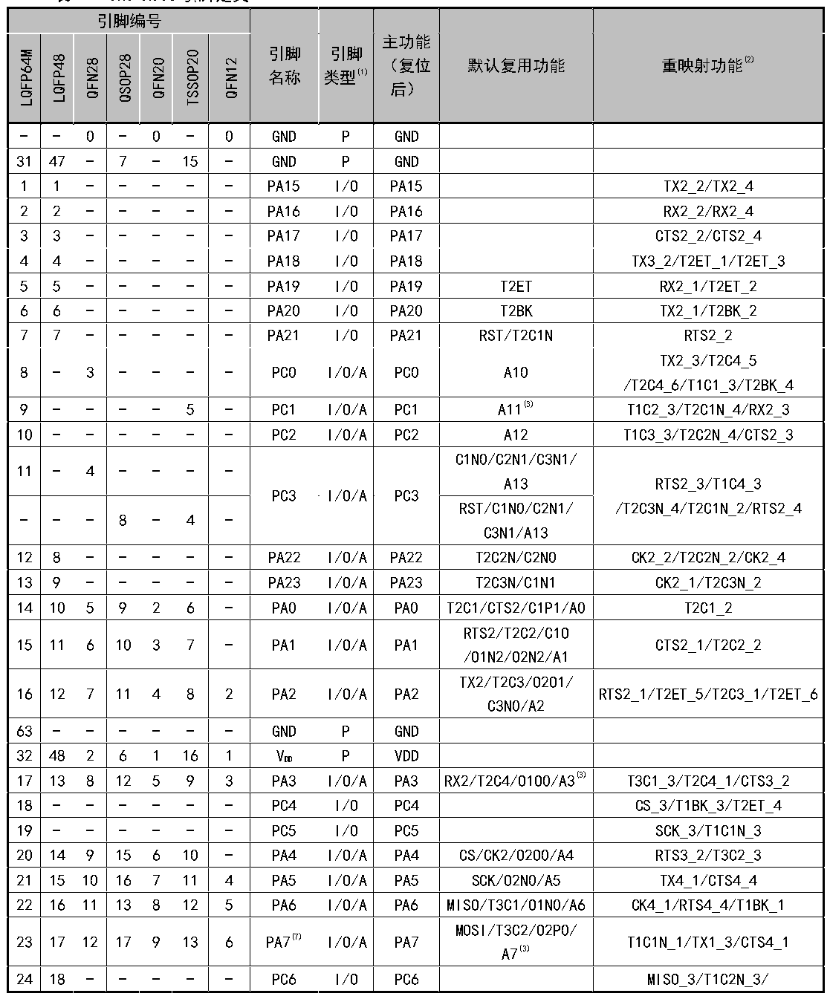

<!-- source-page: 16 -->

[← p.15](0015.md) · [index](../README.md) · [PDF p.16](https://ch32-riscv-ug.github.io/CH32X035/datasheet_zh/CH32X035DS0.PDF#page=16) · [p.17 →](0017.md)

<!-- header: CH32X035数据手册 https://wch.cn -->

## 2.2 引脚描述

注意，下表中的引脚功能描述针对的是所有功能，不涉及具体型号产品。不同型号之间外设资源有差  
异，查看前请先根据产品型号资源表确认是否有此功能。  

 <!-- p16-cluster-01 uncaptioned graphics, rendered from the PDF; verify at https://ch32-riscv-ug.github.io/CH32X035/datasheet_zh/CH32X035DS0.PDF#page=16 -->

🖼 Text parsed from the figure above

<!-- p16-table-001 (table-2-1@1) pages 16-18 -->
<table><caption>表2-1 CH32X035引脚定义</caption><tr><th colspan="7">引脚编号</th><th rowspan="3">引脚</th><th rowspan="3">引脚</th><th rowspan="2">主功能</th><th rowspan="7">默认复用功能</th><th rowspan="7">重映射功能(2)</th></tr><tr><td rowspan="6">LQFP64M</td><td rowspan="6">LQFP48</td><td rowspan="6">QFN28</td><td rowspan="6">QSOP28</td><td rowspan="6">QFN20</td><td rowspan="6">TSSOP20</td><td rowspan="6">QFN12</td></tr><tr><td rowspan="2">（复位</td></tr><tr><td rowspan="2">名称</td><td rowspan="2">类型(1)</td></tr><tr><td rowspan="2">后）</td></tr><tr><td rowspan="2"></td><td rowspan="2"></td></tr><tr><td></td></tr><tr><td>-</td><td>-</td><td>0</td><td>-</td><td>0</td><td>-</td><td>0</td><td>GND</td><td>P</td><td>GND</td><td></td><td></td></tr><tr><td>31</td><td>47</td><td>-</td><td>7</td><td>-</td><td>15</td><td>-</td><td>GND</td><td>P</td><td>GND</td><td></td><td></td></tr><tr><td>1</td><td>1</td><td>-</td><td>-</td><td>-</td><td>-</td><td>-</td><td>PA15</td><td>I/O</td><td>PA15</td><td></td><td>TX2_2/TX2_4</td></tr><tr><td>2</td><td>2</td><td>-</td><td>-</td><td>-</td><td>-</td><td>-</td><td>PA16</td><td>I/O</td><td>PA16</td><td></td><td>RX2_2/RX2_4</td></tr><tr><td>3</td><td>3</td><td>-</td><td>-</td><td>-</td><td>-</td><td>-</td><td>PA17</td><td>I/O</td><td>PA17</td><td></td><td>CTS2_2/CTS2_4</td></tr><tr><td>4</td><td>4</td><td>-</td><td>-</td><td>-</td><td>-</td><td>-</td><td>PA18</td><td>I/O</td><td>PA18</td><td></td><td>TX3_2/T2ET_1/T2ET_3</td></tr><tr><td>5</td><td>5</td><td>-</td><td>-</td><td>-</td><td>-</td><td>-</td><td>PA19</td><td>I/O</td><td>PA19</td><td>T2ET</td><td>RX2_1/T2ET_2</td></tr><tr><td>6</td><td>6</td><td>-</td><td>-</td><td>-</td><td>-</td><td>-</td><td>PA20</td><td>I/O</td><td>PA20</td><td>T2BK</td><td>TX2_1/T2BK_2</td></tr><tr><td>7</td><td>7</td><td>-</td><td>-</td><td>-</td><td>-</td><td>-</td><td>PA21</td><td>I/O</td><td>PA21</td><td>RST/T2C1N</td><td>RTS2_2</td></tr><tr><td>8</td><td>-</td><td>3</td><td>-</td><td>-</td><td>-</td><td>-</td><td>PC0</td><td>I/O/A</td><td>PC0</td><td>A10</td><td style="text-align:left">TX2_3/T2C4_5 /T2C4_6/T1C1_3/T2BK_4</td></tr><tr><td>9</td><td>-</td><td>-</td><td>-</td><td>-</td><td>5</td><td>-</td><td>PC1</td><td>I/O/A</td><td>PC1</td><td>A11(3)</td><td>T1C2_3/T2C1N_4/RX2_3</td></tr><tr><td>10</td><td>-</td><td>-</td><td>-</td><td>-</td><td>-</td><td>-</td><td>PC2</td><td>I/O/A</td><td>PC2</td><td>A12</td><td>T1C3_3/T2C2N_4/CTS2_3</td></tr><tr><td>11</td><td>-</td><td>4</td><td>-</td><td>-</td><td>-</td><td>-</td><td rowspan="2">PC3</td><td rowspan="2">I/O/A</td><td rowspan="2">PC3</td><td style="text-align:left">C1N0/C2N1/C3N1/ A13</td><td rowspan="2" style="text-align:left">RTS2_3/T1C4_3 /T2C3N_4/T2C1N_2/RTS2_4</td></tr><tr><td>-</td><td>-</td><td>-</td><td>8</td><td>-</td><td>4</td><td>-</td><td style="text-align:left">RST/C1N0/C2N1/ C3N1/A13</td></tr><tr><td>12</td><td>8</td><td>-</td><td>-</td><td>-</td><td>-</td><td>-</td><td>PA22</td><td>I/O/A</td><td>PA22</td><td>T2C2N/C2N0</td><td>CK2_2/T2C2N_2/CK2_4</td></tr><tr><td>13</td><td>9</td><td>-</td><td>-</td><td>-</td><td>-</td><td>-</td><td>PA23</td><td>I/O/A</td><td>PA23</td><td>T2C3N/C1N1</td><td>CK2_1/T2C3N_2</td></tr><tr><td>14</td><td>10</td><td>5</td><td>9</td><td>2</td><td>6</td><td>-</td><td>PA0</td><td>I/O/A</td><td>PA0</td><td>T2C1/CTS2/C1P1/A0</td><td>T2C1_2</td></tr><tr><td>15</td><td>11</td><td>6</td><td>10</td><td>3</td><td>7</td><td>-</td><td>PA1</td><td>I/O/A</td><td>PA1</td><td style="text-align:left">RTS2/T2C2/C1O /O1N2/O2N2/A1</td><td>CTS2_1/T2C2_2</td></tr><tr><td>16</td><td>12</td><td>7</td><td>11</td><td>4</td><td>8</td><td>2</td><td>PA2</td><td>I/O/A</td><td>PA2</td><td style="text-align:left">TX2/T2C3/O2O1/ C3N0/A2</td><td>RTS2_1/T2ET_5/T2C3_1/T2ET_6</td></tr><tr><td>63</td><td>-</td><td>-</td><td>-</td><td>-</td><td>-</td><td>-</td><td>GND</td><td>P</td><td>GND</td><td></td><td></td></tr><tr><td>32</td><td>48</td><td>2</td><td>6</td><td>1</td><td>16</td><td>1</td><td style="text-align:left">VDD</td><td>P</td><td>VDD</td><td></td><td></td></tr><tr><td>17</td><td>13</td><td>8</td><td>12</td><td>5</td><td>9</td><td>3</td><td>PA3</td><td>I/O/A</td><td>PA3</td><td>RX2/T2C4/O1O0/A3(3)</td><td>T3C1_3/T2C4_1/CTS3_2</td></tr><tr><td>18</td><td>-</td><td>-</td><td>-</td><td>-</td><td>-</td><td>-</td><td>PC4</td><td>I/O</td><td>PC4</td><td></td><td>CS_3/T1BK_3/T2ET_4</td></tr><tr><td>19</td><td>-</td><td>-</td><td>-</td><td>-</td><td>-</td><td>-</td><td>PC5</td><td>I/O</td><td>PC5</td><td></td><td>SCK_3/T1C1N_3</td></tr><tr><td>20</td><td>14</td><td>9</td><td>15</td><td>6</td><td>10</td><td>-</td><td>PA4</td><td>I/O/A</td><td>PA4</td><td>CS/CK2/O2O0/A4</td><td>RTS3_2/T3C2_3</td></tr><tr><td>21</td><td>15</td><td>10</td><td>16</td><td>7</td><td>11</td><td>4</td><td>PA5</td><td>I/O/A</td><td>PA5</td><td>SCK/O2N0/A5</td><td>TX4_1/CTS4_4</td></tr><tr><td>22</td><td>16</td><td>11</td><td>13</td><td>8</td><td>12</td><td>5</td><td>PA6</td><td>I/O/A</td><td>PA6</td><td>MISO/T3C1/O1N0/A6</td><td>CK4_1/RTS4_4/T1BK_1</td></tr><tr><td>23</td><td>17</td><td>12</td><td>17</td><td>9</td><td>13</td><td>6</td><td>PA7(7)</td><td>I/O/A</td><td>PA7</td><td style="text-align:left">MOSI/T3C2/O2P0/ A7(3)</td><td>T1C1N_1/TX1_3/CTS4_1</td></tr><tr><td>24</td><td>18</td><td>-</td><td>-</td><td>-</td><td>-</td><td>-</td><td>PC6</td><td>I/O</td><td>PC6</td><td></td><td>MISO_3/T1C2N_3/</td></tr><tr><td colspan="7">引脚编号</td><td rowspan="3">引脚</td><td rowspan="3">引脚</td><td rowspan="2">主功能</td><td rowspan="7">默认复用功能</td><td rowspan="7">重映射功能(2)</td></tr><tr><td rowspan="6">LQFP64M</td><td rowspan="6">LQFP48</td><td rowspan="6">QFN28</td><td rowspan="6">QSOP28</td><td rowspan="6">QFN20</td><td rowspan="6">TSSOP20</td><td rowspan="6">QFN12</td></tr><tr><td rowspan="2">（复位</td></tr><tr><td rowspan="2">名称</td><td rowspan="2">类型(1)</td></tr><tr><td rowspan="2">后）</td></tr><tr><td rowspan="2"></td><td rowspan="2"></td></tr><tr><td></td></tr><tr><td>25</td><td>19</td><td>-</td><td>-</td><td>-</td><td>-</td><td>6</td><td>PC7(7)</td><td>I/O</td><td>PC7</td><td></td><td>MOSI_3/T1C3N_3/PIOC_IO0_1</td></tr><tr><td>26</td><td>20</td><td>13</td><td>14</td><td>10</td><td>-</td><td>-</td><td>PB0</td><td>I/O/A</td><td>PB0</td><td>TX4/O1P0/A8</td><td>T1C2N_1</td></tr><tr><td>27</td><td>21</td><td>16</td><td>20</td><td>11</td><td>14</td><td>-</td><td>PB1(5)</td><td>I/O/A</td><td>PB1</td><td>RX4/O2N1/A9</td><td>T1C3N_1</td></tr><tr><td>28</td><td>22</td><td>-</td><td>-</td><td>-</td><td>-</td><td>-</td><td>PB2</td><td>I/O/A</td><td>PB2</td><td>CK4/C2O</td><td>RX1_3/CK4_2/CK4_5</td></tr><tr><td>29</td><td>23</td><td>14</td><td>18</td><td>12</td><td>-</td><td>-</td><td>PB3</td><td>I/O/A</td><td>PB3</td><td>TX3/C3O/O2P1</td><td style="text-align:left">T2C3_2/T2C3N_5/T2C3_3/ T2C3N_6</td></tr><tr><td>30</td><td>24</td><td>15</td><td>19</td><td>-</td><td>-</td><td>-</td><td>PB4</td><td>I/O/A</td><td>PB4</td><td>RX3/O1P2</td><td style="text-align:left">T2C4_2/T3C1_1/T2BK_5/ T2C4_3/T2BK_6</td></tr><tr><td>64</td><td>-</td><td>-</td><td>-</td><td>-</td><td>-</td><td>-</td><td style="text-align:left">VDD</td><td>P</td><td style="text-align:left">VDD</td><td></td><td></td></tr><tr><td>33</td><td>25</td><td>16</td><td>20</td><td>-</td><td>-</td><td>-</td><td>PB5(5)</td><td>I/O/A</td><td>PB5</td><td>CK3/O1O1/T1BK</td><td>CK1_2/T3C2_1/CK3_1/T1BK_2</td></tr><tr><td>34</td><td>26</td><td>17</td><td>21</td><td>-</td><td>-</td><td>-</td><td>PB6</td><td>I/O/A</td><td>PB6</td><td>T1C1N/CTS3/O1N1</td><td>T1C1N_2/CTS3_1</td></tr><tr><td>35</td><td>27</td><td>18</td><td>22</td><td>-</td><td>-</td><td>-</td><td>PB7</td><td>I/O/A</td><td>PB7</td><td>T1C2N/O2P2/RTS3</td><td>RTS3_1/T1C2N_2</td></tr><tr><td>36</td><td>28</td><td>19</td><td>23</td><td>-</td><td>-</td><td>-</td><td>PB8</td><td>I/O/A</td><td>PB8</td><td>T1C3N/O1P1</td><td>CK3_2/CK4_3/T1C3N_2</td></tr><tr><td>37</td><td>-</td><td>-</td><td>-</td><td>-</td><td>-</td><td>-</td><td>PB16</td><td>I/O</td><td>PB16</td><td></td><td>TX3_3/T2C1_4</td></tr><tr><td>38</td><td>-</td><td>-</td><td>-</td><td>-</td><td>-</td><td>-</td><td>PB17</td><td>I/O</td><td>PB17</td><td></td><td>T2C2_4/RX3_3</td></tr><tr><td>39</td><td>-</td><td>-</td><td>-</td><td>-</td><td>-</td><td>-</td><td>PB18</td><td>I/O</td><td>PB18</td><td></td><td>T2C3_4/CTS3_3</td></tr><tr><td>40</td><td>-</td><td>-</td><td>-</td><td>-</td><td></td><td>-</td><td>PB19</td><td>I/O</td><td>PB19</td><td></td><td>RTS3_3/T2C4_4</td></tr><tr><td>41</td><td>29</td><td>20</td><td>24</td><td>-</td><td>-</td><td>-</td><td>PB9</td><td>I/O</td><td>PB9</td><td>CK1/T1C1/MCO</td><td>TX4_3/CK1_1/T1C1_1/T1C1_2</td></tr><tr><td>42</td><td>30</td><td>21</td><td>25</td><td>-</td><td>-</td><td>-</td><td>PB10</td><td>I/O</td><td>PB10</td><td>TX1/T1C2</td><td>T1C2_1/T1C2_2/TX1_2</td></tr><tr><td>43</td><td>31</td><td>22</td><td>26</td><td>13</td><td>-</td><td>-</td><td>PB11</td><td>I/O</td><td>PB11</td><td>T1C3/RX1</td><td>T1C3_1/T1C3_2/RX1_2/T2C1N_6</td></tr><tr><td rowspan="2">44</td><td rowspan="2">32</td><td rowspan="2">26</td><td rowspan="2">2</td><td>17</td><td rowspan="2">17</td><td>7</td><td>PC16(4)(9)</td><td>I/O/A</td><td>PC16</td><td>UDM/T1C4/CTS1</td><td style="text-align:left">TX4_2/SCL_2(3)/SDA_4(3)/RX4_5/ CTS1_1/T1C4_1</td></tr><tr><td>-</td><td>-</td><td>PC11(4)</td><td>I/O</td><td>PC11</td><td></td><td></td></tr><tr><td rowspan="2">45</td><td rowspan="2">33</td><td rowspan="2">27</td><td rowspan="2">3</td><td>18</td><td rowspan="2">18</td><td>8</td><td>PC17(4)(8)</td><td>I/O/A</td><td>PC17</td><td>UDP/RTS1/T1ET</td><td style="text-align:left">TX4_5/SDA_2(3)/SCL_4(3)/RX4_2 /RTS1_1/T1ET_1</td></tr><tr><td>-</td><td>-</td><td>PC10(4)</td><td>I/O</td><td>PC10</td><td></td><td></td></tr><tr><td>46</td><td>34</td><td>25</td><td>28</td><td>14</td><td>19</td><td>9</td><td>PC18</td><td>I/O</td><td>PC18</td><td>DIO/PIOC_IO0</td><td style="text-align:left">TX3_1/T2C1N_5/SDA_3(3)/ SCL_5(3)/T1ET_2/T1ET_3/ T3C2_2</td></tr><tr><td>47</td><td>35</td><td>23</td><td>27</td><td>15</td><td>1</td><td>-</td><td>PB12</td><td>I/O</td><td>PB12</td><td></td><td style="text-align:left">CK1_3/T1C4_2/T2C2N_5/ T2C2N_6</td></tr><tr><td>48</td><td>36</td><td>-</td><td>-</td><td>-</td><td>-</td><td>-</td><td>PB13</td><td>I/O</td><td>PB13</td><td></td><td>TX4_4</td></tr><tr><td>49</td><td>37</td><td>24</td><td>1</td><td>16</td><td>20</td><td>10</td><td>PC19</td><td>I/O/A</td><td>PC19</td><td>DCK/PIOC_IO1/C1P0</td><td style="text-align:left">T2C1_5/T3C1_2/SCL_3(3)/ SDA_5(3)/RX3_1/RX4_4/T2C1_6</td></tr><tr><td>50</td><td>-</td><td>-</td><td>-</td><td>-</td><td>-</td><td>-</td><td>PB14</td><td>I/O</td><td>PB14</td><td></td><td>RX3_2</td></tr><tr><td>51</td><td>-</td><td>-</td><td>-</td><td>-</td><td>-</td><td>-</td><td>PB20</td><td>I/O</td><td>PB20</td><td></td><td>CK2_3</td></tr><tr><td>52</td><td>-</td><td>-</td><td>-</td><td>-</td><td>-</td><td>-</td><td>PB21</td><td>I/O</td><td>PB21</td><td></td><td>T2C1_1/CS_1/RTS4_1/T2C1_3</td></tr><tr><td>53</td><td>-</td><td>-</td><td>-</td><td>-</td><td>-</td><td>-</td><td>PB15</td><td>I/O</td><td>PB15</td><td>CTS4</td><td>T2C2_1/SCK_1/T2C2_3/CTS4_2/</td></tr><tr><td colspan="7">引脚编号</td><td rowspan="3">引脚</td><td rowspan="3">引脚</td><td rowspan="2">主功能</td><td rowspan="7">默认复用功能</td><td rowspan="7">重映射功能(2)</td></tr><tr><td rowspan="6">LQFP64M</td><td rowspan="6">LQFP48</td><td rowspan="6">QFN28</td><td rowspan="6">QSOP28</td><td rowspan="6">QFN20</td><td rowspan="6">TSSOP20</td><td rowspan="6">QFN12</td></tr><tr><td rowspan="2">（复位</td></tr><tr><td rowspan="2">名称</td><td rowspan="2">类型(1)</td></tr><tr><td rowspan="2">后）</td></tr><tr><td rowspan="2"></td><td rowspan="2"></td></tr><tr><td></td></tr><tr><td></td><td></td><td></td><td></td><td></td><td></td><td></td><td></td><td></td><td></td><td></td><td>CTS4_5</td></tr><tr><td>54</td><td>38</td><td>28</td><td>4</td><td>19</td><td>2</td><td>11</td><td>PC14(6)</td><td>I/O/A</td><td>PC14</td><td>CC1</td><td>T1C3_4/T2C2_6</td></tr><tr><td>55</td><td>39</td><td>1</td><td>5</td><td>20</td><td>3</td><td>12</td><td>PC15(6)</td><td>I/O/A</td><td>PC15</td><td>CC2</td><td>T2C3_6/T1ET_4</td></tr><tr><td>56</td><td>40</td><td>-</td><td>-</td><td>-</td><td>-</td><td>-</td><td>PA8</td><td>I/O</td><td>PA8</td><td>RTS4</td><td style="text-align:left">RTS1_2/CK4_4/RTS4_2/RTS4_5/ MISO_1</td></tr><tr><td>57</td><td>41</td><td>-</td><td>-</td><td>-</td><td>-</td><td>-</td><td>PA9</td><td>I/O</td><td>PA9</td><td></td><td style="text-align:left">MOSI_1/RX4_1/CTS1_2/MISO_2/ T2BK_1/T2BK_3</td></tr><tr><td>58</td><td>42</td><td>-</td><td>-</td><td>-</td><td>-</td><td>-</td><td>PA10</td><td>I/O</td><td>PA10</td><td>SCL(3)</td><td>TX1_1/MOSI_2/RX4_3</td></tr><tr><td>59</td><td>43</td><td>-</td><td>-</td><td>-</td><td>-</td><td>-</td><td>PA11</td><td>I/O/A</td><td>PA11</td><td>SDA(3)/C2P1</td><td>SCK_2/RX1_1</td></tr><tr><td>60</td><td>44</td><td>-</td><td>4</td><td>-</td><td>-</td><td>-</td><td>PA12(6)</td><td>I/O/A</td><td>PA12</td><td>C2P0</td><td>CS_2/T2C2_5/T2C1N_1/T2C1N_3</td></tr><tr><td>61</td><td>45</td><td>-</td><td>5</td><td>-</td><td>-</td><td>-</td><td>PA13(6)</td><td>I/O/A</td><td>PA13</td><td>C3P0</td><td style="text-align:left">SCL_1(3)/RTS4_3/CTS1_3/ T2C3_5/T2C2N_1/T2C2N_3</td></tr><tr><td>62</td><td>46</td><td>-</td><td>-</td><td>-</td><td>-</td><td>-</td><td>PA14</td><td>I/O/A</td><td>PA14</td><td>C3P1</td><td style="text-align:left">SDA_1(3)/RTS1_3/T2C3N_1/ CTS4_3/T2C3N_3</td></tr></table>

<!-- image: p16-draw-image-00001 bbox=[500.88, 779.28, 520.32, 789.6] -->
<!-- footer: V2.2 14 -->
