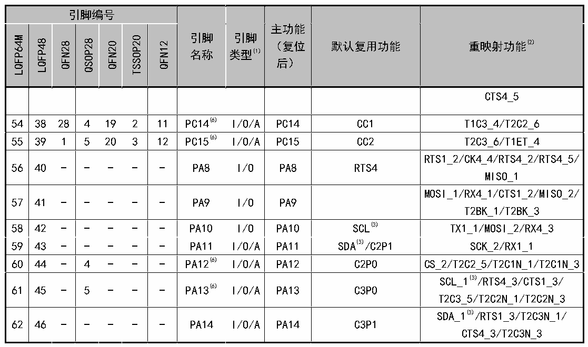

<!-- source-page: 18 -->

[← p.17](0017.md) · [index](../README.md) · [PDF p.18](https://ch32-riscv-ug.github.io/CH32X035/datasheet_zh/CH32X035DS0.PDF#page=18) · [p.19 →](0019.md)

<!-- header: CH32X035数据手册 https://wch.cn -->

 <!-- p18-cluster-01 uncaptioned graphics, rendered from the PDF; verify at https://ch32-riscv-ug.github.io/CH32X035/datasheet_zh/CH32X035DS0.PDF#page=18 -->

🖼 Text parsed from the figure above

> ⬆ **Table continued** — rendered in full at [page 16](0016.md). <!-- p18-table-001 -->

<!-- p18-table-002 (table-2-2@1) pages 18-19 -->
<table><caption>表2-2 CH32X033引脚定义</caption><tr><th colspan="2">引脚编号</th><th rowspan="2" style="text-align:left">引脚名称</th><th rowspan="2" style="text-align:left">引脚类型(1)</th><th rowspan="2" style="text-align:left">主功能 （复位后）</th><th rowspan="2">默认复用功能</th><th rowspan="2">重映射功能(2)</th></tr><tr><td></td><td>TSSOP20</td></tr><tr><td>-</td><td>7</td><td>GND</td><td>P</td><td>GND</td><td></td><td></td></tr><tr><td>-</td><td>9</td><td style="text-align:left">VDD</td><td>P</td><td>VDD</td><td></td><td></td></tr><tr><td>-</td><td>14</td><td>PA0</td><td>I/O/A</td><td>PA0</td><td>T2C1/CTS2/C1P1/A0</td><td>T2C1_2</td></tr><tr><td>-</td><td>15</td><td>PA1</td><td>I/O/A</td><td>PA1</td><td style="text-align:left">RTS2/T2C2/C1O /O1N2/O2N2/A1</td><td>CTS2_1/T2C2_2</td></tr><tr><td>-</td><td>16</td><td>PA2</td><td>I/O/A</td><td>PA2</td><td style="text-align:left">TX2/T2C3/O2O1/C3N0 /A2</td><td>RTS2_1/T2ET_5/T2C3_1/T2ET_6</td></tr><tr><td>-</td><td>17</td><td>PA3</td><td>I/O/A</td><td>PA3</td><td>RX2/T2C4/O1O0/A3(3)</td><td>T3C1_3/T2C4_1/CTS3_2</td></tr><tr><td>-</td><td>19</td><td>PA4</td><td>I/O/A</td><td>PA4</td><td>CS/CK2/O2O0/A4</td><td>RTS3_2/T3C2_3</td></tr><tr><td>-</td><td>20</td><td>PA5</td><td>I/O/A</td><td>PA5</td><td>SCK/O2N0/A5</td><td>TX4_1/CTS4_4</td></tr><tr><td>-</td><td>1</td><td>PA6</td><td>I/O/A</td><td>PA6</td><td>MISO/T3C1/O1N0/A6</td><td>CK4_1/RTS4_4/T1BK_1</td></tr><tr><td>-</td><td>2</td><td>PA7(10)</td><td>I/O/A</td><td>PA7</td><td>MOSI/T3C2/O2P0/A7(3)</td><td>T1C1N_1/TX1_3/CTS4_1</td></tr><tr><td>-</td><td>10</td><td>PA9</td><td>I/O</td><td>PA9</td><td></td><td style="text-align:left">MOSI_1/RX4_1/CTS1_2/MISO_2 /T2BK_1/T2BK_3</td></tr><tr><td>-</td><td>12</td><td>PA10</td><td>I/O</td><td>PA10</td><td>SCL(3)</td><td>TX1_1/MOSI_2/RX4_3</td></tr><tr><td>-</td><td>11</td><td>PA11</td><td>I/O/A</td><td>PA11</td><td>SDA(3)/C2P1</td><td>SCK_2/RX1_1</td></tr><tr><td>-</td><td>2</td><td>PB0(10)</td><td>I/O/A</td><td>PB0</td><td>TX4/O1P0/A8</td><td>T1C2N_1</td></tr><tr><td>-</td><td>3</td><td>PB1</td><td>I/O/A</td><td>PB1</td><td>RX4/O2N1/A9</td><td>T1C3N_1</td></tr><tr><td colspan="2">引脚编号</td><td rowspan="3">引脚</td><td rowspan="3">引脚</td><td rowspan="2">主功能</td><td rowspan="7">默认复用功能</td><td rowspan="7">重映射功能(2)</td></tr><tr><td rowspan="6"></td><td rowspan="6">TSSOP20</td></tr><tr><td rowspan="2">（复位</td></tr><tr><td rowspan="2">名称</td><td rowspan="2">类型(1)</td></tr><tr><td rowspan="2">后）</td></tr><tr><td rowspan="2"></td><td rowspan="2"></td></tr><tr><td></td></tr><tr><td>-</td><td>4</td><td>PB7</td><td>I/O/A</td><td>PB7</td><td>RST/T1C2N/O2P2/RTS3</td><td>RTS3_1/T1C2N_2</td></tr><tr><td>-</td><td>13</td><td>PC3</td><td>I/O/A</td><td>PC3</td><td>C1N0/C2N1/C3N1/A13</td><td style="text-align:left">RTS2_3/T1C4_3 /T2C3N_4/T2C1N_2/RTS2_4</td></tr><tr><td>-</td><td rowspan="2">5</td><td>PC16(4)(9)</td><td>I/O/A</td><td>PC16</td><td>UDM/T1C4/CTS1</td><td style="text-align:left">TX4_2/SCL_2(3)/SDA_4(3)/RX4_5 /CTS1_1/T1C4_1</td></tr><tr><td>-</td><td>PC11(4)</td><td>I/O</td><td>PC11</td><td></td><td></td></tr><tr><td>-</td><td rowspan="2">6</td><td>PC17(4)(8)</td><td>I/O/A</td><td>PC17</td><td>UDP/RTS1/T1ET</td><td style="text-align:left">TX4_5/SDA_2(3)/SCL_4(3)/RX4_2 /RTS1_1/T1ET_1</td></tr><tr><td>-</td><td>PC10(4)</td><td>I/O</td><td>PC10</td><td></td><td></td></tr><tr><td>-</td><td>8</td><td>PC18</td><td>I/O</td><td>PC18</td><td>DIO/PIOC_IO0</td><td style="text-align:left">TX3_1/T2C1N_5/SDA_3(3)/SCL_5(3) T1ET_2/T1ET_3/T3C2_2</td></tr><tr><td>-</td><td>18</td><td>PC19</td><td>I/O/A</td><td>PC19</td><td>DCK/PIOC_IO1/C1P0</td><td style="text-align:left">T2C1_5/T3C1_2/SCL_3(3)/SDA_5(3) /RX3_1/RX4_4/T2C1_6</td></tr></table>

<!-- image: p18-draw-image-00001 bbox=[500.88, 779.28, 520.32, 789.6] -->
<!-- footer: V2.2 16 -->
