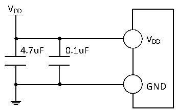

<!-- source-page: 23 -->

[← p.22](0022.md) · [index](../README.md) · [PDF p.23](https://ch32-riscv-ug.github.io/CH32X035/datasheet_zh/CH32X035DS0.PDF#page=23) · [p.24 →](0024.md)

<!-- header: CH32X035数据手册 https://wch.cn -->

# 第 3 章 电气特性

## 3.1 测试条件

除非特殊说明和标注，所有电压都以GND为基准。  
所有最小值和最大值将在最坏的环境温度、供电电压和时钟频率条件下得到保证。典型数值是基  
于常温25℃和VDD= 额定5V环境下用于设计指导。  
对于通过综合评估、设计模拟或工艺特性得到的数据，不会在生产线进行测试。在综合评估的基  
础上，最小和最大值是通过样本测试后统计得到。除非特殊说明为实测值，否则特性参数以综合评估  
或设计保证。  
供电方案：  

图3-1 常规供电典型电路  
 <!-- rendered from the PDF; verify at https://ch32-riscv-ug.github.io/CH32X035/datasheet_zh/CH32X035DS0.PDF#page=23 -->

🖼 Text parsed from the figure above

VDD  
VDD  
4.7uF 0.1uF  
GND  

## 3.2 绝对最大值

临界或者超过绝对最大值将可能导致芯片工作不正常甚至损坏。  

<!-- p23-table-001 (table-3-1@1) -->
<table><caption>表3-1 绝对最大值参数表</caption><tr><th>符号</th><th>描述</th><th>最小值</th><th>最大值</th><th>单位</th></tr><tr><td style="text-align:left">TA</td><td>工作时的环境温度</td><td>-40</td><td>85</td><td>℃</td></tr><tr><td style="text-align:left">TS</td><td>存储时的环境温度</td><td>-40</td><td>125</td><td>℃</td></tr><tr><td style="text-align:left">VDD</td><td style="text-align:left">外部主供电引脚V 上的电压DD</td><td>-0.3</td><td>6.0</td><td>V</td></tr><tr><td style="text-align:left">VIN</td><td>I/O引脚上的电压</td><td>-0.3</td><td style="text-align:left">V +0.3DD</td><td>V</td></tr><tr><td style="text-align:left">|△V | DD_x</td><td style="text-align:left">主供电引脚各V 之间的电压差DD</td><td></td><td>20</td><td>mV</td></tr><tr><td style="text-align:left">|△GND | _x</td><td>公共地引脚各GND之间的电压差</td><td></td><td>20</td><td>mV</td></tr><tr><td style="text-align:left">VESD(HBM)</td><td>普通I/O引脚的ESD静电放电电压（HBM）</td><td colspan="2">4K</td><td>V</td></tr><tr><td style="text-align:left">IVDD</td><td style="text-align:left">所有V 主供电引脚的合计总电流DD</td><td></td><td>150</td><td>mA</td></tr><tr><td style="text-align:left">IGND</td><td>所有GND公共地引脚的合计总电流</td><td></td><td>200</td><td>mA</td></tr><tr><td rowspan="2" style="text-align:left">IIO</td><td>任意I/O引脚上的sink电流</td><td></td><td>40</td><td>mA</td></tr><tr><td>任意I/O引脚上的source电流</td><td></td><td>30</td><td>mA</td></tr></table>

## 3.3 电气参数

### 3.3.1 工作条件

<!-- p23-table-002 (table-3-2@1) pages 23-24 -->
<table><caption>表3-2 通用工作条件</caption><tr><th>符号</th><th>参数</th><th>条件</th><th>最小值</th><th>最大值</th><th>单位</th></tr><tr><td style="text-align:left">FHCLK或FSYS</td><td style="text-align:left">内部系统总线频率或微处理器主频</td><td></td><td></td><td>48</td><td>MHz</td></tr><tr><td rowspan="3" style="text-align:left">VDD</td><td rowspan="3">工作电源电压（额定5V）</td><td>未用USB和PD功能</td><td>2.0</td><td>5.5</td><td rowspan="2">V</td></tr><tr><td>使用USB或PD功能</td><td>3.0</td><td>5.3</td></tr><tr><td>未使用ADC功能</td><td>2.0</td><td>5.5</td><td>V</td></tr><tr><td></td><td></td><td>使用ADC功能</td><td>2.5</td><td>5.5</td><td></td></tr></table>

<!-- image: p23-draw-image-00001 bbox=[502.8, 786.36, 522.24, 796.68] -->
<!-- footer: V2.2 21 -->
