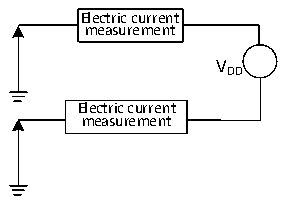

<!-- source-page: 25 -->

[← p.24](0024.md) · [index](../README.md) · [PDF p.25](https://ch32-riscv-ug.github.io/CH32X035/datasheet_zh/CH32X035DS0.PDF#page=25) · [p.26 →](0026.md)

<!-- header: CH32X035数据手册 https://wch.cn -->

图3-2 电流消耗测量  
 <!-- rendered from the PDF; verify at https://ch32-riscv-ug.github.io/CH32X035/datasheet_zh/CH32X035DS0.PDF#page=25 -->

🖼 Text parsed from the figure above

Electric current  
measurement  
VDD  
Electric current  
measurement  

微控制器处于下列条件：  
常温VDD= 3.3V情况下，测试时：所有IO端口配置上拉输入，HSI=48M。使能或关闭所有外设时  
钟的功耗。  
注：小封装型号未封装出的引脚或者已封装出来但未使用的引脚，建议配置为上拉输入或者下拉输入，  
否则可能影响电流指标，具体操作请参考EVT低功耗例程。  

<!-- p25-table-001 (table-3-6@1) -->
<table><caption>表3-6 运行模式下典型的电流消耗，数据处理代码从内部闪存中运行</caption><tr><th rowspan="2">符号</th><th rowspan="2">参数</th><th rowspan="2" colspan="2">条件</th><th colspan="2">典型值</th><th rowspan="2">单位</th></tr><tr><td>使能所有外设</td><td>关闭所有外设</td></tr><tr><td rowspan="4" style="text-align:left">I (1) DD</td><td rowspan="4" style="text-align:left">运行模式下的供应电流</td><td rowspan="4" style="text-align:left">运行于高速内部RC振荡器（HSI）， 使用 HB 预分频以减低频率</td><td style="text-align:left">F = 48MHz HCLK</td><td>4.2</td><td>3.0</td><td rowspan="4">mA</td></tr><tr><td style="text-align:left">F = 24MHz HCLK</td><td>3.2</td><td>2.6</td></tr><tr><td style="text-align:left">F = 16MHz HCLK</td><td>2.5</td><td>2.1</td></tr><tr><td style="text-align:left">F = 8MHz HCLK</td><td>2.2</td><td>2.0</td></tr></table>

注：以上为实测参数。  

<!-- p25-table-002 (table-3-7@1) -->
<table><caption>表3-7 睡眠模式下典型的电流消耗，数据处理代码从内部闪存或SRAM中运行</caption><tr><th rowspan="2">符号</th><th rowspan="2">参数</th><th rowspan="2" colspan="2">条件</th><th colspan="2">典型值</th><th rowspan="2">单位</th></tr><tr><td>使能所有外设</td><td>关闭所有外设</td></tr><tr><td rowspan="4" style="text-align:left">I (1) DD</td><td rowspan="4" style="text-align:left">睡眠模式下的供应电流 （此时外设供电和时钟保持）</td><td rowspan="4" style="text-align:left">运行于高速内部RC振荡器（HSI）， 使用 HB 预分频以减低频率</td><td style="text-align:left">F = 48MHz HCLK</td><td>3.0</td><td>1.8</td><td rowspan="4">mA</td></tr><tr><td style="text-align:left">F = 24MHz HCLK</td><td>2.1</td><td>1.5</td></tr><tr><td style="text-align:left">F = 16MHz HCLK</td><td>1.8</td><td>1.4</td></tr><tr><td style="text-align:left">F = 8MHz HCLK</td><td>1.5</td><td>1.3</td></tr></table>

注：以上为实测参数。  

<!-- p25-table-003 (table-3-8@1) -->
<table><caption>表3-8 停止和待机模式下典型的电流消耗</caption><tr><th>符号</th><th>参数</th><th>条件</th><th>典型值</th><th>单位</th></tr><tr><td rowspan="4" style="text-align:left">IDD</td><td>停止模式下的供应电流</td><td style="text-align:left">高速内部 RC 振荡器处于关闭状态（没有独立看门狗）</td><td>75</td><td rowspan="4">uA</td></tr><tr><td rowspan="3">待机模式下的供应电流</td><td>独立看门狗处于开启状态</td><td>530</td></tr><tr><td>AWU处于开启状态</td><td>528</td></tr><tr><td>独立看门狗和AWU处于关闭状态</td><td>51</td></tr></table>

注：以上为实测参数。  
<!-- image: p25-draw-image-00001 bbox=[502.8, 786.36, 522.24, 796.68] -->
<!-- footer: V2.2 23 -->
