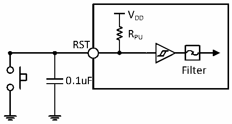

<!-- source-page: 28 -->

[← p.27](0027.md) · [index](../README.md) · [PDF p.28](https://ch32-riscv-ug.github.io/CH32X035/datasheet_zh/CH32X035DS0.PDF#page=28) · [p.29 →](0029.md)

<!-- header: CH32X035数据手册 https://wch.cn -->

### 3.3.9 RST引脚特性

<!-- p28-table-001 (table-3-15@1) -->
<table><caption>表3-15 外部复位引脚特性</caption><tr><th>符号</th><th>参数</th><th>条件</th><th>最小值</th><th>典型值</th><th>最大值</th><th>单位</th></tr><tr><td style="text-align:left">VF(RST)</td><td>RST输入信号脉宽</td><td></td><td>300</td><td></td><td></td><td>ns</td></tr></table>

电路参考设计及要求：  

图3-3 外部复位引脚典型电路  
 <!-- rendered from the PDF; verify at https://ch32-riscv-ug.github.io/CH32X035/datasheet_zh/CH32X035DS0.PDF#page=28 -->

🖼 Text parsed from the figure above

VDD  
RPU  
RST  
Filter  
0.1uF  

### 3.3.10 USB PD接口特性

<!-- p28-table-002 (table-3-16@1) -->
<table><caption>表3-16 PD接口I/O特性，应用：PD通讯</caption><tr><th>符号</th><th>参数</th><th>条件</th><th>最小值</th><th>典型值</th><th>最大值</th><th>单位</th></tr><tr><td style="text-align:left">t Rise</td><td>上升时间</td><td style="text-align:left">幅度10%到90%之间的时间， 最小值为无负载条件下的时间。</td><td>300</td><td></td><td>600</td><td>ns</td></tr><tr><td style="text-align:left">t Fall</td><td>下降时间</td><td style="text-align:left">幅度10%到90%之间的时间， 最小值为无负载条件下的时间。</td><td>300</td><td></td><td>600</td><td>ns</td></tr><tr><td style="text-align:left">VSwing</td><td style="text-align:left">输出电压摆幅 （峰-峰值）</td><td>低电压输出模式，CL=50pF</td><td>1.04</td><td>1.12</td><td>1.20</td><td>V</td></tr><tr><td rowspan="3" style="text-align:left">I pu</td><td rowspan="3">CC上拉电流</td><td style="text-align:left">引脚电压 &lt; V - 1V，PUCC[1:0] = 11DD</td><td>64</td><td>80</td><td>96</td><td>uA</td></tr><tr><td style="text-align:left">引脚电压 &lt; V - 1V，PUCC[1:0] = 10DD</td><td>144</td><td>180</td><td>216</td><td>uA</td></tr><tr><td style="text-align:left">引脚电压 &lt; V - 1V，PUCC[1:0] = 01DD</td><td>264</td><td>330</td><td>396</td><td>uA</td></tr></table>

注：外加Type-C/PD高压接口芯片CH211可实现PD引脚28V耐压以及内置Type-C规范定义的可控Rd  
下拉电阻5K1。  

### 3.3.11 TIM定时器特性

<!-- p28-table-003 (table-3-17@1) -->
<table><caption>表3-17 TIMx特性</caption><tr><th>符号</th><th>参数</th><th>条件</th><th>最小值</th><th>最大值</th><th>单位</th></tr><tr><td rowspan="2" style="text-align:left">t res(TIM)</td><td rowspan="2">定时器基准时钟</td><td></td><td>1</td><td></td><td style="text-align:left">t TIMxCLK</td></tr><tr><td style="text-align:left">f = 48MHz TIMxCLK</td><td>20.8</td><td></td><td>ns</td></tr><tr><td rowspan="2" style="text-align:left">FEXT</td><td rowspan="2">CH1至CH4的定时器外部时钟频率</td><td></td><td>0</td><td style="text-align:left">f /2TIMxCLK</td><td>MHz</td></tr><tr><td style="text-align:left">f = 48MHz TIMxCLK</td><td>0</td><td>24</td><td>MHz</td></tr><tr><td style="text-align:left">R esTIM</td><td>定时器分辨率</td><td></td><td></td><td>16</td><td>位</td></tr><tr><td rowspan="2" style="text-align:left">t COUNTER</td><td rowspan="2" style="text-align:left">当选择了内部时钟时，16 位计数器时钟周期</td><td></td><td>1</td><td>65536</td><td style="text-align:left">t TIMxCLK</td></tr><tr><td style="text-align:left">f = 48MHz TIMxCLK</td><td>0.0208</td><td>1363</td><td>us</td></tr><tr><td rowspan="2" style="text-align:left">t MAX_COUNT</td><td rowspan="2">最大可能的计数</td><td></td><td></td><td>65535</td><td style="text-align:left">t TIMxCLK</td></tr><tr><td style="text-align:left">f = 48MHz TIMxCLK</td><td></td><td>1363</td><td>us</td></tr></table>

<!-- image: p28-draw-image-00001 bbox=[502.8, 786.36, 522.24, 796.68] -->
<!-- footer: V2.2 26 -->
