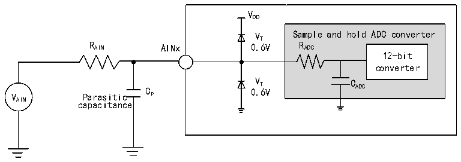

<!-- source-page: 33 -->

[← p.32](0032.md) · [index](../README.md) · [PDF p.33](https://ch32-riscv-ug.github.io/CH32X035/datasheet_zh/CH32X035DS0.PDF#page=33) · [p.34 →](0034.md)

<!-- header: CH32X035数据手册 https://wch.cn -->

> ⬆ **Table continued** — rendered in full at [page 32](0032.md). <!-- p33-table-001 -->

注：以上均为设计参数保证。  
公式：最大RAIN  
<!-- image: p33-draw-image-00002 bbox=[209.28, 189.84, 365.88, 214.2] -->
上述公式用于决定最大的外部阻抗，使得误差可以小于1/4 LSB。其中N=12(表示12位分辨率)。  

<!-- p33-table-002 (table-3-22@1) -->
<table><caption>表3-22 fADC= 8MHz时的最大RAIN</caption><tr><th style="text-align:left">T(周期) S</th><th style="text-align:left">t (us) S</th><th style="text-align:left">最大R (kΩ) AIN</th></tr><tr><td>4</td><td>0.5</td><td>1.85</td></tr><tr><td>5</td><td>0.625</td><td>2.46</td></tr><tr><td>6</td><td>0.75</td><td>3.07</td></tr><tr><td>7</td><td>0.875</td><td>3.69</td></tr><tr><td>8</td><td>1.0</td><td>4.30</td></tr><tr><td>9</td><td>1.125</td><td>4.91</td></tr><tr><td>10</td><td>1.25</td><td>5.53</td></tr><tr><td>11</td><td>1.375</td><td>6.14</td></tr></table>

注：以上均为设计参数保证。  

<!-- p33-table-003 (table-3-23@1) -->
<table><caption>表3-23 ADC误差</caption><tr><th>符号</th><th>参数</th><th>条件</th><th>最小值</th><th>典型值</th><th>最大值</th><th>单位</th></tr><tr><td>EO</td><td>失调误差</td><td rowspan="3" style="text-align:left">f = 3MHz, ADC R ＜ 10 kΩ, AIN V = 5VDD</td><td></td><td>±4</td><td></td><td rowspan="3">LSB</td></tr><tr><td>ED</td><td>微分非线性误差</td><td></td><td>±1</td><td>±10</td></tr><tr><td>EL</td><td>积分非线性误差</td><td></td><td>±4</td><td>±20</td></tr></table>

注：以上均为设计参数保证。  
Cp 表示PCB与焊盘上的寄生电容（大约5pF），可能与焊盘和PCB布局质量有关。较大的Cp 数值将  
降低转换精度，解决办法是降低fADC 值。  

图3-8 ADC典型连接图  
 <!-- rendered from the PDF; verify at https://ch32-riscv-ug.github.io/CH32X035/datasheet_zh/CH32X035DS0.PDF#page=33 -->

🖼 Text parsed from the figure above

VDD  
VT Sample and hold ADC converter  
R AIN AINx 0.6V R ADC  
12-bit  
converter  
V Parasitic C P 0 V . T 6V C ADC  
AIN capacitance  

<!-- image: p33-draw-image-00001 bbox=[502.8, 786.36, 522.24, 796.68] -->
<!-- footer: V2.2 31 -->
